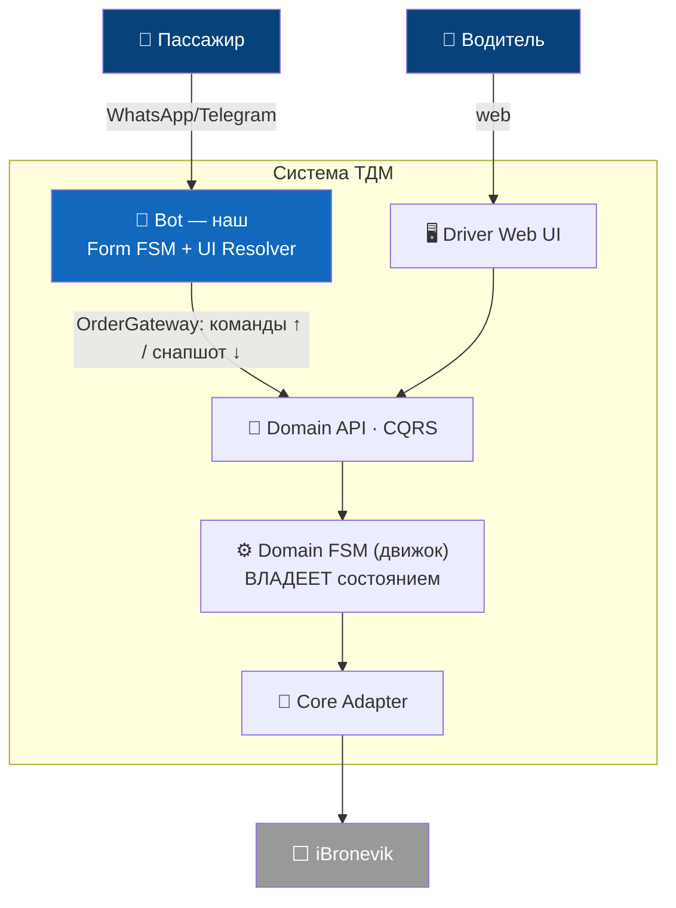
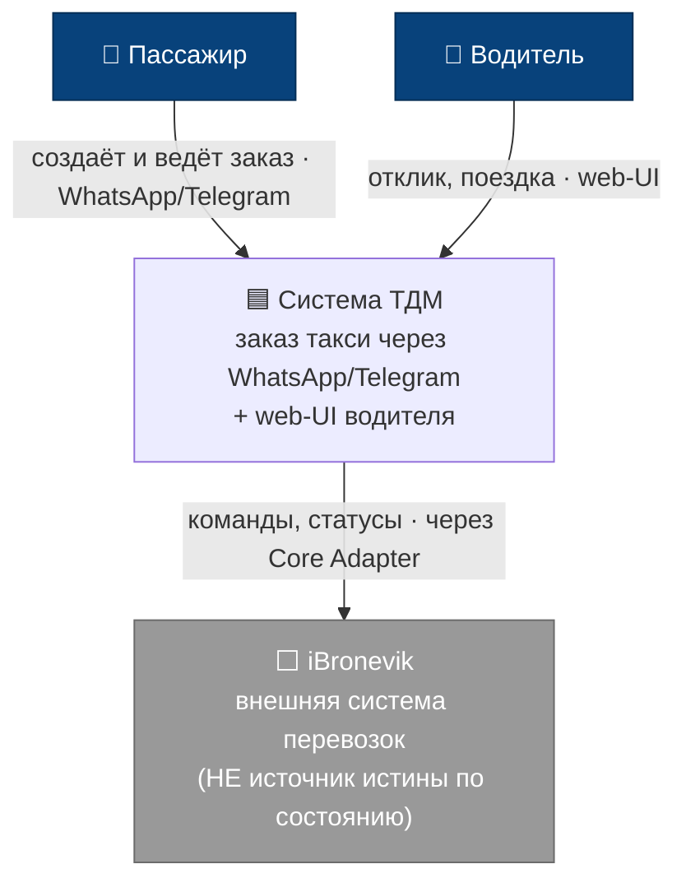
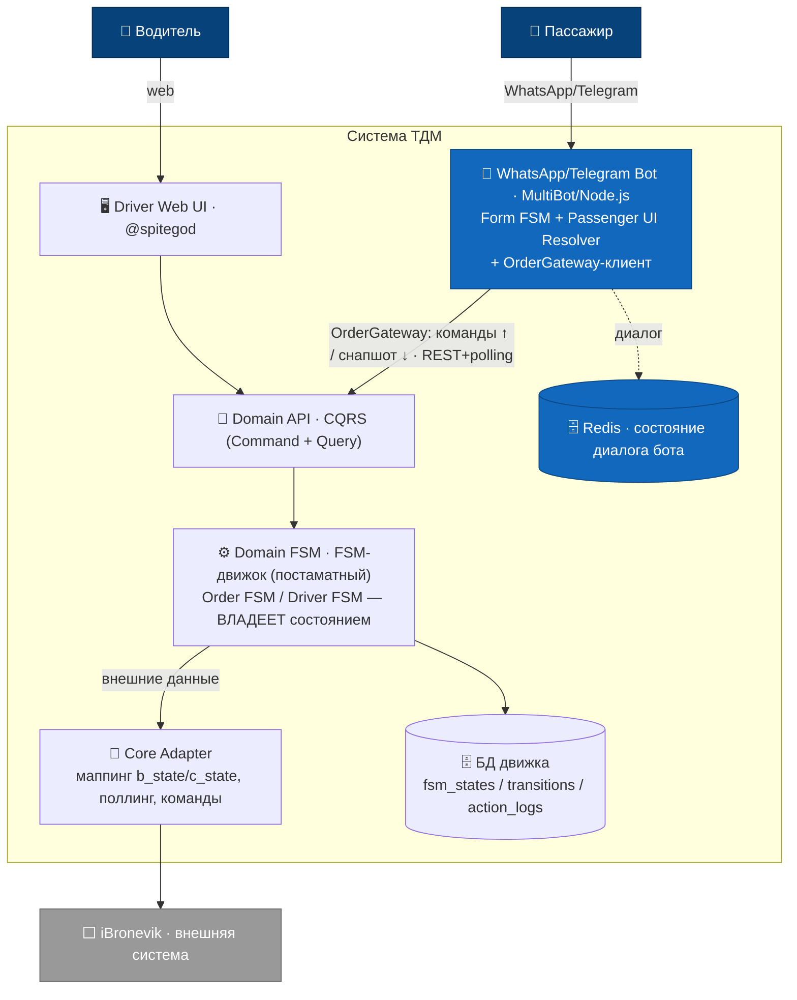
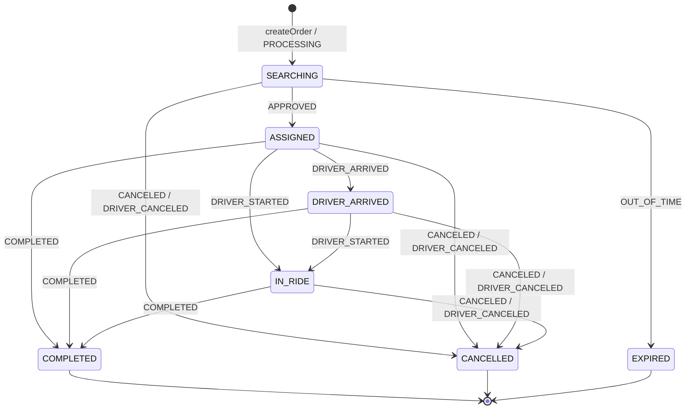
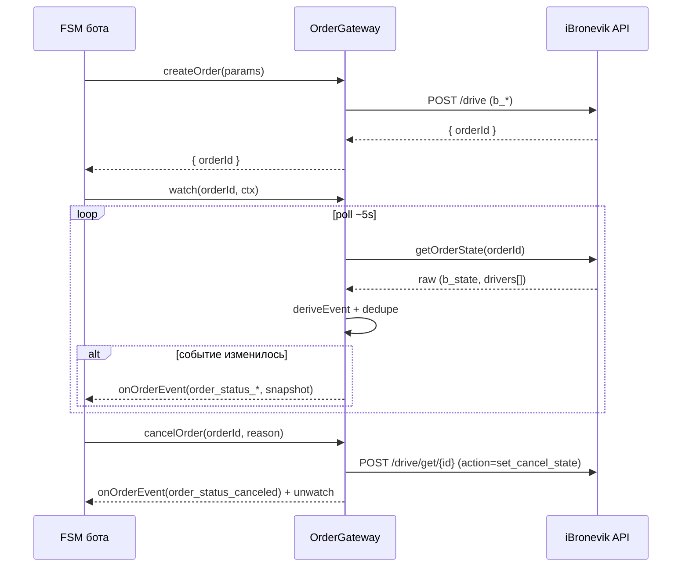
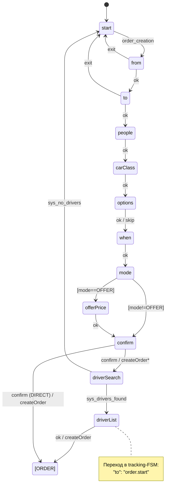
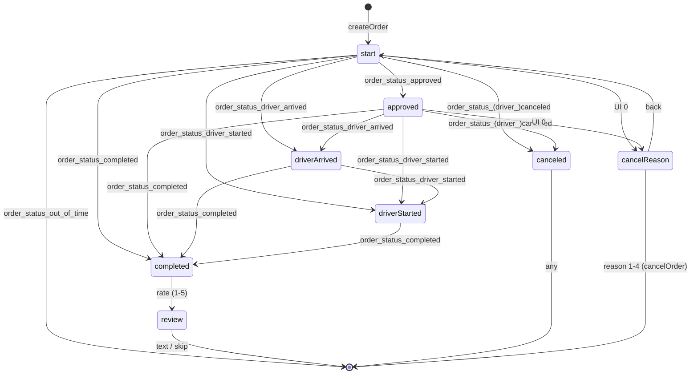

# Такси Для Марокко (TDM) — сводный отчёт по документации

> Единый MD, собранный из проектной документации и код-README репозитория `tdm`.
> Это **отчёт для ознакомления/ревью**, а не оригинальная схема хранения файлов.
>
> Дата сборки: 2026-06-26 · Источников: 33 файлов.
> Не включено: `node_modules`, приватная папка `_workspace`, `driver-emulator`.

---

## Оглавление

1. [Обзор проекта TDM](#1-Обзор-проекта-tdm) — `tdm/README.md`
2. [Карта документации](#2-Карта-документации) — `tdm/docs/README.md`
3. [План проекта (ROADMAP)](#3-План-проекта-roadmap) — `tdm/docs/ROADMAP.md`
4. [Открытые вопросы и владельцы](#4-Открытые-вопросы-и-владельцы) — `tdm/docs/open-questions.md`
5. [ADR-001 · Архитектура (Вариант 3, серверный FSM)](#5-adr-001-·-Архитектура-Вариант-3-серверный-fsm) — `tdm/docs/architecture-decision-variant3.md`
6. [Домен · Глоссарий](#6-Домен-·-Глоссарий) — `tdm/docs/domain/glossary.md`
7. [Домен · Модель заказа](#7-Домен-·-Модель-заказа) — `tdm/docs/domain/order-model.md`
8. [Домен · Модели исполнения](#8-Домен-·-Модели-исполнения) — `tdm/docs/domain/execution-models.md`
9. [Домен · Бизнес-правила](#9-Домен-·-Бизнес-правила) — `tdm/docs/domain/business-rules.md`
10. [Order-FSM · Состояния и переходы](#10-order-fsm-·-Состояния-и-переходы) — `tdm/docs/order-fsm/states.md`
11. [Order-FSM · Каркас серверного FSM-ядра (strawman)](#11-order-fsm-·-Каркас-серверного-fsm-ядра-strawman) — `tdm/docs/order-fsm/fsm-core-design.md`
12. [Order-FSM · Маппинг на backend](#12-order-fsm-·-Маппинг-на-backend) — `tdm/docs/order-fsm/backend-mapping.md`
13. [Order-FSM · Справочник payload API](#13-order-fsm-·-Справочник-payload-api) — `tdm/docs/order-fsm/api-payload-reference.md`
14. [Order-FSM · События](#14-order-fsm-·-События) — `tdm/docs/order-fsm/events.md`
15. [Order-FSM · Команды](#15-order-fsm-·-Команды) — `tdm/docs/order-fsm/commands.md`
16. [Order-FSM · Таймеры](#16-order-fsm-·-Таймеры) — `tdm/docs/order-fsm/timers.md`
17. [Интеграция · Контракт Order Gateway](#17-Интеграция-·-Контракт-order-gateway) — `tdm/docs/integration/order-gateway-contract.md`
18. [Интеграция · Контракт B0 (Бот ↔ Domain API)](#18-Интеграция-·-Контракт-b0-Бот-↔-domain-api) — `tdm/docs/integration/bot-domain-api-contract.md`
19. [Интеграция · Версионирование/совместимость API (дополнение к B0)](#19-Интеграция-·-Версионированиесовместимость-api-дополнение-к-b0) — `tdm/docs/domain-api-contract.md`
20. [Bot-FSM · Спецификация DSL](#20-bot-fsm-·-Спецификация-dsl) — `tdm/docs/bot-fsm/dsl-spec.md`
21. [Bot-FSM · Модель событий](#21-bot-fsm-·-Модель-событий) — `tdm/docs/bot-fsm/event-model.md`
22. [Bot-FSM · Форма (сбор данных)](#22-bot-fsm-·-Форма-сбор-данных) — `tdm/docs/bot-fsm/form-fsm.md`
23. [Bot-FSM · Сопровождение / UI Resolver](#23-bot-fsm-·-Сопровождение-ui-resolver) — `tdm/docs/bot-fsm/tracking-fsm.md`
24. [Gap-анализ](#24-gap-анализ) — `tdm/docs/gap-analysis.md`
25. [План реализации](#25-План-реализации) — `tdm/docs/implementation-plan.md`
26. [Схемы](#26-Схемы) — `tdm/schemas/README.md`
27. [Код бота · README](#27-Код-бота-·-readme) — `tdm/bot/README.md`
28. [Код бота · app.schema](#28-Код-бота-·-appschema) — `tdm/bot/config/app.schema.md`
29. [Код бота · Деплой](#29-Код-бота-·-Деплой) — `tdm/bot/docs/DEPLOYMENT.md`
30. [Код бота · Engine](#30-Код-бота-·-engine) — `tdm/bot/src/engine/README.md`
31. [Код бота · OrderManager](#31-Код-бота-·-ordermanager) — `tdm/bot/src/newManagers/OrderManager/README.md`
32. [Код бота · Orchestrator](#32-Код-бота-·-orchestrator) — `tdm/bot/src/newManagers/orchestrator/README.md`
33. [Код бота · Transport](#33-Код-бота-·-transport) — `tdm/bot/src/transport/Readme.md`

---


## 1. Обзор проекта TDM

<sub>📄 Источник: `tdm/README.md`</sub>

# ТДМ — Такси Для Марокко

Проектная документация и код сервиса заказа такси через WhatsApp-бот (и другие каналы).

## Цель проекта

Спроектировать **FSM интерфейса бота**, который выступает чистым представлением (UI-слоем)
над **внешним FSM заказа**, не владея бизнес-логикой заказа.

Архитектура разделяет три независимых конечных автомата (FSM):

1. **FSM формы/диалога** — сбор данных у клиента (per-channel: WhatsApp / web / mobile).
2. **FSM сопровождения заказа в боте** — подписка на доменные события и их отрисовка клиенту.
3. **FSM заказа** (внешний) — жизненный цикл заказа: CREATED → MATCHING → ASSIGNED →
   BOARDING → RIDE → FINISHED; режимы DIRECT / VOTE / OFFER.

## Структура репозитория

```
docs/        — документация (доменная модель, спецификации FSM, контракты)
  ROADMAP.md — план проекта по этапам
  domain/    — glossary, модель заказа, модели исполнения (DIRECT/VOTE/OFFER)
  order-fsm/ — спецификация внешнего FSM заказа + маппинг на бэкенд iBronevik
  integration/ — контракт OrderGateway (бот ↔ FSM заказа)
  bot-fsm/   — спецификация FSM интерфейса бота (форма + сопровождение)
  gap-analysis.md, implementation-plan.md
schemas/     — черновики JSON-схем FSM (form.json, order.json, _init.json)
```

## Статус

Проектирование и документация завершены (6 этапов). Начат переход к реализации.
См. [docs/README.md](docs/README.md) (индекс) и [docs/ROADMAP.md](docs/ROADMAP.md).


---


## 2. Карта документации

<sub>📄 Источник: `tdm/docs/README.md`</sub>

# Документация ТДМ

Индекс проектной документации.

> **Обновлено:** 2026-06-26 · ведёт: Павел (аналитика). История решений — [ROADMAP.md](ROADMAP.md) §0, [ADR-001](architecture-decision-variant3.md) §6.

## TL;DR — резюме проекта

**Цель.** Спроектировать **FSM интерфейса бота** (WhatsApp + Telegram) как чистый UI-слой над
**внешним FSM заказа**: бот **не владеет** бизнес-логикой и **никогда не вычисляет статус сам** — лишь
отражает доменное состояние, пришедшее с сервера.

**Архитектура — принята ([ADR-001](architecture-decision-variant3.md), Вариант 3).** Владелец состояния —
**серверный Domain FSM** на универсальном табличном FSM-движке (постаматный, дорабатывает @spitegod).
iBronevik — за Core-слоем, **не** источник истины. UI пассажира и водителя — **производные** (UI Resolver),
не хранятся как самостоятельная истина.

**FSM на едином движке ([ADR-001](architecture-decision-variant3.md) §2):** серверные — Domain Order,
Driver (домен + web-UI); ботовые — **WhatsApp Form** (Redis) и **Passenger UI Resolver** (проекция домена).


<sub>Container-уровень C4 (компактно). Полная версия + System Context — [ADR-001 §1а](architecture-decision-variant3.md).</sub>

**Статус.** Документация Этапов 1–6 — готова ✅; черновики JSON-схем — есть ✅. В работе 🟡: ядро серверного
FSM (strawman [order-fsm/fsm-core-design.md](order-fsm/fsm-core-design.md); RFC по развитию ядра отправлен
@spitegod — [order-fsm/fsm-engine-rfc.md](order-fsm/fsm-engine-rfc.md)).

**Ключевые блокеры** (полный список с владельцами — [open-questions.md](open-questions.md)).
1. Ответы @spitegod по RFC ядра (guard / effect / timer / context / registry) → затем синхронизация `fsm-core-design.md`.
2. Как бэкенд отдаёт состав кандидатов/предложений — в поллинге VOTE / OFFER / DIRECT **неразличимы**.
3. Утверждение кодовой базы заказчиком (рекомендация — MultiBot, [gap-analysis.md](gap-analysis.md) §4).
4. **Timer Worker** (no-show / expire) ещё не построен — таймерные переходы есть в графе, но в рантайме не срабатывают.

**Ближайшие шаги.** Ответы @spitegod → синхронизация `fsm-core-design.md` → подтверждение базы →
реализация по [implementation-plan.md](implementation-plan.md).

---

## План
- [ROADMAP.md](ROADMAP.md) — план проекта по этапам, ключевые решения, открытые вопросы.
- [open-questions.md](open-questions.md) — ⭐ сводный навигатор открытых вопросов: владельцы, приоритеты, ссылки.

## Этап 1 — Доменный фундамент ✅
- [domain/glossary.md](domain/glossary.md) — единый словарь терминов.
- [domain/order-model.md](domain/order-model.md) — доменная модель заказа.
- [domain/execution-models.md](domain/execution-models.md) — модели исполнения DIRECT / VOTE / OFFER + Carrier Determination.
- [domain/business-rules.md](domain/business-rules.md) — ⭐ бизнес-правила: стоимость (4 формы), оплата, отмена/завершение, инциденты (заказчик 2026-06-20).

## Этап 2 — Спецификация FSM заказа (внешний) ✅
- [order-fsm/backend-mapping.md](order-fsm/backend-mapping.md) — текущий бэкенд iBronevik (`b_state`+`c_state`) → доменная модель.
- [order-fsm/api-payload-reference.md](order-fsm/api-payload-reference.md) — ⭐ авторитетный контракт payload/actions API (из дампа серверного FSM).
- [order-fsm/states.md](order-fsm/states.md) — состояния и переходы (12 доменных состояний движка + наблюдаемый/целевой FSM).
- [order-fsm/fsm-core-design.md](order-fsm/fsm-core-design.md) — ⭐ strawman устройства серверного FSM-ядра: агрегаты, сущности, таблицы, переходы (команда/авто/таймер), таймеры, авто-действия. Предмет проектирования для @spitegod.
- [order-fsm/events.md](order-fsm/events.md) — каталог событий `order_status_*` + payload.
- [order-fsm/commands.md](order-fsm/commands.md) — команды бот → заказ.
- [order-fsm/timers.md](order-fsm/timers.md) — таймеры.

## Этап 3 — Контракт интеграции ✅
- [integration/order-gateway-contract.md](integration/order-gateway-contract.md) — порт `OrderGateway`, маппинг, гарантии доставки.
- [integration/bot-domain-api-contract.md](integration/bot-domain-api-contract.md) — ⭐ контракт B0: Бот ↔ Domain API (CQRS, snapshot, availableActions, fsmVersion). Согласован v1.
- [domain-api-contract.md](domain-api-contract.md) — дополнение к B0: версионирование, forward-совместимость, capabilities, коды ошибок/идемпотентность, разведение FSM-state vs ObservedState.

## Этап 4 — FSM интерфейса бота (основная задача) ✅
- [bot-fsm/dsl-spec.md](bot-fsm/dsl-spec.md) — DSL: состояния, validation, Guard, cross-flow, actions.
- [bot-fsm/event-model.md](bot-fsm/event-model.md) — единая модель событий UI / System / Domain.
- [bot-fsm/form-fsm.md](bot-fsm/form-fsm.md) — слой 1: сбор данных заказа.
- [bot-fsm/tracking-fsm.md](bot-fsm/tracking-fsm.md) — слой 3: сопровождение заказа (реакция на FSM заказа).

## Этап 5 — Gap-анализ и выбор базы ✅
- [gap-analysis.md](gap-analysis.md) — сравнение WATaxiBot vs MultiBot, рекомендация базы.

## Этап 6 — План реализации ✅
- [implementation-plan.md](implementation-plan.md) — блоки A–E, MVP-срез, граф зависимостей.

## Черновики схем (реализация спеки)
- [../schemas/](../schemas/) — `_init.json`, `form.json` (форма такси), `order.json` (сопровождение) — DSL MultiBot + Guard.

---

**Все 6 этапов документации завершены + черновики схем.** Дальше — утверждение базы заказчиком,
ответы бэкенд-команды (ветки VOTE/OFFER), переход к реализации по [implementation-plan.md](implementation-plan.md).


---


## 3. План проекта (ROADMAP)

<sub>📄 Источник: `tdm/docs/ROADMAP.md`</sub>

# ТДМ — Roadmap проекта

> Проект: **ТДМ (Такси Для Марокко)** — WhatsApp-бот такси.
> Основная цель: спроектировать **FSM интерфейса WhatsApp-бота**, который выступает чистым
> представлением (UI-слоем) над **внешним FSM заказа**, не владея бизнес-логикой заказа.
>
> Дата составления: 2026-06-19. Статус: черновик, требует утверждения заказчиком.

---

## 0. Ключевые решения (приняты)

> 🏛 **2026-06-24 — принят Вариант 3 ([ADR-001](architecture-decision-variant3.md)).** Владелец
> состояния — **серверный Domain FSM** на универсальном FSM-движке (постаматный, дорабатывает
> @spitegod). iBronevik — за Core-слоем, НЕ источник истины. Бот = WhatsApp-канал: Form FSM +
> Passenger UI Resolver + клиент серверного API. Строки таблицы ниже частично пересмотрены этим ADR.

| Вопрос | Решение |
|---|---|
| Кодовая база нового бота | **MultiBot** (заказчик утвердил; перенесён в `tdm/bot/`). |
| **Владелец FSM заказа** ⭐ | **Серверный Domain FSM** на FSM-движке (Вариант 3, ADR-001). Бот ходит в **серверный API**, не в iBronevik напрямую. `OrderGateway` = исходящий порт бота к этому API; маппинг iBronevik уходит на сервер в Core Adapter. ~~Внешний — текущий бэкенд iBronevik~~ (пересмотрено). |
| Транспорт событий заказа | **Polling** существующего API (как сейчас, ~5 сек). За абстракцией — чтобы при необходимости заменить на webhook/WS. |
| Модели исполнения в MVP | **Все 3 сразу** — DIRECT / VOTE / OFFER. Текущий бэкенд их поддерживает (`isVoting`, `b_only_offer`, action `set_offer`, `BookingState.OfferedToDrivers`). |
| Каналы | **WhatsApp + Telegram** (Telegram — «если не влияет заметно на трудоёмкость»; MultiBot его уже умеет → почти бесплатно). |
| Бэкенд заказа | **Пока под текущий** (iBronevik). Идеализированная доменная модель ТДМ — целевой ориентир, не реализуется сейчас. |

### Ответы заказчика на открытые вопросы (2026-06-19)
1. Транспорт → **поллинг**. 2. Модели → **все 3 сразу**. 3. Каналы → **Telegram можно**, если не бьёт по трудоёмкости.
4. База → **на усмотрение, заказчику ближе эволюция**. 5. Бэкенд → **пока под текущий**.

### Предварительная рекомендация по базе
Ответы 1/3/5 + целевая архитектура указывают на **MultiBot** как базу эволюции: он уже декларативный
(JSON-FSM), персистентный (Redis), мульти-канальный, и — главное — уже реализует целевой паттерн
«FSM бота реагирует на внешний FSM заказа» (`OrderManager` поллит API и шлёт `order_status_*` как
system-events в FSM). WATaxiBot — production-источник истины по бизнес-нюансам (voting-таймеры, offer).
**Финальное решение — после Этапа 5.**

---

## 1. Архитектурный принцип (фундамент всего плана)

> 🏛 **Уточнено Вариантом 3 ([ADR-001](architecture-decision-variant3.md)):** слоёв-FSM на деле пять
> (Domain Order / Driver UI / Passenger UI / WhatsApp Form), владелец состояния — **сервер**. Схема
> ниже верна по сути (бот — представление над FSM заказа), но «Слой 2 (внешний)» теперь = серверный
> Domain FSM на движке, а «Слой 3 (сопровождение)» = Passenger UI Resolver (производное, не хранится).
> Точное распределение — в ADR-001 §2–3.

Разделяем **три независимых FSM**, которые сейчас в коде перемешаны:

```
┌─────────────────────────────────────────────────────────────┐
│  СЛОЙ 1: FSM формы/диалога (per-channel)                      │
│  Сбор данных у клиента: from, to, места, время, опции…        │
│  Своя реализация на каждый канал (WhatsApp / web / mobile).   │
└───────────────────────────┬─────────────────────────────────┘
                            │ создаёт заказ (Order params)
                            ▼
┌─────────────────────────────────────────────────────────────┐
│  СЛОЙ 3: FSM сопровождения заказа в боте  ← НАША ОСНОВНАЯ ЗАДАЧА │
│  Подписка на доменные события + отрисовка их клиенту в WA.     │
│  Никакой бизнес-логики заказа внутри — только представление.  │
└───────────────────────────┬─────────────────────────────────┘
                            │ слушает события / шлёт команды
                            ▼ (через абстрактный контракт)
┌─────────────────────────────────────────────────────────────┐
│  СЛОЙ 2: FSM ЗАКАЗА (внешний, «чужой»)                        │
│  CREATED → MATCHING → ASSIGNED → BOARDING → RIDE → FINISHED   │
│  Режимы DIRECT / VOTE / OFFER. Владеет внешняя система ТДМ.    │
└─────────────────────────────────────────────────────────────┘
```

**Инвариант:** бот никогда не вычисляет статус заказа сам — он только отражает события,
пришедшие из FSM заказа, и отправляет в него команды (создать/отменить/выбрать водителя).

---

## 2. Этапы работ

### Этап 1 — Доменный фундамент (документация) ✅ ГОТОВО
**Цель:** единая непротиворечивая модель, на которую опирается весь проект.
*(grok1.txt прямо указал на расхождения между документами — устранены здесь.)*

- [x] **1.1 Glossary** — единый словарь терминов. → `docs/domain/glossary.md`
- [x] **1.2 Доменная модель заказа** — структура Order. → `docs/domain/order-model.md`
- [x] **1.3 Модели исполнения** — DIRECT / VOTE / OFFER. → `docs/domain/execution-models.md`
- [x] **1.4 Carrier Determination** — стратегии + когда CandidateSelected → DriverAssigned. → `docs/domain/execution-models.md` §6

**Результат:** `docs/domain/` (glossary.md, order-model.md, execution-models.md). ✅

> Расхождение PoolVisibility / CandidatePool / candidateDrivers сведено в execution-models.md §1.
> Открытые бизнес-вопросы (ценообразование, отмены, оплата, SOS) вынесены в конец order-model.md и execution-models.md.

---

### Этап 2 — Спецификация FSM заказа (внешний контракт) ✅ ГОТОВО
**Цель:** описать «чужой» FSM как чёрный ящик, на события которого реагирует бот.
*(Привязан к текущему бэкенду iBronevik — решение заказчика «под текущий».)*

- [x] **2.0 Маппинг бэкенда** — iBronevik (`b_state`+`c_*`) → доменная модель. → `docs/order-fsm/backend-mapping.md`
- [x] **2.1 Состояния и переходы** — наблюдаемый FSM (реализуем) + целевой (ориентир, gpt3+grok). → `docs/order-fsm/states.md`
- [x] **2.2 Каталог событий** — 8 наблюдаемых `order_status_*` + целевые по режимам, payload. → `docs/order-fsm/events.md`
- [x] **2.3 Таймеры** — окно ожидания + votingTimer (реализованы) + целевые. → `docs/order-fsm/timers.md`
- [x] **2.4 Команды боту → FSM заказа** — create/cancel/selectCandidate/selectOffer/confirmBoarding/rate. → `docs/order-fsm/commands.md`

**Результат:** `docs/order-fsm/` + Mermaid-диаграммы. ✅

> Ключевая находка: поллинговый трек **режим-агностичен** (VOTE/OFFER/DIRECT неразличимы по статусу).
> Состав кандидатов/предложений нужно читать из `drivers[]` — открытый вопрос к бэкенд-команде.

---

### Этап 3 — Контракт интеграции (бот ↔ FSM заказа) ✅ ГОТОВО
**Цель:** абстрактный интерфейс, изолирующий бот от реализации внешнего FSM.
*(Транспорт — поллинг; контракт спроектирован под замену на webhook/WS.)*

- [x] **3.1 Порт интеграции `OrderGateway`** — команды + watch/unwatch + onOrderEvent. → `docs/integration/order-gateway-contract.md`
- [x] **3.2 Маппинг статусов вынесен в адаптер iBronevik** — таблица в адаптере, не в FSM бота.
- [x] **3.3 Стратегии доставки** — поллер за интерфейсом; замена на Webhook/WS без изменения FSM.
- [x] **3.4 Идемпотентность/доставка** — дедуп, терминальность, упорядочивание, пропуски, восстановление.

**Результат:** `docs/integration/order-gateway-contract.md`. ✅

> `OrderGateway` = рефакторинг текущего `OrderManager` в явный порт + вынос маппинга в адаптер +
> обогащение событий снимком (`OrderSnapshot`) + персистентность реестра (Redis).

---

### Этап 4 — Спецификация FSM интерфейса бота (ОСНОВНАЯ ЗАДАЧА) ✅ ГОТОВО
**Цель:** формальное описание двух ботовых FSM. Привязано к реальному DSL (`main.json`/`order.json`).

- [x] **4.1 FSM формы (слой 1)** — from→to→people→carClass→options→when→mode→(offerPrice)→confirm; очищена от «протечек» домена. → `docs/bot-fsm/form-fsm.md`
- [x] **4.2 FSM сопровождения (слой 3)** — наблюдаемый трек (start→approved→…→completed→review, cancelReason) + ветки VOTE/OFFER как расширение. → `docs/bot-fsm/tracking-fsm.md`
- [x] **4.3 Guard в DSL** — синтаксис, правила выбора перехода, примеры для ТДМ. → `docs/bot-fsm/dsl-spec.md` §3
- [x] **4.4 Единая модель событий** — UI / System / Domain, конвенция именования, обработка гонок. → `docs/bot-fsm/event-model.md`
- [x] **4.5 Cross-flow переходы** — формализованы (полный id `flow.state`, как в реальном коде). → `docs/bot-fsm/dsl-spec.md` §1

**Результат:** `docs/bot-fsm/` (dsl-spec, event-model, form-fsm, tracking-fsm). ✅

> Ветки VOTE/OFFER в сопровождении — поверх чтения `OrderSnapshot.candidates/offers`; активируются
> после ответа бэкенд-команды (ROADMAP §4). Базовый трек от них не зависит.
> JSON-схемы-черновики (реализация спеки) — отнесены к Этапу 6.

---

### Этап 5 — Gap-анализ кода и выбор базы ✅ ГОТОВО
**Цель:** на основе Этапов 1–4 решить — MultiBot, WATaxiBot или гибрид.

- [x] **5.1 Reverse-mapping WATaxiBot** — кастомная FSM, in-memory, зрелый бизнес. → `docs/gap-analysis.md` §1
- [x] **5.2 Reverse-mapping MultiBot** — JSON-FSM, Redis, system-events, мульти-канал. → §2
- [x] **5.3 Сопоставление с целевой моделью** — таблица по 9 критериям. → §3
- [x] **5.4 Решение** — **рекомендация: MultiBot как база + перенос бизнес-логики из WATaxiBot.** → §4

**Результат:** `docs/gap-analysis.md`. ✅ *(финальное утверждение базы — за заказчиком)*

---

### Этап 6 — План реализации / миграции ✅ ГОТОВО
**Цель:** превратить спеки в инкрементальный план разработки.

- [x] **6.1 Доработка движка** — Guard, модель событий, dispatch, очистка протечек. → `implementation-plan.md` Блок A
- [x] **6.2 Схемы FSM** — form/tracking + перенос бизнес-логики. → Блок C
- [x] **6.3 OrderGateway + адаптер + snapshot + персистентность.** → Блок B
- [x] **6.4 Тесты** — DIRECT/отмена/таймаут/гонки/VOTE/OFFER/reassignment + fake gateway. → Блок D
- [x] **6.5 Поэтапное переключение** + наблюдаемость + депрекация. → Блок E

**Результат:** `docs/implementation-plan.md` (с MVP-срезом и графом зависимостей). ✅

---

## 3. Зависимости этапов

```
Этап 1 (домен)
   ├──> Этап 2 (FSM заказа) ──┐
   │                          ├──> Этап 4 (FSM бота) ──> Этап 5 (gap) ──> Этап 6 (реализация)
   └──> Этап 3 (контракт) ────┘
```

Этапы 2 и 3 можно вести параллельно после Этапа 1. Этап 5 требует готового Этапа 4.

---

## 4. Открытые вопросы

> Полный сводный список (все доки, владельцы, приоритеты) — [open-questions.md](open-questions.md). Ниже — срез по этому плану.

### Разрешено заказчиком (2026-06-19) — см. §0
1. ✅ Транспорт → поллинг. 2. ✅ Модели → все 3. 3. ✅ Каналы → +Telegram. 4. ✅ База → эволюция. 5. ✅ Бэкенд → текущий.

### Новые вопросы, вскрытые при анализе кода (к заказчику/бэкенд-команде)
- **VOTE/OFFER на текущем API:** механика есть (`isVoting`, `b_only_offer`, `set_offer`, `OfferedToDrivers`),
  но поллинговый статус заказа (`deriveEvent` по `b_state`+`c_*`) её **не различает** — все режимы дают
  одинаковый трек PROCESSING→APPROVED→…→COMPLETED. Нужно подтвердить, как именно бэкенд отдаёт
  состав кандидатов/предложений для отрисовки выбора клиенту. (см. `docs/order-fsm/backend-mapping.md`)
- **OFFER с ценой клиента:** передаётся ли желаемая цена клиента в заказ и как водители её видят/перебивают?
- **Ценообразование/отмены/оплата/SOS:** перенесены из Этапа 1 (order-model.md, execution-models.md).

---

## 5. Источники

- `Переписка с заказчиком.txt` — доменная модель, модели исполнения, разделение домен/UI.
- `gpt1.txt`, `gpt2.txt` — ревью движков (State/Memory/Event/Guard/Action; пробелы Guard и событий).
- `gpt3.txt` — единая FSM заказа ТДМ (3 уровня).
- `gpt4.txt` — методология миграции кода на FSM.
- `grok1.txt` — рецензия доменной документации (пробелы: Carrier Determination, таймеры, отмены/оплата).
- `WATaxiBot-main/` — старый WhatsApp-бот (кастомная FSM, in-memory).
- `MultiBot-main/` — новый движок (JSON-FSM, Redis, мульти-канал).


---


## 4. Открытые вопросы и владельцы

<sub>📄 Источник: `tdm/docs/open-questions.md`</sub>

# Открытые вопросы и владельцы

> Сводный **навигатор** по открытым вопросам проекта. Без дублирования: каждый пункт ссылается на
> первоисточник (там детали и контекст), здесь — **владелец, приоритет, статус, ссылка**.
>
> Закрытые решения живут в источниках: [ADR-001](architecture-decision-variant3.md) §5,
> [domain/business-rules.md](domain/business-rules.md), [order-fsm/fsm-core-sync-checklist.md](order-fsm/fsm-core-sync-checklist.md) §4.
>
> **Легенда приоритета:** 🔴 блокер / до MVP · 🟡 к утверждению или после MVP · ⚪ детализация целевого FSM (later).
> **Обновлено:** 2026-06-26.

---

## Сводка блокеров (🔴 — мешают MVP)

1. **Timer Worker не построен** — таймерные переходы `order_expire` (T15) / `order_no_show` (T16) **есть в
   seed**, но в рантайме не срабатывают → штатный сценарий заказа зависает. Владелец: **@spitegod**.
   → [fsm-core-design.md](order-fsm/fsm-core-design.md) §11, [timers.md](order-fsm/timers.md) §1, [fsm-core-sync-checklist.md](order-fsm/fsm-core-sync-checklist.md) §5.
2. **`availableActions` через Domain API** + **атомарность записи состояния** (`orders.status` ↔ `server_fsm_instances`). Владелец: **@spitegod**.
   → [fsm-core-design.md](order-fsm/fsm-core-design.md) §11.
3. **Выбор кодовой базы** (MultiBot vs WATaxiBot) — ждёт утверждения заказчиком; рекомендация — **MultiBot**.
   → [gap-analysis.md](gap-analysis.md) §4, [implementation-plan.md](implementation-plan.md).

---

## @spitegod — ядро серверного FSM / сервер

| Вопрос | Приоритет | Статус | Источник |
|---|---|---|---|
| Timer Worker (`order_expire`/`order_no_show` по `next_timer_at`) | 🔴 до MVP | зона сервера | [fsm-core-design §11](order-fsm/fsm-core-design.md) · [timers §1](order-fsm/timers.md) |
| `availableActions` в снапшоте Domain API | 🔴 до MVP | ждёт API | [fsm-core-design §11](order-fsm/fsm-core-design.md) |
| Атомарность `orders.status` ↔ `server_fsm_instances` | 🔴 до MVP | открыт | [fsm-core-design §11](order-fsm/fsm-core-design.md) |
| Event store / outbox / идемпотентность (есть только `fsm_action_logs`) | 🟡 после MVP | открыт | [fsm-core-design §11 #6](order-fsm/fsm-core-design.md) |
| Развитие ядра: guard / effect / timer subsystem / context / registry (9 вопросов) | 🟡 эволюция движка | **RFC отправлен** | [fsm-engine-rfc.md](order-fsm/fsm-engine-rfc.md) |
| `idempotencyKey` в Command API B0 | 🟡 | рекомендация | [domain-api-contract §Открытые](domain-api-contract.md) |
| Push-транспорт (webhook/SSE/WS) + формат доставки снапшота | 🟡 след. этап | отложено | [domain-api-contract §Открытые](domain-api-contract.md) |
| Сроки готовности серверного API (create + read state) | ⏳ | без даты | [bot-domain-api-contract §7](integration/bot-domain-api-contract.md) |

---

## Бэкенд-команда — iBronevik / Core Adapter

| Вопрос | Приоритет | Статус | Источник |
|---|---|---|---|
| Семантика принятия OFFER / контр-цены (помимо `set_performer`) | 🟡 для веток VOTE/OFFER | ⏳ уточнить | [order-gateway-contract §Открытые](integration/order-gateway-contract.md) |
| Схема `offers[]` (цена / eta / comment), симметрично `candidates[]` | 🟡 | согласовать | [bot-domain-api-contract §7](integration/bot-domain-api-contract.md) |
| Payload `pickup-fee`, `boarding/confirm` (код посадки VOTE), `rating` | 🟡 | согласовать | [bot-domain-api-contract §7](integration/bot-domain-api-contract.md) |
| Состав кандидатов/предложений для отрисовки (в поллинге VOTE/OFFER/DIRECT неразличимы) | 🟡 | частично (`drivers[]` + `c_options`) | [ROADMAP §4](ROADMAP.md) · [events §1](order-fsm/events.md) |

---

## Заказчик (Валентин) — бизнес-правила

| Вопрос | Приоритет | Статус | Источник |
|---|---|---|---|
| Состав справочника причин отмены пассажиром (для Марокко) | 🟡 для UI отмены | не задан | [business-rules §4.1.1](domain/business-rules.md) · [tracking-fsm §1](bot-fsm/tracking-fsm.md) |
| Источник `Minimum Ride Price` по регионам Марокко | 🟡 | открыт | [business-rules §Открытые](domain/business-rules.md) |
| Правила корректировки `Actual` за попутчиков (Petit Taxi) | ⚪ | формализовать | [business-rules §Открытые](domain/business-rules.md) |

---

## Детализация домена / целевого FSM (после MVP, ⚪)

| Вопрос | Источник |
|---|---|
| Событие и атрибуты `RIDE_INTERRUPTED` (причина, точка фактической высадки, расчёт суммы) | [business-rules §Открытые](domain/business-rules.md) |
| Финальные правила Carrier Determination для VOTE | [execution-models §Открытые](domain/execution-models.md) |
| Состояния `EN_ROUTE` / `HEADING_TO_PICKUP` после `ASSIGNED` | [execution-models §Открытые](domain/execution-models.md) |
| Re-matching / Re-assignment (отказ водителя) — частично есть, saga после MVP | [execution-models §Открытые](domain/execution-models.md) · [fsm-core-sync-checklist §4](order-fsm/fsm-core-sync-checklist.md) |
| Параллельные таймеры, приоритеты; маппинг на `b_max_waiting` + votingTimer | [timers §3](order-fsm/timers.md) · [fsm-engine-rfc.md](order-fsm/fsm-engine-rfc.md) |

---

> **Недавно закрыто** (для контекста, чтобы не открывать повторно): режимы MVP — **все 3** (DIRECT/VOTE/OFFER,
> [ROADMAP §0](ROADMAP.md)); владелец состояния — **серверный Domain FSM** ([ADR-001](architecture-decision-variant3.md));
> no-show — **специфичен для VOTE**, для DIRECT/OFFER ручная отмена ([business-rules.md](domain/business-rules.md) §4.3);
> ценообразование — в **Core** ([ADR-001](architecture-decision-variant3.md) §5); 12 состояний движка сверены 1:1
> ([states.md](order-fsm/states.md) §1a).


---


## 5. ADR-001 · Архитектура (Вариант 3, серверный FSM)

<sub>📄 Источник: `tdm/docs/architecture-decision-variant3.md`</sub>

# ADR-001 — Целевая архитектура: серверный FSM-владелец состояния (Вариант 3)

> **Статус: ПРИНЯТО.** Подтверждено заказчиком (Валентин), 2026-06-24.
> Закрывает стратегическую развилку (блокер №2). Этот документ — источник истины по архитектурному
> разделению ответственности; затронутые доки ссылаются сюда.

---

## 1. Решение

Целевая архитектура — **Вариант 3** («постаматная»): владельцем состояния заказа является
**серверный Domain FSM**, работающий на **универсальном FSM-движке**. Движок не пишется с нуля и не
сводится к набору SQL-таблиц состояний — это существующая единая платформа (первоначально разработана
для доставки через постаматы), которую @spitegod дорабатывает под **Vote-заказ ТДМ** и **web-UI
водителя**. На этом движке будут работать Order FSM, Driver FSM и другие доменные автоматы.

```
WhatsApp / Web / Driver UI     ← каналы (наш WhatsApp-бот — здесь)
        ↓
       API                     ← серверный API (контракт, который потребляет бот)
        ↓
   Domain FSM                  ← Order FSM / Driver FSM. ВЛАДЕЕТ состоянием. На FSM-движке.
        ↓
      Core                     ← Core Adapter: интеграция внешних систем
        ↓
   iBronevik                   ← внешняя система. НЕ источник истины по состоянию заказа.
```

**Инварианты:**
- iBronevik интегрирован через **Core-слой** и не является источником истины по состоянию заказа.
- WhatsApp / Web / Driver UI работают через **единый серверный FSM** и **не содержат** собственной
  логики жизненного цикла заказа.
- UI-состояния пассажира и водителя — **производные**: вычисляются из доменных состояний через
  **UI Resolver**, а не хранятся как самостоятельная истина в БД.

**Что это закрывает:** прежняя развилка «бот ходит в серверный FSM vs напрямую в iBronevik» решена в
пользу серверного FSM. Бот **не** поллит `b_state`, **не** маппит статусы iBronevik, **не** держит
бизнес-логику заказа.

---

## 1а. Архитектура в нотации C4 (Context + Container)

Та же модель, что и пайплайн выше (§1), в нотации [C4](https://c4model.com): кто пользуется системой
(Context) и из каких блоков она состоит (Container). Компактная версия — в [README §TL;DR](README.md).

**Уровень 1 — System Context.** Кто и зачем взаимодействует с ТДМ.



**Уровень 2 — Container.** Из чего состоит ТДМ и кто чем владеет (см. §2–3).



> **Зоны ответственности:** синим (`bot`, `redis`) — **наш WhatsApp-бот** (Form FSM + UI Resolver,
> §3); остальное внутри ТДМ — **сервер** (@spitegod): Domain FSM владеет состоянием, Core Adapter
> прячет iBronevik. Бот ходит **только** в Domain API, не в iBronevik напрямую (инвариант §1).

---

## 2. Пять FSM и кто чем владеет

Свод доменных состояний (формулировки заказчика, диалог 2) с нашими доками:

| FSM (каноника заказчика) | Наш документ | Владелец | Хранение | Статус для нас |
|---|---|---|---|---|
| **Domain Order FSM** | `order-fsm/states.md` (+events/commands/timers) | сервер | БД (движок) | наш `states.md` = *предлагаемая каноника*, свести с реальными состояниями движка |
| **Driver UI FSM** | — (вне нашего scope) | сервер (@spitegod) | производное, без БД | вне зоны бота; web-UI водителя делает @spitegod |
| **Passenger UI FSM** | `bot-fsm/tracking-fsm.md` | **бот** | производное, без БД | переосмыслить как **UI Resolver** (проекция), не авторитетный трекинг |
| **WhatsApp Form FSM** | `bot-fsm/form-fsm.md` | **бот** | Redis (это диалог) | без изменений — остаётся нашим ✅ |

Имена доменных состояний у заказчика «почти каноничны» — задача: свести `order-fsm/states.md` с
фактическими состояниями движка (когда @spitegod даст их перечень / по дампу `vote_fsm`).

---

## 3. Зона ответственности бота (WhatsApp-канал)

**Остаётся за ботом:**
1. **WhatsApp Form FSM** — диалог сбора параметров заказа (`form.json`). Персистится в Redis. ✅ C2/C3.
2. **Passenger UI Resolver** — чистая проекция доменного состояния заказа (из API) в сообщения/кнопки
   WhatsApp. Состояние пассажирского UI **вычисляется**, не хранится как истина.
   `bot-fsm/tracking-fsm.md` — спецификация этого резолвера.
3. **Клиент серверного API** — исходящий порт `OrderGateway`: шлёт намерения/события пользователя
   ВВЕРХ, получает доменные состояния ВНИЗ.

**Уходит на сервер (@spitegod / backend), вне зоны бота:**
- **Domain Order FSM** (на FSM-движке) — владеет состоянием.
- **Driver FSM + Driver Web UI.**
- **Core Adapter** — интеграция iBronevik: маппинг `b_state`/`c_*`, поллинг, команды
  `set_offer`/`set_performer`, идемпотентность доставки. Наши `order-fsm/backend-mapping.md`,
  `order-fsm/api-payload-reference.md` и находки `driver-emulator` — **спецификация** для этого
  Core Adapter, а не код бота.

**Усиление инварианта:** раньше «бот не вычисляет статус, а отражает события поллинга». Теперь — ещё
строже: бот не поллит и не выводит события сам; сервер владеет состоянием, бот рендерит то, что отдал
API.

---

## 4. Влияние на план реализации (Этап 6)

| Блок | Было (Вариант 2) | Стало (Вариант 3) |
|---|---|---|
| **A** (движок A1/A3 ✅) | ядро FSM бота | без изменений — питает Form FSM и логику UI Resolver |
| **B1** `OrderGateway`-порт | фасад над iBronevik | остаётся как **исходящий порт бота**, но за ним — **серверный API**, не iBronevik |
| **B2** адаптер iBronevik | в боте (`deriveEvent`, `b_state`-маппинг) | **уходит на сервер** в Core Adapter. В боте — тонкий *server-API adapter* (когда API готов) |
| **B3** OrderSnapshot | собирать из сырого поллера | доменное представление приходит из **API**, бот не деривит |
| **B4/B5** реестр/доставка | в боте | преимущественно серверные заботы (FSM-движок) |
| **C1** tracking → `order.json` | авторитетный трек | **Passenger UI Resolver** (проекция домена) |
| **C2/C3** form + mode ✅ | наш Form FSM | без изменений — остаётся нашим |
| **C4** расчёт `Actual` 🟡 | в боте | ⚠️ это **доменное** вычисление → вероятно **серверная** сторона; бот рендерит. Уточнить (см. §5) |
| **C5** ветки VOTE/OFFER | поверх снапшота из поллера | поверх доменного состояния из API |

**Новый критический артефакт — контракт Бот↔API:** какие события бот шлёт ВВЕРХ (намерения
пассажира: подтвердить, отменить, задать pickup fee, принять цену OFFER…) и какое представление
доменного состояния API отдаёт ВНИЗ для UI Resolver. Проектируется **совместно с @spitegod**.

Roadmap-направление подтверждено заказчиком:
**домен → адаптация FSM-движка → Order FSM → Driver FSM → Core Adapter → каналы.**

---

## 5. Координационные вопросы — ✅ ЗАКРЫТЫ (@spitegod + Валентин, 2026-06-24)

Все 4 вопроса отвечены. Решения зафиксированы в контракте B0 →
[integration/bot-domain-api-contract.md](integration/bot-domain-api-contract.md).

1. **Тайминг / интерим — ✅ принят (б).** `OrderGateway` как исходящий порт бота допустим как интерим,
   **но его интерфейс сразу = будущий контракт Domain API, а не iBronevik** (требование @spitegod).
   Под портом временно может стоять адаптер iBronevik; при готовности API порт перенаправляется без
   изменения FSM бота. Сроков точных нет — @spitegod заканчивает ORM + action-слой.
2. **Контракт Бот↔API — ✅ согласован (черновик v1).** **CQRS-раздел** (Command API меняет состояние /
   Query API читает снапшот). Старт: REST + поллинг `GET /orders/{id}`; push — следующий этап. Полный
   перечень endpoints, payload создания и схема снапшота — в контракте B0. Ключевые правила Валентина:
   сервер отдаёт только доменный `state` (UI-каунику считает бот), `availableActions` — **обязательное**
   поле (ведёт рендер кнопок без знания ботом бизнес-правил), +`fsmVersion`, структурированные
   `candidates/offers`.
3. **Ценообразование — ✅ Core.** Расчёт цены живёт в **Core** (доменный сервис ценообразования), НЕ в
   FSM-процедуре и НЕ в канале. FSM только **фиксирует** посчитанные значения; бот только **рендерит**.
   → наш `actualPrice.ts` — не доменный код бота, а **спецификация** алгоритма `Actual` для Core.
4. **Состояния движка — ✅ получены (12).** Фактический перечень + маппинг на UI-каноники сведён 1:1 →
   [order-fsm/states.md](order-fsm/states.md) §1a. Добавлен новый UI-статус `NO_SHOW`
   (`order_vote_no_show`). Режимы DIRECT/VOTE/OFFER в Domain FSM — **разные ветки** (различимы, в
   отличие от сырого поллинга iBronevik).

**Новые инварианты (из ответов):**
- Сервер отдаёт **только доменный `state`**, не `uiState` — UI-проекция целиком на боте.
- `availableActions` — **источник истины по разрешённым действиям**; бот не реплицирует бизнес-правила.
- **Цена — в Core**: ни FSM, ни канал её не считают.

---

## 6. История

- 2026-06-24 — заказчик подтвердил Вариант 3 + доступность FSM-движка (@spitegod дорабатывает под
  Vote-заказ ТДМ и web-UI водителя). ADR создан, блокер №2 закрыт.
- 2026-06-24 (позже) — @spitegod ответил на 4 координационных вопроса, Валентин дал 7 уточнений.
  §5 закрыт; создан контракт B0 ([integration/bot-domain-api-contract.md](integration/bot-domain-api-contract.md)),
  `states.md` §1a сведён с фактическими состояниями движка, ценообразование закреплено за Core.


---


## 6. Домен · Глоссарий

<sub>📄 Источник: `tdm/docs/domain/glossary.md`</sub>

# Glossary — единый словарь терминов ТДМ

> Назначение: единая непротиворечивая терминология для всего проекта.
> Сводит термины из переписки с заказчиком, рассуждений GPT (gpt1–4) и рецензии (grok1).
> При расхождениях между источниками здесь зафиксирован **канонический** вариант.
>
> Принцип: термины описывают **домен** (бизнес-смысл), а не UI и не техническую реализацию.

---

## 1. Участники

| Термин | Определение |
|---|---|
| **Клиент** (Client) | Создаёт заказ, задаёт параметры поездки, участвует в выборе исполнителя (в зависимости от модели), подтверждает посадку, может отменить заказ. |
| **Водитель** (Driver) | Получает информацию о доступных заказах, может откликаться, стать кандидатом или исполнителем, участвует в Boarding Verification, выполняет поездку. |
| **Система ТДМ** (System) | Управляет жизненным циклом заказа, формирует пул видимости, отслеживает таймеры, фиксирует события, управляет Boarding Verification, регистрирует результат. |
| **Внешний водитель** (External Driver) | В модели VOTE — водитель, фактически выполнивший перевозку, но **не являющийся участником заказа** в системе. Участвует только в физической перевозке. Заказ при этом отменяется клиентом или завершается по таймеру. |

---

## 2. Заказ и его жизненный цикл

| Термин | Определение |
|---|---|
| **Order** (Заказ) | Основная бизнес-сущность системы. Содержит маршрут, тип поездки, класс авто, требования, цены, таймстемпы. Полная структура — в [order-model.md](order-model.md). |
| **Order Lifecycle** | Жизненный цикл заказа: укрупнённые стадии Creation → Discovery → Candidate Formation → Carrier Determination → Rendezvous → Boarding Verification → Transportation → Completion. |
| **Order FSM** | Конечный автомат жизненного цикла заказа (внешний по отношению к боту). Спецификация — в `docs/order-fsm/`. |
| **OrderExpiration** | Момент утраты актуальности заказа. После него заказ не может получить исполнителя. |
| **ExecutionOutcome** | Итог исполнения заказа. Значения: `completed`, `expired`, `cancelled`, `external_carrier`, `early_terminated`, `incident`. Канон значений — [execution-models.md](execution-models.md) §8. |

> **Каноника имён** (во избежание разночтений — одно явление по-разному пишется на разных слоях, это
> **не разные сущности**):
> - **состояние движка** (snake_case, в `fsm_states` / `orders.status`): `order_created`, `order_vote_no_show`,
>   `ride_interrupted`, `order_cancelled`…
> - **UI-статус** (UPPER, вычисляет бот; проекция состояния 1:1): `SEARCHING`, `NO_SHOW`, `RIDE_INTERRUPTED`,
>   `CANCELLED`… — таблица в [../order-fsm/states.md](../order-fsm/states.md) §1a.
> - **действие движка** (snake_case, в `fsm_actions`; *приводит* в состояние, само статусом не является):
>   `order_no_show`, `order_interrupt_ride`, `order_expire`…
> - **ExecutionOutcome** (lower): `early_terminated`, `cancelled`, `completed`…
>
> Частые точки путаницы:
> - состояние `order_vote_no_show` (**только VOTE**; действие `order_no_show`) → UI-статус `NO_SHOW`. Это
>   **не** `NO_SHOW_DRIVER`: последний — один универсальный терминал будущего *целевого* FSM (не per-mode),
>   [../order-fsm/states.md](../order-fsm/states.md) §4.
> - состояние `ride_interrupted` / UI-статус `RIDE_INTERRUPTED` (досрочное прекращение); его **исход** —
>   `early_terminated`. Встречавшееся в ранних источниках `EARLY_TERMINATED` — то же самое (исход в верхнем
>   регистре), отдельной сущности нет.

---

## 3. Модели (стратегии) исполнения

> **Канон:** VOTE / OFFER / DIRECT — это **не состояния заказа**, а **режимы единой подсистемы подбора исполнителя** (Driver Matching). Подробно — в [execution-models.md](execution-models.md).

| Термин | Определение |
|---|---|
| **DIRECT** | «Кто первый принял заказ — тот и выполняет». Мгновенный захват заказа водителем из пула. |
| **VOTE** | Водители заявляют готовность (становятся кандидатами, видимыми клиенту). Клиент выбирает кандидата, либо полагается на стратегию выбора, либо уезжает на любом/внешнем такси. Исполнитель определяется по факту посадки (BoardingVerification). |
| **OFFER** | Клиент указывает желаемую цену; водители конкурируют ценовыми/иными условиями (предложениями). Клиент выбирает предложение. |

---

## 4. Подсистема подбора исполнителя (Driver Matching)

| Термин | Определение |
|---|---|
| **Driver Matching** | Единый процесс «Поиск и выбор исполнителя», работающий поверх заказа. Поддерживает стратегии VOTE / OFFER / DIRECT. Не три разных процесса, а один с разными режимами. |
| **PoolVisibility** | Набор водителей, которым **в данный момент доступен** заказ. Состав может меняться во времени. |
| **CandidatePool** | Актуальный набор водителей, **допущенных** к участию в заказе (формируется системой по параметрам заказа, состоянию водителей и бизнес-правилам подбора). ⚠️ См. примечание о расхождении ниже. |
| **Candidate** | Водитель, **выразивший готовность** обслужить заказ (в режиме VOTE — отклик; «intent to serve»). Содержит `driverId`, `votedAt`. |
| **candidateDrivers[]** | Список кандидатов в режиме VOTE. Отдельного «списка проголосовавших» не существует — это и есть список кандидатов. |
| **Offer** | Предложение водителя в режиме OFFER. Содержит `driverId`, `price`, `createdAt`. Означает «готов выполнить заказ по указанной цене». |
| **CandidateSelection** | Факт выбора кандидата клиентом. |
| **CarrierSelectionStrategy** | Правило определения фактического перевозчика. Примеры: `ClientManualSelection` (ручной выбор клиента), `FirstArrived` (первый прибывший), `AnyArrived` (любое прибывшее авто), `ExternalCarrier` (внешний перевозчик). |
| **Assignment** | Факт назначения водителя исполнителем. |
| **AssignedDriver** | Водитель, выбранный исполнителем заказа (или сам взявший заказ в DIRECT). |
| **Carrier Determination** | Стадия/процесс определения перевозчика. Способ зависит от модели: DIRECT — первый принявший; VOTE — выбранный или фактически забравший клиента; OFFER — водитель выбранного предложения. |
| **ActualCarrier** | Фактический перевозчик клиента. Обычно совпадает с AssignedDriver. В VOTE может отличаться (если выбора кандидата не было). |

> ⚠️ **Расхождение источников (зафиксировано grok1):** в переписке `CandidatePool` = набор **допущенных** водителей; в gpt3 кандидаты появляются **после** голосования. **Канон:** разделяем два понятия — `PoolVisibility` (кому доступен заказ) и `CandidatePool` / `candidateDrivers[]` (кто откликнулся/допущен к выбору). Уточняется в [execution-models.md](execution-models.md).

---

## 5. Посадка и поездка

| Термин | Определение |
|---|---|
| **Rendezvous** | Сближение клиента и перевозчика к месту встречи. |
| **BoardingVerification** | Доменный процесс подтверждения фактической встречи клиента и водителя. Без успешного завершения поездка не считается начавшейся. Поля: `type`, `value`, `verifiedAt`. |
| **BoardingSession** | Доменный объект процесса Boarding Verification. |
| Механизмы подтверждения | Код посадки (видим клиенту, вводит водитель), QR-код в авто, номер автомобиля, иной идентификатор. |
| **Boarding code** | Код посадки — один из механизмов BoardingVerification. |
| **Trip / Ride** (Поездка) | Фактическая перевозка пассажира после успешного Boarding Verification. |

---

## 6. География заказа

| Термин | Определение |
|---|---|
| **Location** | Точка: `latitude`, `longitude`, `address`. |
| **OrderLocation** | Совокупность точек заказа: `requestedPickupLocation`, `actualPickupLocation`, `destinationLocation`. |
| **requestedPickupLocation** | Точка подачи, указанная клиентом при создании заказа. |
| **actualPickupLocation** | Точка фактической подачи автомобиля. Может отличаться от requested (невозможность подъезда, неточность геолокации, уточнение места). Система должна поддерживать уточнение точки до начала поездки. |
| **destinationLocation** | Точка назначения. |
| **via[]** | Промежуточные точки маршрута. |

---

## 7. Требования и предпочтения клиента

| Термин | Определение |
|---|---|
| **OrderPreferences** | Требования клиента: `requirements[]` + `note`. |
| **Requirement** | Требование с кодом (`code`) и предопределённым режимом обработки. |
| **HARD_FILTER** | Режим требования: водитель **обязан** соответствовать, иначе исключается из подбора. Примеры: `CHILD_SEAT`, `PETS_ALLOWED`, `LARGE_TRUNK`. |
| **SOFT_SCORE** | Режим требования: соответствие не обязательно, но **повышает рейтинг** при сортировке кандидатов. Примеры: `AIR_CONDITIONING`, `NON_SMOKING`, `QUIET_DRIVER`. |
| **Сценарное требование** | Требование с собственными данными как отдельный сценарий. Пример: `AIRPORT_PICKUP` (`flightNumber`, `signText`). |
| **OrderNote** | Текстовая заметка клиента (`text`). **Не участвует** в автоматическом подборе водителей. |

---

## 8. Цены

| Термин | Определение |
|---|---|
| **Расчётная цена** | Цена, рассчитанная системой по формуле/тарифу. |
| **Цена подачи** | Стоимость подачи автомобиля. |
| **Предложение клиента** | Желаемая клиентом цена (актуально в OFFER). |
| **Принятая цена водителя** | Цена, на которую согласился водитель. |
| **Фактическая цена поездки** | Итоговая цена по завершении. |
| **Чаевые** (Tips) | Дополнительная сумма от клиента. |

---

## 9. Тип и параметры поездки

| Термин | Значения / описание |
|---|---|
| **Тип поездки** (Trip type) | `CITY`, `INTERCITY`, `COUNTRY`. |
| **Источник выбора типа** | `AUTO`, `MANUAL`. |
| **Класс автомобиля** (Car class) | `PETIT`, `GRAND`, `ANY`, и др. по мере развития. |
| **Количество мест** | Число пассажиров. |
| **Тип подачи** (Dispatch type) | `NOW`, `LATER`. |
| **Время подачи** | Время для типа `LATER`. |
| **Способ оплаты** | Метод оплаты заказа. |
| **Контактный телефон** | Телефон для связи. |

---

## 10. Таймстемпы и таймеры

| Термин | Определение |
|---|---|
| Таймстемпы жизненного цикла | `createdAt`, `expiresAt`, `assignedAt`, `arrivedAt`, `startedAt`, `finishedAt`. |
| **Таймеры заказа** | Cross-cutting слой: ограничивают время нахождения в состояниях. **Не являются состояниями** — это триггеры переходов. Примеры: `matchingTimeout`, `candidateTimeout`, `offerTimeout`, `boardingTimeout`, `pickupWindowTimeout`. Истечение может менять состояние, отменять назначение, перезапускать поиск или переводить заказ в EXPIRED. |

---

## 11. События (Events)

> **Канон (по gpt2):** различаем три природы событий. Полный каталог доменных событий — в `docs/order-fsm/events.md`.

| Тип | Природа | Примеры |
|---|---|---|
| **UI Event** | Действие пользователя в интерфейсе | `message`, `confirm`, `yes`, `no`, `help`, `exit` |
| **Domain Event** | Событие жизненного цикла заказа | `OrderCreated`, `DriverAssigned`, `BoardingVerified`, `TripStarted`, `TripCompleted`, `CandidateAdded`, `OfferSubmitted` |
| **System Event** | Системное событие (таймеры, поиск) | `drivers_found`, `no_drivers`, таймауты |

---

## 12. FSM-понятия (для интерфейса бота)

> Модель из gpt1: `State + Memory + Event + Guard → Actions + New State`.

| Термин | Определение |
|---|---|
| **State** | Текущее состояние автомата (диалога формы или сопровождения заказа). Пример: `main.from`, `order.driverArrived`. **Не путать** с состоянием заказа в Order FSM. |
| **Memory** | Данные автомата, отделённые от State. Пример: `order.hoursCount`, `registration.phone`. |
| **Event** | Сигнал, инициирующий переход (UI / Domain / System — см. §11). |
| **Guard** | Условие на переходе. Пример: `order.hoursCount > 0`. (В текущих движках почти отсутствует — добавляется на Этапе 4.) |
| **Action** | Декларативный побочный эффект перехода. Пример: `sendL10n`, `createOrder`, `startDriverSearch`. |
| **Transition** | Переход: `State + Event + Guard → Actions + New State`. |
| **OrderGateway** | Абстрактный порт интеграции бота с внешним FSM заказа (контракт — `docs/integration/`). Изолирует бот от транспорта (polling/webhook/WS). |

---

## Источники
- `_workspace/sources/Переписка с заказчиком.txt` — доменная модель, модели исполнения.
- `_workspace/sources/gpt1.txt`, `gpt2.txt` — FSM-модель (State/Memory/Event/Guard/Action), типы событий.
- `_workspace/sources/gpt3.txt` — FSM заказа ТДМ.
- `_workspace/sources/grok1.txt` — рецензия, расхождения терминологии.


---


## 7. Домен · Модель заказа

<sub>📄 Источник: `tdm/docs/domain/order-model.md`</sub>

# Доменная модель заказа ТДМ

> Назначение: описать заказ как бизнес-сущность **без привязки к UI, API, БД, FSM** и технической реализации.
> Источник: переписка с заказчиком (раздел «Доменная модель заказа ТДМ»), выверено по [glossary.md](glossary.md).
>
> Термины см. в [glossary.md](glossary.md). Модели исполнения — в [execution-models.md](execution-models.md).

---

## 1. Что является заказом

**Order** — основная бизнес-сущность системы. Всё, что относится к параметрам поездки и её
жизненному циклу, принадлежит заказу. Подбор и назначение водителя — **отдельная подсистема**
поверх заказа (см. §6).

---

## 2. Состав заказа

### 2.1 Маршрут
- `from` — точка отправления
- `to` — точка назначения
- `via[]` — промежуточные точки

### 2.2 Тип поездки
- Значение: `CITY` | `INTERCITY` | `COUNTRY`
- Источник выбора типа: `AUTO` | `MANUAL`

### 2.3 Параметры автомобиля и пассажиров
- Класс автомобиля: `PETIT` | `GRAND` | `ANY` | (другие по мере развития)
- Количество мест

### 2.4 Требования клиента (OrderPreferences)
```
OrderPreferences
  ├─ requirements[]   — список требований
  └─ note             — текстовая заметка (см. 2.5)

Requirement
  └─ code             — код требования
```
Каждое требование имеет предопределённый системой **режим обработки**:

| Режим | Семантика | Влияние на подбор |
|---|---|---|
| `HARD_FILTER` | Водитель обязан соответствовать | Несоответствующий **исключается** из CandidatePool |
| `SOFT_SCORE` | Соответствие желательно | **Повышает рейтинг** при ранжировании кандидатов |

**Примеры:**
- `CHILD_SEAT` — HARD_FILTER
- `PETS_ALLOWED` — HARD_FILTER
- `LARGE_TRUNK` — HARD_FILTER
- `AIR_CONDITIONING` — SOFT_SCORE
- `NON_SMOKING` — SOFT_SCORE
- `QUIET_DRIVER` — SOFT_SCORE

**Сценарные требования** могут нести собственные данные, например:
```
AIRPORT_PICKUP
  ├─ flightNumber
  └─ signText
```

### 2.5 Заметка клиента
```
OrderNote
  └─ text
```
Текстовая заметка **не участвует** в автоматическом подборе водителей.

### 2.6 Контакты и оплата
- Контактный телефон
- Способ оплаты

### 2.7 Подача
- Тип подачи: `NOW` | `LATER`
- Время подачи (для `LATER`)

### 2.8 Режим поиска исполнителя
- `VOTE` | `OFFER` | `DIRECT` (см. [execution-models.md](execution-models.md))

### 2.9 Цены
- расчётная (Estimated — информационная)
- цена подачи (Pickup Fee — задаёт пассажир)
- предложение клиента
- принятая цена водителя
- фактическая цена поездки (Actual — единственная к оплате)
- минимальная стоимость поездки (Minimum Ride Price — флор)
- чаевые

> Семантика форм стоимости, расчёт `Actual` по режимам, оплата — в [business-rules.md](business-rules.md) §1–3.

### 2.10 Таймстемпы жизненного цикла
- `createdAt`
- `expiresAt`
- `assignedAt`
- `arrivedAt`
- `startedAt`
- `finishedAt`

---

## 3. География заказа

```
Location
  ├─ latitude
  ├─ longitude
  └─ address

OrderLocation
  ├─ requestedPickupLocation   — точка, указанная клиентом при создании
  ├─ actualPickupLocation      — точка фактической подачи
  └─ destinationLocation       — точка назначения
```

`requestedPickupLocation` и `actualPickupLocation` **могут различаться**. Причины:
- невозможность подъезда автомобиля к указанной точке;
- недостаточная точность определения местоположения;
- уточнение места встречи клиентом или водителем;
- особенности дорожной инфраструктуры.

**Требование:** система должна поддерживать уточнение/изменение `actualPickupLocation`
**до начала поездки**.

> ⚠️ Процесс изменения точки встречи после назначения водителя — слабо раскрыт (отмечено grok1).
> Детализируется на этапе спецификации Order FSM.

---

## 4. Таймеры заказа

Заказ может иметь один или несколько активных таймеров, ограничивающих время нахождения
в отдельных состояниях.

Истечение таймера может приводить к:
- смене состояния заказа;
- отмене назначения водителя;
- повторному поиску кандидатов (re-matching);
- переводу заказа в `EXPIRED`.

Таймеры — **cross-cutting слой**, не состояния (см. [glossary.md](glossary.md) §10).

> ⚠️ Взаимодействие параллельных таймеров (могут ли работать одновременно, приоритеты) —
> требует проработки (отмечено grok1). Детализируется в `docs/order-fsm/timers.md`.

---

## 5. Подтверждение посадки (Boarding Verification)

Для начала поездки в режиме VOTE (если водитель **не был выбранным кандидатом**) клиент и
водитель проходят процедуру подтверждения встречи.

```
BoardingVerification
  ├─ type        — механизм подтверждения
  ├─ value       — значение (код / номер / QR)
  └─ verifiedAt  — момент подтверждения
```

**Механизмы:**
- код посадки, видимый клиенту в приложении, со стороны водителя;
- номер автомобиля или QR-код в автомобиле — со стороны клиента;
- иной механизм идентификации.

Успешное подтверждение — основание для перехода заказа в состояние **Ride Started**.

---

## 6. Подсистема подбора и назначения водителя

> **Канон:** подбор исполнителя — **отдельная подсистема поверх заказа** (Driver Matching).
> Её задача — найти и назначить водителя для уже созданного заказа. Это **не** часть
> доменной модели самого заказа, а работающий поверх него процесс.

К подсистеме относятся:
- режим поиска: `VOTE` | `OFFER` | `DIRECT`;
- **CandidatePool** — актуальный набор водителей, допущенных к участию (формируется по параметрам заказа, состоянию водителей, бизнес-правилам подбора);
- список кандидатов (VOTE): `candidateDrivers[]`, каждый — `{ driverId, votedAt }`;
- список предложений (OFFER): каждое — `{ driverId, price, createdAt }`;
- выбранный кандидат / выбранное предложение;
- назначенный водитель (AssignedDriver);
- история назначения и переназначения;
- время назначения водителя.

**Обобщение:** не существует отдельных процессов «голосование» / «предложения» / «назначение».
Существует единый процесс **Driver Matching** с разными стратегиями. Внутри него используются
кандидаты, предложения и назначенные водители — в зависимости от стратегии.

Детали стратегий — в [execution-models.md](execution-models.md).

---

## 7. Что НЕ относится к доменной модели (UI)

Следующее — исключительно представление и может меняться без изменения бизнес-логики:

- размеры/порядок/рекомендуемость кнопок;
- видимость блоков, попапов, панелей;
- расположение элементов, карточки, экраны, вкладки;
- анимации, цвета, css-классы, иконки.

> Это разделение домена и UI — фундамент архитектуры (три слоя FSM, см. ROADMAP §1).
> Состояния диалога вроде `main.hoursCount` — это состояния **формы**, а не заказа (gpt1).

---

## 8. Order Aggregate (границы согласованности)

> ⚠️ Требует проработки (рекомендация grok1, средний приоритет). Предварительно:

- **Order** — корень агрегата. Внутри границы согласованности: маршрут, параметры, цены, таймстемпы, OrderLocation, OrderPreferences, BoardingVerification.
- **Driver Matching** (CandidatePool, Offers, Assignment) — отдельная подсистема, ссылается на заказ по id.
- **Инварианты** (черновик): у заказа не может быть `AssignedDriver`, пока не завершён предыдущий; `RideStarted` невозможен без успешного `BoardingVerified` (кроме DIRECT-сценариев прямого старта).

---

## Открытые вопросы (для заказчика / Этапа 2)
- ✅ Бизнес-правила ценообразования (формы стоимости, расчётная при OFFER) — закрыто заказчиком 2026-06-20, см. [business-rules.md](business-rules.md) §1–2.
- ✅ Политики отмены на разных стадиях — закрыто, см. [business-rules.md](business-rules.md) §4 (CANCELLED только до старта; RIDE_INTERRUPTED после).
- ✅ Оплата — закрыто: только наличные (§3); неоплата — инцидент вне FSM (§5.1). Безнал/refund — будущие версии.
- ✅ Incident / SOS — закрыто: инциденты вне FSM, оргуровень (§5). Dispute — часть оргрегламента инцидентов.


---


## 8. Домен · Модели исполнения

<sub>📄 Источник: `tdm/docs/domain/execution-models.md`</sub>

# Модели исполнения заказа (Order Execution Models)

> Назначение: описать бизнес-процесс исполнения заказа в трёх режимах подсистемы Driver Matching —
> **DIRECT / VOTE / OFFER** — без привязки к UI, API, БД, FSM.
> Источник: переписка с заказчиком (ТДМ — Order Execution Models), gpt3, выверено по grok1.
>
> Термины — в [glossary.md](glossary.md). Структура заказа — в [order-model.md](order-model.md).

---

## 0. Ключевой принцип

VOTE / OFFER / DIRECT — **не состояния заказа**, а **режимы (стратегии) единой подсистемы
подбора исполнителя** (Driver Matching). Один заказ — один режим. Жизненный цикл заказа
(Order Lifecycle) общий; различается лишь способ формирования кандидатов и определения перевозчика.

---

## 1. Уточнение пула водителей (сведение расхождения)

> ⚠️ grok1 зафиксировал расхождение: в переписке `CandidatePool` = «допущенные» водители,
> в gpt3 кандидаты появляются «после голосования». **Канон ТДМ:**

| Понятие | Что это | Когда формируется |
|---|---|---|
| **PoolVisibility** | Кому заказ **виден/доступен** сейчас | Сразу при публикации; состав меняется во времени |
| **CandidatePool** | Кто **допущен** к участию (после HARD_FILTER, бизнес-правил) | Системой на основе параметров заказа и состояния водителей |
| **candidateDrivers[]** | Кто **откликнулся** (VOTE: «intent to serve») | По мере откликов водителей |

Таким образом: водитель сначала входит в `PoolVisibility`, проходит `HARD_FILTER` → попадает в
`CandidatePool`, и при отклике (VOTE) становится элементом `candidateDrivers[]`.

---

## 2. Общий жизненный цикл (все модели)

Любой заказ независимо от режима проходит укрупнённые стадии:

```
1. Order Creation        — заказ создан
        ↓
2. Order Discovery       — опубликован, доступен потенциальным исполнителям
        ↓
3. Candidate Formation   — формируются кандидаты
        ↓
4. Carrier Determination — определяется перевозчик (способ зависит от режима — см. §6)
        ↓
5. Rendezvous            — клиент и перевозчик сближаются
        ↓
6. Boarding Verification — подтверждается факт посадки
        ↓
7. Transportation        — выполняется перевозка
        ↓
8. Completion            — фиксируется результат
```

**До начала перевозки** на любой стадии возможны: отмена заказа, инцидент, истечение срока (EXPIRED).

---

## 3. Модель DIRECT

**Бизнес-смысл:** «Кто первый принял заказ — тот и выполняет».

**Участники:** Клиент, водители из PoolVisibility, Система.

**Этапы:**
1. Публикация заказа — доступен пулу видимости.
2. Захват заказа — один водитель принимает; становится `AssignedDriver`, поиск завершается.
3. Сближение.
4. Boarding Verification — подтверждается кнопкой в интерфейсе водителя.
5. Выполнение поездки.
6. Завершение.

**Ключевые события:** `OrderPublished`, `DriverAccepted`, `DriverAssigned`, `DriverArrived`,
`BoardingVerified`, `TripStarted`, `TripCompleted`.

**Варианты завершения:** успешное; отмена клиентом (до начала); отмена водителем (до начала);
истечение времени (исполнитель не найден); инцидент.

> Примечание (grok1): в DIRECT возможно не только мгновенное назначение, но и подбор системой
> лучшего водителя из пула. Вариант фиксируется как допустимое расширение DIRECT.

---

## 4. Модель VOTE

**Бизнес-смысл:** водители заявляют готовность (становятся кандидатами, видимыми клиенту).
**Ключевая особенность:** «Исполнителем считается водитель, фактически забравший клиента при
успешном выполнении BoardingVerification».

Клиент может:
- выбрать кандидата самостоятельно;
- положиться на логику выбора по фактическому прибытию;
- доверить выбор алгоритму сервиса;
- воспользоваться другим (внешним) такси.

**Участники:** Клиент, Кандидаты, Система, Внешний водитель.

**Этапы:**
1. Публикация заказа для PoolVisibility.
2. Голосование водителей — каждый отклик создаёт кандидата; формируется `candidateDrivers[]`.
3. Ожидание выбора перевозчика — варианты:
   - **Клиент выбрал кандидата** → кандидат становится `assigned`; остальные получают статус «выбран другой».
   - **Никто не выбран** → кандидаты продолжают движение к клиенту.
   - **Клиент ждёт любое такси** → выбор откладывается до фактической посадки.
4. Прибытие водителей — один или несколько кандидатов прибывают.
5. Boarding Verification — подтверждается посадка; **в этот момент определяется `ActualCarrier`**:
   - клиент сел к кандидату;
   - клиент сел к другому водителю системы;
   - клиент сел к водителю вне системы (External Carrier).
6. Выполнение поездки (если перевозчик — участник системы).
7. Завершение.

**Ключевые события:** `OrderPublished`, `CandidateAdded`, `CandidateRemoved`, `CandidateSelected`,
`CandidateArrived`, `BoardingVerified`, `CarrierDetermined`, `TripStarted`, `TripCompleted`,
`TripCanceled`, `TripSOS`.

**Варианты завершения:** поездка выполнена кандидатом; **клиент уехал на другом такси** (специальное
успешное завершение, `external_carrier`); отмена клиентом (до посадки); истечение времени (посадка не
произошла); инцидент.

---

## 5. Модель OFFER

**Бизнес-смысл:** клиент указывает желаемую цену; водители конкурируют ценовыми/иными условиями.

**Участники:** Клиент, водители, Система.

**Этапы:**
1. Публикация заказа.
2. Сбор предложений — водители публикуют `Offer { driverId, price, createdAt }`.
3. Выбор предложения — клиент выбирает; водитель предложения становится `AssignedDriver`.
4. Сближение.
5. Boarding Verification.
6. Выполнение поездки.
7. Завершение.

**Ключевые события:** `OrderPublished`, `OfferSubmitted`, `OfferUpdated`, `OfferWithdrawn`,
`OfferSelected`, `DriverAssigned`, `BoardingVerified`, `TripStarted`, `TripCompleted`.

**Варианты завершения:** успешное; отмена клиентом (до начала); истечение времени (предложение не
выбрано); инцидент.

---

## 6. Carrier Determination (детализация)

> Самый сложный момент, особенно в VOTE. grok1 отметил недостаточную проработку — раскрываем здесь.

### 6.1 Способ определения по режиму

| Режим | Когда определяется перевозчик | Кто становится ActualCarrier |
|---|---|---|
| DIRECT | В момент захвата заказа | Первый принявший водитель |
| OFFER | В момент выбора предложения клиентом | Водитель выбранного предложения |
| VOTE | По стратегии (см. 6.2), часто — в момент BoardingVerification | Выбранный кандидат / фактически забравший клиента / внешний водитель |

### 6.2 Стратегии (CarrierSelectionStrategy)

| Стратегия | Описание | AssignedDriver vs ActualCarrier |
|---|---|---|
| `ClientManualSelection` | Клиент явно выбирает кандидата | `AssignedDriver` = `ActualCarrier` (выбранный кандидат) |
| `FirstArrived` | Перевозчик — первый прибывший кандидат | Определяется по `CandidateArrived` |
| `AnyArrived` | Клиент садится в любое прибывшее авто (в т.ч. вне системы) | `ActualCarrier` может ≠ любому кандидату |
| `ExternalCarrier` | Клиент уехал на такси вне системы | `ActualCarrier` отсутствует в системе; исход `external_carrier` |

### 6.3 Когда CandidateSelected → DriverAssigned

- **ClientManualSelection:** при выборе клиента кандидат немедленно → `AssignedDriver`; остальные
  кандидаты получают статус «выбран другой» (но в VOTE могут продолжать движение, если клиент
  допускает посадку в любое авто).
- **FirstArrived / AnyArrived:** назначение откладывается; несколько кандидатов остаются «в пути»;
  `ActualCarrier` фиксируется в момент BoardingVerification.

> ⚠️ Точные правила перехода (немедленно vs отложенно, что с «лишними» кандидатами) —
> финализируются при проектировании Order FSM (Этап 2), здесь зафиксирована доменная логика.

---

## 7. Таблица различий режимов

| Этап / признак | DIRECT | VOTE | OFFER |
|---|:---:|:---:|:---:|
| Мгновенное назначение водителя | Да | Нет | Нет |
| Формирование CandidatePool | Нет¹ | Да | Да |
| Голосование кандидатов | Нет | Да | Нет |
| Выбор кандидата клиентом | Нет | Да | Нет |
| Сбор ценовых предложений | Нет | Нет | Да |
| Выбор предложения | Нет | Нет | Да |
| Возможность внешнего перевозчика | Нет | Да | Нет |

¹ В базовом DIRECT пул кандидатов не требуется; при расширении (подбор лучшего системой) — возможен.

---

## 8. ExecutionOutcome (итог)

Возможные значения исхода заказа: `completed`, `expired`, `cancelled`, `external_carrier`,
`early_terminated` (досрочное прекращение после старта — `RIDE_INTERRUPTED`, см.
[business-rules.md](business-rules.md) §4.2), `incident`.

> `cancelled` — только **до** начала поездки; после `RIDE_STARTED` — `early_terminated`, не `cancelled`
> ([business-rules.md](business-rules.md) §4). Неоплата и SOS — `incident`, состояние не меняют (§5).

---

## Открытые вопросы (Этап 2)
- Финальные правила переходов в Carrier Determination для VOTE (см. 6.3).
- Состояния EN_ROUTE / HEADING_TO_PICKUP после DRIVER_ASSIGNED (отмечено grok1) — добавить в Order FSM.
- Состояния Re-matching / Re-assignment (водитель отказался после назначения) — добавить в Order FSM.
- Какие режимы входят в MVP (открытый вопрос к заказчику, см. ROADMAP §4).


---


## 9. Домен · Бизнес-правила

<sub>📄 Источник: `tdm/docs/domain/business-rules.md`</sub>

# Бизнес-правила: стоимость, оплата, отмена, инциденты

> Назначение: зафиксировать бизнес-правила ценообразования, оплаты, отмены/завершения и инцидентов
> **без привязки к UI, API, БД, реализации**. Эти правила задают границы FSM заказа и расчёта суммы.
> Источник: переписка с заказчиком (Валентин, 2026-06-20) — раздел «Бизнес-правила цены, оплаты, отмен и SOS».
>
> Термины — в [glossary.md](glossary.md). Структура заказа — в [order-model.md](order-model.md) (§2.9 «Цены»).
> Режимы исполнения — в [execution-models.md](execution-models.md). Состояния заказа — в
> [../order-fsm/states.md](../order-fsm/states.md).

---

## 1. Формы стоимости

Стоимость заказа существует в **четырёх формах**. Только одна (фактическая) подлежит оплате.

| Форма | Назначение | Кто определяет | Обязательна к оплате |
|---|---|---|:---:|
| **Estimated Price** (расчётная) | Информирование пассажира и водителя **до** поездки, прогноз | Сервис (расчёт) | Нет |
| **Pickup Fee** (цена на подачу) | Стоимость прибытия водителя к месту посадки | **Пассажир** (сервис не рассчитывает, только учитывает) | Как часть Actual |
| **Minimum Ride Price** (минимальная) | Нижняя граница суммы за поездку независимо от расстояния/времени | **Законодательство региона посадки** | Как флор для Actual |
| **Actual Price** (фактическая) | **Единственная сумма к оплате** | По режиму (см. §2) | **Да** |

**Инварианты:**
- `Actual = стоимость поездки + Pickup Fee (если указана)`.
- `Actual ≥ Minimum Ride Price` — всегда.
- `Estimated` — **только информационная/прогнозная**, к оплате не предъявляется и состояние FSM не определяет.
- `Pickup Fee` задаёт пассажир; сервис её **не рассчитывает**, лишь учитывает в итоговой сумме.
- `Minimum Ride Price` — внешний параметр региона посадки (не вычисляется сервисом из заказа).

> Соответствие [order-model.md](order-model.md) §2.9: «расчётная» = Estimated, «цена подачи» = Pickup Fee,
> «фактическая цена поездки» = Actual. «Предложение клиента» / «принятая цена водителя» — механизм
> формирования Actual в OFFER/DIRECT (см. §2). «Минимальная стоимость» добавлена этим документом.

---

## 2. Определение фактической стоимости по режимам

### 2.1 Petit Taxi (таксометр)
- `Actual` = показания таксометра **+ Pickup Fee**.
- Если результат < `Minimum Ride Price` → к оплате принимается `Minimum Ride Price`.
- При отклонениях маршрута (подбор/высадка попутных пассажиров) допускается **корректировка** по правилам сервиса.
- Итоговая величина после корректировки и есть `Actual`.

### 2.2 OFFER
- `Actual` = **предложение (offer) выбранного водителя**.
- **Pickup Fee в режиме OFFER отсутствует.**
- После выбора предложения клиентом сумма считается **согласованной** и является суммой к оплате.
- Если для предложения задана `Minimum Ride Price` → `Actual` не может быть ниже неё.

### 2.3 DIRECT (не-Petit)
- `Estimated` — ориентировочная.
- `Actual` определяется **по договорённости пассажира и водителя в момент посадки** с учётом
  `Pickup Fee` и `Minimum Ride Price`.
- После согласования сумма считается обязательной к оплате.

> Petit Taxi в DIRECT рассчитывается по правилу §2.1 (таксометр), а не §2.3.

> **Реализация (C4):** правила §1–§2 закодированы как чистая функция `computeActualPrice`
> (`bot/src/engine/children/order/actualPrice.ts`, тест `bot/tests/test_actual_price.ts`) —
> только вычисление, без UI/API. Pickup Fee применяется в PETIT, отсутствует в OFFER, в DIRECT
> учтён в договорённости; флор Minimum — общий инвариант. Отрисовка суммы — отдельный слой.

---

## 3. Оплата

- На текущем этапе сервис поддерживает **только оплату наличными**.
- Безналичные способы — отдельная задача будущих версий (не входят в текущую модель).

---

## 4. Отмена и завершение

### 4.1 Отмена (CANCELLED) — только до начала поездки

Отмена допускается **со стороны пассажира и водителя** на любом этапе **до фактического начала поездки**.
Допустимые состояния для отмены:

- `CREATED`
- `MATCHING_STARTED`
- `WAITING_FOR_CANDIDATES`
- `DRIVER_ASSIGNED`
- `ARRIVAL`
- `BOARDING_VERIFICATION`

После перехода в `RIDE_STARTED` **отмена как бизнес-операция не существует**.
`CANCELLED` используется **исключительно до начала поездки**.

### 4.1.1 Причина отмены — обязательна и фиксируется в заказе

> Источник: Валентин, 2026-06-26.

**Любая отмена сопровождается причиной, которая записывается в заказ.**

- **Отмена пассажиром** (UI-действие `cancel`): пассажира **обязательно** запрашивают причину —
  **выбор из предопределённого списка** (не свободный текст). Причина — обязательный атрибут операции
  отмены; без выбора отмена не завершается.
- **Автоотмена по таймеру** (системная, без участия пассажира): причина **фиксированная и конкретная** —
  `«отмена по таймеру»`; проставляется системой и так же **фиксируется в заказе**.

Следствия для модели:

- Причина отмены — **атрибут терминального состояния**, а не отдельное состояние. Источник значения:
  для `order_cancelled` (пассажир) — выбор из списка; для системного завершения по таймеру
  (`order_expired` до назначения / `order_no_show` после) — фиксированный системный код.
- Команда отмены домена несёт `reason` как **обязательный** параметр для отмены пассажиром
  (ранее в [../order-fsm/api-payload-reference.md](../order-fsm/api-payload-reference.md) фигурировал как
  опциональный `reason?` у `set_cancel_state`). Снапшот заказа должен экспонировать причину
  (`cancellationReason`) для отображения и аналитики.
- В UI бота под-диалог выбора причины **уже существует** в коде-прообразе (MultiBot `order.json` →
  `order.cancelReason`, «Список причин отмены»), см. [../bot-fsm/tracking-fsm.md](../bot-fsm/tracking-fsm.md) §1.
  Конкретный **состав списка** причин для Марокко заказчиком пока не задан → «Открытые вопросы».

### 4.2 Завершение после начала поездки

После `RIDE_STARTED` возможны два исхода:

| Исход | Смысл | Состояние |
|---|---|---|
| Штатное завершение | Поездка выполнена по факту | `FINISHED` |
| Досрочное прекращение | Высадка пассажира **не в плановой точке** назначения (аналог) | `RIDE_INTERRUPTED` (исход `early_terminated`) |

Досрочное прекращение — **отдельный бизнес-сценарий завершения**, не отмена. Для него рекомендуется
**отдельное событие** и **отдельное терминальное состояние** `RIDE_INTERRUPTED` (исход `early_terminated`),
**отличное от `CANCELLED`**.

> Это уточняет целевой FSM в [../order-fsm/states.md](../order-fsm/states.md) §4: к терминальным
> `CANCELLED / EXPIRED / NO_SHOW_DRIVER` добавляется `RIDE_INTERRUPTED`. И `ExecutionOutcome`
> в [execution-models.md](execution-models.md) §8 — значение `early_terminated`.

---

### 4.3 «Назначенный водитель не приехал» (no-show) — по режимам

> Источник: ревью 2026-06-26 (Валентин, поддержка позиции Павла). Закрывает вопрос «нужен ли отдельный
> терминал no-show для DIRECT/OFFER».

Ситуация «исполнитель назначен, но не вышел на посадку» обрабатывается **по-разному в зависимости от
режима**, и отдельного терминала на каждый режим **не вводится**:

| Режим | Почему так | Терминал |
|---|---|---|
| **VOTE** | клиент выбрал **конкретного** водителя, тот прибыл (или должен был), а клиент не появился — специфичный, различимый исход | `order_vote_no_show` (по таймеру подачи; [../order-fsm/states.md](../order-fsm/states.md) §1a, T16) |
| **DIRECT / OFFER** | причины разнородны (водитель не приехал / отменил; клиент отменил; истекло ожидание; не дозвонились) — единый ярлык «no-show» некорректен | **ручная отмена** пассажира → `order_cancelled` (§4.1) |

- `no_show` остаётся **специфичным для VOTE**. Новых терминальных состояний под DIRECT/OFFER **не вводим**
  (принцип «не плодить состояния без подтверждённого бизнес-правила»).
- Если в будущем понадобится авто-обработка «не приехал» для DIRECT/OFFER, она вводится как **событие**
  (`pickup_timeout`), разрешаемое в существующий `order_cancelled` по бизнес-правилу, а не как новый
  per-mode терминал. См. [../order-fsm/events.md](../order-fsm/events.md) §4 и
  [../order-fsm/fsm-core-design.md](../order-fsm/fsm-core-design.md) §5a.

---

## 5. Инциденты (вне FSM заказа)

Некоторые ситуации **не являются состояниями** жизненного цикла заказа и **не изменяют состояние FSM**.
Они фиксируются как **инциденты** и передаются на **организационный уровень** обработки, вне рамок FSM.

### 5.1 Неоплата
- Отказ пассажира оплатить `Actual` **не влияет** на жизненный цикл заказа и **не меняет** состояние FSM.
- Фиксируется как инцидент → оргуровень.
- **Отдельное состояние неоплаты в FSM не вводится.**

### 5.2 SOS
- Активируется **только пассажиром**.
- Срабатывание SOS **не является** отдельным состоянием и **не изменяет** состояние FSM автоматически.
- Фиксируется как инцидент → оргуровень. Обработка — вне FSM заказа.

---

## 6. Сводка влияния на FSM

| Правило | Влияние на FSM заказа |
|---|---|
| Формы стоимости (§1) | Атрибуты заказа; на состояния **не влияют** |
| `Actual` по режиму (§2) | Вычисляется к моменту/после завершения; не вводит состояний |
| Оплата наличными (§3) | Вне FSM (способ расчёта) |
| `CANCELLED` (§4.1) | Терминальное; **только** из состояний до `RIDE_STARTED` |
| Причина отмены (§4.1.1) | **Атрибут** терминала, состояний не вводит; пассажир — из списка (обязательно), таймер — фикс. системный код |
| No-show по режимам (§4.3) | VOTE → `order_vote_no_show`; DIRECT/OFFER → ручная отмена (`order_cancelled`). Новых терминалов **не вводит**; на будущее — событие `pickup_timeout` |
| `RIDE_INTERRUPTED` (§4.2) | **Новое терминальное** после `RIDE_STARTED`, отдельно от `CANCELLED` |
| Неоплата (§5.1) | **Инцидент**, состояние не меняет; отдельного состояния нет |
| SOS (§5.2) | **Инцидент**, состояние не меняет; отдельного состояния нет |

---

## Открытые вопросы (уточнить при детализации Order FSM)
- Правила корректировки `Actual` за попутчиков в Petit Taxi (§2.1) — формализовать «правила сервиса».
- Источник значения `Minimum Ride Price` по регионам Марокко (справочник / параметр конфигурации).
- Событие и атрибуты `RIDE_INTERRUPTED` (причина, точка фактической высадки, расчёт суммы при досрочном завершении).
- **Состав списка причин отмены пассажиром (§4.1.1)** — заказчик подтвердил «выбор из списка», но
  сам перечень для Марокко не задан. В коде-прообразе MultiBot список placeholder (1–4). Нужен
  авторитетный справочник причин (значения + локализация) — к Валентину.
- Регламент оргуровня для инцидентов (неоплата, SOS): кто, как, SLA — вне рамок FSM, но требует процесса.


---


## 10. Order-FSM · Состояния и переходы

<sub>📄 Источник: `tdm/docs/order-fsm/states.md`</sub>

# FSM заказа (внешний) — состояния и переходы

> 🏛 **Архитектура (ADR-001, Вариант 3):** этот FSM = **Domain Order FSM**, владелец состояния —
> **сервер** (на FSM-движке, дорабатывает @spitegod), не iBronevik. Бот его НЕ владеет и НЕ вычисляет.
> iBronevik — за Core-слоем. Маппинг `b_state`/`c_*` ниже — спецификация для серверного **Core
> Adapter**, а не код бота. Состояния здесь — *предлагаемая каноника*; свести с фактическими
> состояниями движка. См. [../architecture-decision-variant3.md](../architecture-decision-variant3.md).
>
> «Чужой» FSM заказа как чёрный ящик, на события которого реагирует бот. Привязан к текущему
> бэкенду iBronevik (см. [backend-mapping.md](backend-mapping.md)), выверен по идеализированной
> модели ([../domain/execution-models.md](../domain/execution-models.md)) и рецензии grok1.
>
> ⚠️ Бот **не владеет** этим FSM и не вычисляет его состояние — только получает доменные состояния
> от серверного API. Состояния ниже — то, что различимо в доменном представлении.

---

## 1. Два уровня описания

- **Фактические состояния Domain FSM (@spitegod, 2026-06-24)** — авторитетный перечень состояний
  серверного движка и маппинг на UI-каноники (раздел 1a). **Истина по состоянию заказа.**
- **Целевой FSM (домен ТДМ)** — полный, со стратегиями Carrier Determination (раздел 4). Ориентир.
- **Наблюдаемый FSM (текущий бэкенд)** — то, что реально различимо по 8 событиям поллинга iBronevik
  (раздел 2). Это путь Core Adapter / интерим-адаптера, НЕ доменная истина.

---

## 1a. Фактические состояния Domain FSM (авторитет — @spitegod, 2026-06-24)

Перечень доменных состояний движка (12). Это то, что отдаёт серверный API в поле `state` снапшота
([../integration/bot-domain-api-contract.md](../integration/bot-domain-api-contract.md) §3). Бот их
НЕ владеет и НЕ вычисляет — только проецирует в UI через **Passenger UI Resolver**.

| Доменное состояние | Режим | UI-каноника (резолвер бота) |
|---|---|---|
| `order_created` | все | `SEARCHING` |
| `order_vote_waiting_candidates` | VOTE | `SEARCHING` |
| `order_offer_waiting` | OFFER | `SEARCHING` |
| `order_vote_driver_assigned` | VOTE | `ASSIGNED` |
| `order_driver_assigned` | DIRECT/OFFER | `ASSIGNED` |
| `order_driver_arrived` | все | `DRIVER_ARRIVED` |
| `order_in_ride` | все | `IN_RIDE` |
| `order_completed` ⛔ | все | `COMPLETED` |
| `order_cancelled` ⛔ | все | `CANCELLED` |
| `order_expired` ⛔ | все | `EXPIRED` |
| `ride_interrupted` ⛔ | все | `RIDE_INTERRUPTED` |
| `order_vote_no_show` ⛔ | VOTE | `NO_SHOW` *(новый UI-статус)* |

⛔ — терминальное.

> **Причина отмены — атрибут терминала, не отдельное состояние** (business-rules
> [../domain/business-rules.md](../domain/business-rules.md) §4.1.1, Валентин 2026-06-26). `order_cancelled`
> несёт `cancellationReason` из выбора пассажира (обязателен, из списка); системные завершения по таймеру
> (`order_expired` до назначения / `order_vote_no_show` после) несут фикс. системную причину
> (`«отмена по таймеру»`), проставляемую timer worker'ом. Снапшот экспонирует поле `cancellationReason`
> ([../integration/bot-domain-api-contract.md](../integration/bot-domain-api-contract.md) §3).

> ✅ **Подтверждено машинно (2026-06-26):** `taxi_order_fsm_seed.sql` + `fsm_spec.py` (Иван) содержат ровно
> эти 12 имён состояний (1:1), без промежуточных. Все 5 терминалов подтверждены отсутствием исходящих
> переходов в seed. Построчная сверка переходов — [fsm-core-sync-checklist.md](fsm-core-sync-checklist.md) §1.

> **`uiState` сервер НЕ отдаёт** — UI-каноника вычисляется ботом (ADR §3, Вариант 3). `availableActions`
> из снапшота ведут рендер кнопок без знания ботом бизнес-правил.
> `order_vote_driver_assigned` и `order_driver_assigned` сводятся к `ASSIGNED` для пассажира, но на
> доменном уровне различны — важно для аналитики (Валентин #6).

> **No-show — специфика VOTE (решение Валентина 2026-06-26, поддержана позиция Павла).**
> `order_vote_no_show` существует **только** для VOTE: клиент выбрал **конкретного** водителя, тот прибыл
> (или должен был), а клиент не появился. Для DIRECT/OFFER отдельного терминала «не приехал» **намеренно
> нет** — там «не доехали» имеет разные причины (водитель не приехал / отменил; клиент отменил; истекло
> ожидание; не дозвонились), и закрывается **ручной отменой** пассажира (→ `order_cancelled`). Новых
> состояний не вводим (принцип «не плодить состояния без бизнес-правила»). На будущее различаем **событие**
> (`pickup_timeout`), а не терминал: оно разрешается по режиму (VOTE→`order_vote_no_show`,
> DIRECT/OFFER→`order_cancelled`) — [fsm-core-design.md](fsm-core-design.md) §5a, [events.md](events.md) §4.

### Ветки по режимам (различимы в Domain FSM)

```
DIRECT: order_created → order_driver_assigned → order_driver_arrived → order_in_ride → order_completed
VOTE:   order_created → order_vote_waiting_candidates → order_vote_driver_assigned
                      → order_driver_arrived → order_in_ride → order_completed
OFFER:  order_created → order_offer_waiting → order_driver_assigned
                      → order_driver_arrived → order_in_ride → order_completed
```

---

## 2. Наблюдаемый FSM (поллинг iBronevik) — путь Core Adapter, НЕ доменная истина

### Состояния
| Состояние | Вход (событие) | Смысл (поля бэкенда) |
|---|---|---|
| `SEARCHING` | `PROCESSING` | Идёт поиск/ожидание исполнителя (`b_state` 1; OFFER — `b_state=6`) |
| `ASSIGNED` | `APPROVED` | Водитель назначен (`b_state=2`, `c_state=3`) |
| `DRIVER_ARRIVED` | `DRIVER_ARRIVED` | Водитель прибыл (`c_state=4`) |
| `IN_RIDE` | `DRIVER_STARTED` | Поездка идёт (`c_state=5`) |
| `COMPLETED` ⛔ | `COMPLETED` | Поездка завершена (`c_state=6` / `b_state=4`) |
| `CANCELLED` ⛔ | `CANCELED` / `DRIVER_CANCELED` | Отменён (`b_state=3` / `c_state=2`) |
| `EXPIRED` ⛔ | `OUT_OF_TIME` | Истёк таймер ожидания |

⛔ — терминальное. Маппинг `b_state`/`c_state` — [backend-mapping.md](backend-mapping.md) §2–4.

### Диаграмма (наблюдаемый)



> Заметки:
> - Переходы повторяют фактический `order.json` MultiBot (start/approved/driverArrived/driverStarted →
>   completed/canceled) — см. backend-mapping §4.
> - `DRIVER_CANCELED` (после назначения) в текущем боте трактуется как отмена (→ CANCELLED). В целевой
>   модели здесь возможен **re-matching** (раздел 4) — пока не реализовано бэкендом так явно.

---

## 3. Соответствие доменным стадиям

| Наблюдаемое | Доменная стадия ([execution-models.md](../domain/execution-models.md)) |
|---|---|
| SEARCHING | Discovery + Candidate Formation + (часть) Carrier Determination |
| ASSIGNED | Carrier Determination завершена (AssignedDriver) |
| DRIVER_ARRIVED | Rendezvous завершён; перед Boarding Verification |
| IN_RIDE | Transportation (после Boarding Verification) |
| COMPLETED/CANCELLED/EXPIRED | Completion (ExecutionOutcome) |

> Boarding Verification в текущем потоке отдельным наблюдаемым состоянием не выделено: переход
> `DRIVER_ARRIVED → IN_RIDE` (`c_started`) уже подразумевает состоявшуюся посадку. В VOTE с внешним
> водителем подтверждение — через `b_driver_code` (код посадки), но статусом поллинга не отражается.

---

## 4. Целевой FSM (домен ТДМ) — ориентир

Полная машина из gpt3, дополненная по grok1 (EN_ROUTE, re-matching). **Не реализуется сейчас** —
держим как направление развития, когда бэкенд начнёт отдавать больше деталей.

```
INIT/DRAFT → CREATED → MATCHING_STARTED
  ├─ DIRECT:  → DRIVER_ASSIGNED
  ├─ VOTE:    WAITING_FOR_CANDIDATES → DRIVER_SELECTED_BY_CLIENT ─┐
  │                                  → (FirstArrived/AnyArrived)  │
  └─ OFFER:   WAITING_FOR_OFFERS     → OFFER_SELECTED → DRIVER_ASSIGNED
DRIVER_ASSIGNED → EN_ROUTE/HEADING_TO_PICKUP → ARRIVAL
   → BOARDING_VERIFICATION → RIDE_STARTED → FINISHED
Терминальные: CANCELLED, EXPIRED, NO_SHOW_DRIVER, RIDE_INTERRUPTED
Возвраты: RE_MATCHING / RE_ASSIGNMENT (водитель отказался после назначения)
```

**Правило отмены/завершения** (бизнес-правила заказчика, [../domain/business-rules.md](../domain/business-rules.md) §4):
- `CANCELLED` допустим **только до начала поездки** — из `CREATED`, `MATCHING_STARTED`,
  `WAITING_FOR_CANDIDATES`, `DRIVER_ASSIGNED`, `ARRIVAL`, `BOARDING_VERIFICATION`.
- После `RIDE_STARTED` отмены нет; досрочное прекращение поездки (высадка не в плановой точке) —
  **отдельное терминальное** `RIDE_INTERRUPTED` (исход `early_terminated`), **отличное от** `CANCELLED`.
- Неоплата и SOS — **инциденты вне FSM**, состояние не меняют ([business-rules.md](../domain/business-rules.md) §5).

Отличия целевого от наблюдаемого (gap для будущего):
- явные `WAITING_FOR_CANDIDATES` / `WAITING_FOR_OFFERS` с составом для выбора клиентом;
- `EN_ROUTE` между ASSIGNED и ARRIVAL;
- `BOARDING_VERIFICATION` как отдельное состояние;
- `RE_MATCHING` / `RE_ASSIGNMENT` вместо безусловного CANCELLED при отказе водителя;
- `NO_SHOW_DRIVER` — **один универсальный** будущий терминал (не per-mode), только при появлении
  бизнес-правила; вводится **событием** `pickup_timeout`, а не отдельным `*_no_show` на режим. На MVP
  его нет: VOTE использует `order_vote_no_show`, DIRECT/OFFER — ручную отмену (§1a, решение 2026-06-26).

См. [events.md](events.md) (каталог событий), [timers.md](timers.md) (таймеры), [commands.md](commands.md) (команды боту → заказу).


---


## 11. Order-FSM · Каркас серверного FSM-ядра (strawman)

<sub>📄 Источник: `tdm/docs/order-fsm/fsm-core-design.md`</sub>

# Каркас серверного FSM-ядра заказа (strawman для проектирования)

> **Статус: STRAWMAN (предложение), НЕ истина.** Этот документ описывает *предлагаемое* устройство
> **самого ядра** — то, что в контракте [../integration/bot-domain-api-contract.md](../integration/bot-domain-api-contract.md)
> (B0) остаётся «чёрным ящиком». Цель — дать @spitegod / Ивану конкретный предмет для реакции, а не
> зафиксировать готовый дизайн. **Источник истины по графу состояний — движок** (@spitegod); расхождения
> сводятся в [states.md](states.md) §1a.
>
> 🏛 Контекст — ADR-001 (Вариант 3): Domain Order FSM на универсальном FSM-движке владеет состоянием;
> iBronevik — за Core-слоем ([../architecture-decision-variant3.md](../architecture-decision-variant3.md)).
>
> **Зачем.** Контракт B0 отвечает «как бот работает с ядром». Этот документ отвечает «как устроено ядро»:
> агрегаты, сущности, хранение, состояния, **переходы** (что их вызывает: команда / авто / таймер),
> таймеры и автоматические действия. Именно это сейчас определяет структуру БД.
>
> **Следующий шаг (ревью 2026-06-24):** не новые документы, а **сверка** этого strawman'а с реальным
> универсальным движком Ивана (платформа постаматов) — насколько таблица переходов §5 (T1–T16),
> модель агрегатов §2 и развилка §2.4 ложатся на существующую платформу. Открытые вопросы §11 —
> программа этой сверки. Рабочий лист для встречи — [fsm-core-sync-checklist.md](fsm-core-sync-checklist.md).
>
> **Scope:** Order FSM. Driver FSM и Driver Web UI — зона @spitegod, **вне** этого документа (ADR §2).
> Опирается на: [../domain/order-model.md](../domain/order-model.md), [../domain/execution-models.md](../domain/execution-models.md),
> [../domain/business-rules.md](../domain/business-rules.md), [states.md](states.md), [commands.md](commands.md),
> [timers.md](timers.md), [backend-mapping.md](backend-mapping.md).

---

## Происхождение разделов (что уже реально, что — предложение Павла)

> Постановка для сверки: не «правильно ли спроектирован FSM», а **какие элементы уже соответствуют
> универсальному движку, а какие — проектные пожелания Павла, подлежащие сверке**. Роли: **Павел** —
> аналитик/интегратор (бизнес-правила, контракт бота, проекции, ожидаемое поведение); **Иван** —
> архитектор/разработчик движка (реальная модель FSM, переходы, хранение); **Максим** — носитель
> референсной реализации (постаматный FSM, прошедший ручное тестирование со всеми ролями) — проверяет
> «согласуется с универсальным движком / ломает универсальность».

| Раздел | Происхождение | Статус |
|---|---|---|
| §2 Агрегаты/сущности | предложение Павла (по [order-model.md](../domain/order-model.md) §6,§8) | сверить с моделью движка |
| §3 Хранение (таблицы) | **предложение** Павла (помечено как не-схема) | сверить со схемой движка / `vote_fsm` |
| §4 Состояния (12) | **авторитетно — @spitegod** ([states.md](states.md) §1a) | подтвердить имена/полноту |
| §5 Переходы T1–T16 | **предложение** Павла | пометить есть/нет/иначе/покрыто |
| §6 Command→переход | производно от B0 §2 + §5 | сверить |
| §7 Таймеры | частично реально (`votingTimer`, `b_max_waiting`), частично предложение | сверить механизм |
| §8 Авто-действия + Core Adapter | маппинг `b_state`/`c_state` — **реально** (эмулятор/дамп, [backend-mapping.md](backend-mapping.md)); эффекты переходов — предложение | сверить |

> Итого: единственное **авторитетное** ядро — 12 состояний (§4) и реальный маппинг бэкенда (§8/backend-
> mapping). Всё остальное — материал Павла для построчной сверки, см. [fsm-core-sync-checklist.md](fsm-core-sync-checklist.md).

---

## 1. Уровни описания (во избежание смешения)

| Уровень | Что | Где истина |
|---|---|---|
| **Aggregate / Entity** | бизнес-сущности и границы согласованности (§2) | домен (order-model) |
| **Persistence** | таблицы БД (§3) — *предложение* | движок / схема @spitegod |
| **FSM state** | доменные состояния (§4) | [states.md](states.md) §1a (@spitegod) |
| **Transition** | переходы + триггеры (§5–6) | движок (этот документ — strawman) |
| **Timer / Auto-action** | cross-cutting триггеры и эффекты (§7–8) | движок |
| **ObservedState / UI** | проекция для отрисовки | **бот** (UI Resolver) — НЕ ядро |

> ⚠️ Ядро **не строится** на UI-канониках (`SEARCHING`…). Это уровень API/представления
> ([domain-api-contract.md](../domain-api-contract.md) §1). Ниже — только доменный уровень.

---

## 2. Агрегаты и сущности

> Закрывает замечание рецензии: «что такое Order / Candidate / Offer / DriverAssignment / Trip — таблицы,
> FSM, проекции?» Ответ: это **доменные сущности**; массивы `candidates[]`/`offers[]` в снапшоте B0 —
> их **read-проекции**; таблицы — в §3.

### 2.1 Order (Aggregate Root)
Корень агрегата. Владеет жизненным циклом и **является носителем FSM-состояния**.

- **Идентичность:** `orderId`.
- **Владеет (внутри границы согласованности):** маршрут (`from/to/via`), параметры (тип поездки, класс,
  места), `OrderPreferences` (requirements + note), цены (4 формы), способ подачи (`NOW/LATER`), режим
  (`DIRECT/VOTE/OFFER`), таймстемпы, `OrderLocation` (`requested/actualPickup`, `destination`),
  `BoardingSession`, **текущее FSM-состояние**, `fsmVersion`.
- **Не владеет напрямую** (отдельная подсистема, ссылается по `orderId`): Driver Matching — `Candidate`,
  `Offer`, `DriverAssignment` (см. [order-model.md](../domain/order-model.md) §6, §8).

### 2.2 Driver Matching (подсистема поверх заказа)
Единый процесс подбора с режимами; по границе **согласованности/хранения** — отдельно от агрегата
Order, ссылается на него по `orderId`. ⚠️ Но **владелец FSM** для фаз подбора — открытый вопрос: см.
развилку §2.4 (граница агрегата ≠ владелец FSM).

| Сущность | Что | Поля (черновик) | Режим | Проекция в снапшоте B0 |
|---|---|---|---|---|
| **Candidate** | водитель, заявивший готовность (VOTE: «intent to serve») | `orderId`, `driverUserId`, `vehicle`, `votedAt`, `status` | VOTE | `candidates[]` |
| **Offer** | ценовое предложение водителя | `orderId`, `driverUserId`, `vehicle`, `price`, `eta?`, `comment?`, `createdAt`, `status` | OFFER | `offers[]` |
| **DriverAssignment** | факт назначения исполнителя | `orderId`, `driverUserId`, `assignedAt`, `releasedAt?`, `source` (manual/firstArrived/…) | все | `driver` |
| **BoardingSession** | подтверждение посадки | `orderId`, `type` (code/QR/plate), `value`, `verifiedAt?` | VOTE/внешн. | `boarding` (если вводим) |
| **Trip** | фактическая перевозка после успешного boarding | `orderId`, `driverUserId`, `startedAt`, `finishedAt?`, `actualPrice?`, `outcome` | все | поля цены/времени |

> **CandidatePool / PoolVisibility** ([execution-models.md](../domain/execution-models.md) §1) — рантайм-
> понятия подбора (кому виден заказ / кто допущен после HARD_FILTER). Могут быть проекциями, а не
> таблицами — **открытый вопрос §11**.

### 2.3 Инварианты агрегата (черновик, [order-model.md](../domain/order-model.md) §8)
- У заказа не может быть активного `DriverAssignment`, пока не снят предыдущий.
- `Trip.startedAt` невозможен без успешного `BoardingSession.verifiedAt` (кроме DIRECT-сценариев прямого
  старта).
- `actualPrice ≥ minimumRidePrice` всегда; `actual` фиксируется к завершению ([business-rules.md](../domain/business-rules.md) §1).
- Цену **считает Core**, FSM только фиксирует (ADR §5 / B0 §5).

### 2.4 ✅ Развилка: владелец Driver Matching — РЕШЕНА (Вариант A, сверка 2026-06-26)

> **Закрыто ответом Ивана** ([fsm-core-sync-checklist.md](fsm-core-sync-checklist.md) §3.B, `fsm-core-sync-checklist-answer.md`):
> принят **Вариант A** — единый Order FSM, фазы подбора = состояния Order. **Candidate/Offer — контекст
> заказа в `orders.metadata_json`**, не отдельные сущности/таблицы/FSM (на MVP). Nested/Parallel FSM в
> движке **нет и не нужны**. Линза движка: Order = экземпляр FSM; Candidate/Offer = контекст FSM;
> DriverAssignment = эффект перехода; Boarding = guard/effect; Trip = domain model (`Ride`). Текст ниже —
> исходная постановка развилки, оставлен для истории.


Противоречие, которое надо снять с Иваном. §2.2 говорит: подбор — отдельная подсистема, не часть
агрегата Order. Но в перечне состояний (§4) фазы подбора — `order_vote_waiting_candidates`,
`order_offer_waiting`, `order_vote_driver_assigned` — это состояния **самого Order FSM**. То есть подбор
фактически живёт внутри Order FSM. Нужно выбрать трактовку:

| | **Вариант A — единый Order FSM** | **Вариант B — декомпозиция FSM** |
|---|---|---|
| Машины | одна: фазы подбора = состояния Order | Order FSM + Matching FSM (+ Trip FSM); Order делегирует фазу подбора |
| Состояния §4 | `order_vote_waiting_*` / `order_offer_waiting` — **родные** состояния Order | те же имена — **проекция** состояния Matching FSM на Order |
| Агрегаты | Candidate/Offer — сущности/таблицы, но фазой владеет Order FSM | Matching — самостоятельный агрегат со своим жизненным циклом |
| БД | состояние подбора в `orders.state` | отдельное `matching.state` + связь с заказом |
| Сложность | проще (1 машина); риск разрастания состояний Order | чище разделение, но 2–3 машины и их синхронизация |
| Когда уместно | подбор линеен и строго внутри одного заказа | сложный подбор: re-matching, раунды, параллельные кандидаты |

**Ключ к разрешению:** различать **границу агрегата** (согласованность/хранение) и **владельца FSM**
(кто двигает состояние фазы). Это разные оси: можно держать Candidate/Offer как отдельные сущности
(свои таблицы) и при этом отражать *фазу* подбора как состояния Order — гибрид, ближе к A.

**Сигнал из каноники:** текущие 12 состояний @spitegod ([states.md](states.md) §1a) **читаются как
Вариант A** — фазы подбора уже перечислены как состояния Order FSM. Возможно, движок де-факто выбрал A.
Подтвердить у Ивана: (1) Candidate/Offer — отдельные сущности движка или часть payload заказа;
(2) не появится ли отдельный Matching/Trip FSM при усложнении (re-matching, `order_vote_no_show`).

→ Развилка **решается сверкой с движком**, не на стороне бота. Поднята вопросом №1 в §11.

---

## 3. Хранение (предлагаемые таблицы)

> ⚠️ **Предложение**, не схема. Свести с реальной схемой движка / дампом `vote_fsm`.
>
> **Развилка хранения состояния (вопрос A к Ивану):** `orders.state` как поле заказа — *или* состояние
> живёт в **общей инфраструктуре движка** (`fsm_instances` / `fsm_states` / `fsm_transitions`), а `orders`
> лишь ссылается на инстанс FSM. Для «универсальной платформы постаматов» второй вариант вероятен — тогда
> состояния (§4), переходы (§5) и таймеры (§7) ложатся на **движковые** таблицы, а не на заказо-
> специфичные. От этого зависит, что вообще писать в `orders`, а что — в инфраструктуре движка.

| Таблица | Назначение | Ключевые поля |
|---|---|---|
| `orders` | агрегат Order | `order_id` (PK), `mode`, `state`, `fsm_version`, маршрут, цены, таймстемпы, `payment_status` |
| `order_candidates` | Candidate (VOTE) | `order_id`, `driver_user_id`, `vehicle`, `voted_at`, `status` |
| `order_offers` | Offer (OFFER) | `order_id`, `driver_user_id`, `price`, `eta`, `comment`, `created_at`, `status` |
| `driver_assignments` | DriverAssignment | `order_id`, `driver_user_id`, `assigned_at`, `released_at`, `source` |
| `boarding_sessions` | BoardingSession | `order_id`, `type`, `value`, `verified_at` |
| `trips` | Trip | `order_id`, `driver_user_id`, `started_at`, `finished_at`, `actual_price`, `outcome` |
| `order_timers` | активные таймеры (§7) | `order_id`, `kind`, `deadline_at`, `active` |
| `order_events` | журнал переходов/событий (audit + дедуп) | `order_id`, `seq`, `from_state`, `to_state`, `trigger`, `payload`, `occurred_at` |

> `order_events` даёт **источник для дедупликации/упорядочивания** доставки (B0/gateway §5) и аналитику
> по различимым доменным ветвям (Валентин #6).

---

## 4. FSM-состояния (авторитет — states.md §1a, @spitegod)

12 доменных состояний. Имена и терминальность — из [states.md](states.md) §1a; здесь повторены для
полноты переходной таблицы (§5).

| # | Доменное состояние | Режим | Терминальное | UI-каноника (бот) |
|---|---|---|:---:|---|
| 1 | `order_created` | все | — | SEARCHING |
| 2 | `order_vote_waiting_candidates` | VOTE | — | SEARCHING |
| 3 | `order_offer_waiting` | OFFER | — | SEARCHING |
| 4 | `order_vote_driver_assigned` | VOTE | — | ASSIGNED |
| 5 | `order_driver_assigned` | DIRECT/OFFER | — | ASSIGNED |
| 6 | `order_driver_arrived` | все | — | DRIVER_ARRIVED |
| 7 | `order_in_ride` | все | — | IN_RIDE |
| 8 | `order_completed` | все | ✅ | COMPLETED |
| 9 | `order_cancelled` | все | ✅ | CANCELLED |
| 10 | `order_expired` | все | ✅ | EXPIRED |
| 11 | `ride_interrupted` | все | ✅ | RIDE_INTERRUPTED |
| 12 | `order_vote_no_show` | VOTE | ✅ | NO_SHOW |

### Ветки по режимам ([states.md](states.md) §1a)
```
DIRECT: order_created → order_driver_assigned → order_driver_arrived → order_in_ride → order_completed
VOTE:   order_created → order_vote_waiting_candidates → order_vote_driver_assigned
                      → order_driver_arrived → order_in_ride → order_completed
OFFER:  order_created → order_offer_waiting → order_driver_assigned
                      → order_driver_arrived → order_in_ride → order_completed
```

---

## 5. Переходы и их природа

> Закрывает главное замечание рецензии: какие переходы **пользовательские** (команда пассажира),
> **автоматические** (приходят из Core от внешней системы/водителя), **таймерные** (истечение таймера).

**Легенда триггера:** 👤 USER — команда пассажира (B0 §2) · 🔄 AUTO — событие водителя/Core
([backend-mapping.md](backend-mapping.md) §2–4) · ⏲ TIMER — истечение таймера (§7).

> **✅ Сверено с движком (2026-06-26)** по `taxi_order_fsm_seed.sql` + `fsm_spec.py` (Иван). Совпало
> 14/16; T1/T5/T8 корректно отсутствуют как переходы (init / self без смены state). Расхождение —
> только T15 (исправлено ниже). Построчно — [fsm-core-sync-checklist.md](fsm-core-sync-checklist.md) §1.
>
> **Авторитетные имена действий движка** (колонка «Эффекты» ниже ссылается на них): `order_publish_vote`
> (T2) · `order_publish_offer` (T3) · `order_assign_direct` (T4) · `order_select_candidate` (T6) ·
> `order_release_candidate` (T7) · `order_select_offer` (T9) · `order_arrive` (T10) · `order_start` (T11) ·
> `order_finish` (T12) · `order_interrupt_ride` (T13) · `order_cancel_by_client` (T14) · `order_expire`
> (T15) · `order_no_show` (T16). Всего 13 действий, 21 строка переходов в seed.

| # | From → To | Триггер | Условие / guard | Эффекты (сущности, события) |
|---|---|---|---|---|
| T1 | — → `order_created` | 👤 `createOrder` | валиден payload | создать Order; старт `matchingTimeout`; событие `OrderCreated` |
| T2 | `order_created` → `order_vote_waiting_candidates` | 🔄 авто (mode=VOTE, опубликован) | mode=VOTE | старт `candidateTimeout` |
| T3 | `order_created` → `order_offer_waiting` | 🔄 авто (mode=OFFER) | mode=OFFER | старт `offerTimeout` |
| T4 | `order_created` → `order_driver_assigned` | 🔄 AUTO водитель захватил (DIRECT) | mode=DIRECT | создать `DriverAssignment`; `assignedAt`; событие `DriverAssigned` |
| T5 | `order_vote_waiting_candidates` → (self) | 🔄 AUTO отклик/отзыв кандидата | — | ⚠️ **состояние НЕ меняется** (Иван): upsert `Candidate` в `orders.metadata_json`; бот видит кандидатов через снапшот Query API (`candidates[]`), не через смену state; событие `CandidateAdded/Removed` |
| T6 | `order_vote_waiting_candidates` → `order_vote_driver_assigned` | 👤 `selectCandidate` | есть кандидат | `DriverAssignment(source=manual)`; событие `CandidateSelected` |
| T7 | `order_vote_driver_assigned` → `order_vote_waiting_candidates` | 👤 `releaseCandidate` | назначение было | снять `DriverAssignment` (`released_at`) |
| T8 | `order_offer_waiting` → (self) | 🔄 AUTO предложение водителя | — | ⚠️ **состояние НЕ меняется** (Иван): upsert `Offer` в `orders.metadata_json`; бот видит офферы через снапшот (`offers[]`); событие `OfferSubmitted/Updated/Withdrawn` |
| T9 | `order_offer_waiting` → `order_driver_assigned` | 👤 `selectOffer` | есть оффер | `DriverAssignment`; зафиксировать `actual` = offer.price; событие `OfferSelected` |
| T10 | `order_*_driver_assigned` → `order_driver_arrived` | 🔄 AUTO водитель прибыл | — | `arrivedAt`; старт `boardingTimeout`/`pickupWindowTimeout`; событие `DriverArrived` |
| T11 | `order_driver_arrived` → `order_in_ride` | 🔄 AUTO старт поездки (+👤 `confirmBoarding` для VOTE/внешн.) | boarding verified (VOTE) | `BoardingSession.verifiedAt`; создать `Trip`; `startedAt`; событие `TripStarted` |
| T12 | `order_in_ride` → `order_completed` | 🔄 AUTO завершение | — | `Trip.finishedAt`; Core считает `actual`; событие `TripCompleted` |
| T13 | `order_in_ride` → `ride_interrupted` | 🔄 AUTO/👤 досрочное прекращение | высадка не в плановой точке | терминальное; `outcome=early_terminated` ([business-rules.md](../domain/business-rules.md) §4.2) |
| T14 | {created, vote_waiting_candidates, offer_waiting, vote_driver_assigned, driver_assigned, **driver_arrived**} → `order_cancelled` | 👤 `cancel` (`order_cancel_by_client`) | состояние **до** `order_in_ride` ([business-rules.md](../domain/business-rules.md) §4.1) | терминальное; `outcome=cancelled`. ✅ **Сверено: все 6 источников в seed, включая `order_driver_arrived → order_cancelled`** (Иван добавил по нашему запросу) |
| T15 | {created, vote_waiting_candidates, offer_waiting} → `order_expired` | ⏲ `matchingTimeout`/`candidateTimeout`/`offerTimeout` (`order_expire`) | исполнитель не найден/не выбран **до назначения** | терминальное; `outcome=expired`. ✅ **Сверено: только эти 3 до-назначенческих источника** — из `*_assigned` expire НЕТ (исправлено: ранее ошибочно значилось `*_assigned`; после назначения работает no_show, не expire) |
| T16 | `order_vote_driver_assigned` → `order_vote_no_show` | ⏲ `pickupWindowTimeout` / 🔄 AUTO (`order_no_show`) | назначенный (VOTE) не прибыл | терминальное (VOTE); `outcome=no_show`. ✅ Сверено: единственный источник — `order_vote_driver_assigned`. **Для DIRECT/OFFER аналога НЕТ — намеренно** (решение Валентина 2026-06-26: ручная отмена → `order_cancelled`; §11). `no_show` — специфика VOTE. Различать стоит **событие**, не терминал — см. §5a |

> ✅ Строки T2–T16 **сверены** с `taxi_order_fsm_seed.sql`/`fsm_spec.py` (2026-06-26): совпали, кроме
> сужения T15 (исправлено). Re-matching/re-assignment (водитель отказался после назначения → возврат в
> поиск вместо CANCELLED) — на MVP покрыт лишь частично (T7 release candidate); полноценный re-matching по
> причинам / saga — после MVP (развилка C). В seed re-matching сверх T7 нет — подтверждено.

---

## 5a. Таймаут — это событие, а не состояние (принцип различения, 2026-06-26)

> Вклад ревью 2026-06-26 (Валентин, поддержка позиции Павла). Снимает соблазн плодить per-mode
> терминалы «не приехал» и задаёт ось различения переходов.

Различать стоит не столько **конечное состояние**, сколько **причину перехода (событие)**. Один
системный сигнал — «назначенный исполнитель не вышел на посадку в окно» — целесообразно моделировать
**одним событием** (`pickup_timeout` / `timeout_wait_driver`); а уже бизнес-правило выбирает терминал по
режиму:

| Режим | Событие | Терминал | Статус |
|---|---|---|---|
| VOTE | `pickup_timeout` | `order_vote_no_show` | ✅ MVP (T16) |
| DIRECT | `pickup_timeout` | `order_cancelled` | принцип; в MVP — **ручная отмена** (T14) |
| OFFER | `pickup_timeout` | `order_cancelled` | принцип; в MVP — **ручная отмена** (T14) |
| (будущее) | `pickup_timeout` | отдельный универсальный терминал | только при появлении бизнес-правила |

**Почему `no_show` — только VOTE.** `order_vote_no_show` несёт конкретную семантику: клиент выбрал
**конкретного** водителя, водитель прибыл (или должен был), **клиент** не появился. В DIRECT/OFFER за
«не доехали» стоят разные причины (водитель не приехал / отменил; клиент отменил; истекло ожидание; не
удалось связаться) — называть их все `no_show` некорректно. Пока нет процесса, отдельно обрабатывающего
«no-show в DIRECT», новое состояние только усложняет модель (принцип Ивана «не плодить состояния без
подтверждённого бизнес-правила» — подтверждён верным).

**Следствие для MVP:** новых терминалов под DIRECT/OFFER **не вводим**; «не приехал» там закрывается
**ручной отменой** пассажира (→ `order_cancelled`, T14). Событийная развязка выше — **направление
развития**: когда (если) появится авто-таймаут подачи для DIRECT/OFFER, он войдёт как `pickup_timeout`,
разрешаемый в существующий `order_cancelled`, а не как новый per-mode `*_no_show`. См. также
[events.md](events.md) §4.

---

## 6. Command → переход (источник для AvailableActions, Вариант 1)

Поскольку **ядро владеет `availableActions`** (B0, Вариант 1), они выводятся из этой таблицы: команда
доступна в состоянии ⇔ из него есть USER-переход по этой команде (с учётом guard).

| Команда (B0 §2) | Глагол `availableActions` | Action движка | Допустимые состояния-источники | Переход |
|---|---|---|---|---|
| `POST /orders` | — (старт) | — (init + publish) | — | T1 |
| `POST /orders/{id}/cancel` | `cancel` | `order_cancel_by_client` | created, vote_waiting_candidates, offer_waiting, vote_driver_assigned, driver_assigned, driver_arrived | T14 |
| `…/candidates/{u}/select` | `selectCandidate` | `order_select_candidate` | vote_waiting_candidates | T6 |
| `…/candidates/release` | `releaseCandidate` | `order_release_candidate` | vote_driver_assigned | T7 |
| `…/offers/{u}/select` | `selectOffer` | `order_select_offer` | offer_waiting | T9 |
| `…/pickup-fee` | `setPickupFee` | — (мутация заказа) | created, vote_waiting_candidates, offer_waiting (до назначения) | (не смена состояния) |
| `…/boarding/confirm` | `confirmBoarding` | — (guard/effect в `order_start`) | driver_arrived (VOTE/внешн.) | вклад в T11 |
| `…/rating` | `rate` | — (пост-обработка) | order_completed | (не смена состояния) |

> **Не-пользовательские действия движка** (🔄 Core / ⏲ timer, не попадают в `availableActions`):
> `order_publish_vote`/`order_publish_offer`/`order_assign_direct` (публикация/прямое назначение),
> `order_arrive`/`order_start`/`order_finish`/`order_interrupt_ride` (события водителя/Core),
> `order_expire`/`order_no_show` (таймерные — дёргает timer worker). Бот их не вызывает.

> Так бот **никогда** не реплицирует эти правила: он показывает кнопки строго из `availableActions`
> снапшота ([domain-api-contract.md](../domain-api-contract.md) §3). Таблица выше — спецификация для
> **сервера**, как этот список считать.

---

## 7. Таймеры (cross-cutting, [timers.md](timers.md))

Таймеры — не состояния, а триггеры переходов. Каждый привязан к фазе и при истечении даёт переход (§5).

| Таймер | Ограничивает (состояние) | Истечение → переход | Реализация сейчас (iBronevik) |
|---|---|---|---|
| `matchingTimeout` | created (DIRECT) | T15 → expired | `b_max_waiting` / fallback 600с |
| `candidateTimeout` | vote_waiting_candidates | T15 → expired (или re-matching) | votingTimer (+3 мин, ≤30с нотификация) |
| `offerTimeout` | offer_waiting | T15 → expired | — (уточнить) |
| `boardingTimeout` | driver_arrived (VOTE) | отмена / re-matching | `b_driver_code` flow |
| `pickupWindowTimeout` | *_driver_assigned → arrival | T16 → no_show / re-matching | — (целевой) |

> Открыто ([timers.md](timers.md) §3): могут ли таймеры работать параллельно, приоритеты, и как лягут на
> механизм движка (один общий таймер ожидания + votingTimer сейчас).

> **Timer Worker — часть MVP, не «после MVP» (ревью 2026-06-26).** Переходы `order_expire` (T15) и
> `order_no_show` (T16) есть в графе, но **сами не сработают** — их обязан дёргать worker по
> `server_fsm_instances.next_timer_at`. Без него часть графа недостижима при штатном сценарии, поэтому
> таймеры — уже **обязательная часть исполнения FSM**, а не «архитектурное улучшение». Разделяем два
> уровня: **Timer Worker** (запускает timeout-действия; механизм простой — worker + `next_timer_at`) —
> **в MVP**; **универсальный Timer Subsystem** (параметризуемые таймеры, registry, приоритеты,
> параллельность) — **после MVP**. В MVP worker обслуживает только: `matchingTimeout`/`candidateTimeout`/
> `offerTimeout` → T15 (до-назначенческий expire) и `pickupWindowTimeout` (VOTE) → T16. Для DIRECT/OFFER
> таймера подачи в MVP нет (ручная отмена, §5a).

---

## 8. Автоматические действия (эффекты переходов)

Side-effects, выполняемые ядром при входе/выходе состояния (не пользовательские):

| Триггер | Авто-действие |
|---|---|
| вход `order_created` | публикация заказа в подбор; старт релевантного таймера; запись `order_events` |
| AUTO из Core (смена `b_state`/`c_state`) | нормализация в доменный переход ([backend-mapping.md](backend-mapping.md) §4); дедуп по `order_events.seq` |
| вход `order_driver_assigned` | фиксация `assignedAt`; снятие конкурирующих кандидатов (по стратегии); уведомление каналов |
| вход `order_in_ride` | создать `Trip`; остановить таймеры подбора |
| вход терминального | остановить все таймеры; снять с наблюдения; зафиксировать `outcome`; (Core) расчёт `actual` |
| истечение таймера | переход §7; запись события |

> **Core Adapter** ([architecture-decision-variant3.md](../architecture-decision-variant3.md) §3) —
> источник 🔄 AUTO-переходов: он поллит/слушает iBronevik и транслирует `b_state`/`c_state` в доменные
> события ядра. Маппинг — спецификация в [backend-mapping.md](backend-mapping.md), это **серверный** код,
> не бот.

---

## 9. Связь с контрактом B0

| Элемент ядра | Что видит бот (B0) |
|---|---|
| `Order.state` (12 доменных) | `snapshot.state` (доменное) + бот проецирует в UI-канунику |
| `Candidate[]` / `Offer[]` | `snapshot.candidates[]` / `offers[]` (проекции) |
| `DriverAssignment` | `snapshot.driver` |
| цены (Core) | `snapshot.price.{estimated,pickupFee,minimumRidePrice,actual}` |
| Command→переход (§6) | `snapshot.availableActions` (Вариант 1) |
| `order_events.seq` | дедуп/упорядочивание доставки |

---

## 10. Что НЕ входит в ядро
- Расчёт цены — **Core**, не FSM-процедура (ADR §5). FSM только фиксирует значения.
- UI-каноники, тексты, кнопки, экраны — **бот** (UI Resolver).
- Driver FSM / Driver Web UI — @spitegod, отдельный документ.
- Form FSM (сбор параметров) — бот, Redis ([../bot-fsm/form-fsm.md](../bot-fsm/form-fsm.md)).

---

## 11. Открытые вопросы к @spitegod / Ивану — СТАТУС после сверки 2026-06-26

> ⭐ **Вопрос №1 — главная развилка (§2.4): владелец Driver Matching — ✅ ЗАКРЫТ.** Принят **Вариант A**
> (единый Order FSM; Candidate/Offer = контекст в `orders.metadata_json`; nested/parallel FSM нет).
> См. §2.4 и [fsm-core-sync-checklist.md](fsm-core-sync-checklist.md) §3.B.

Ответы Ивана (полностью — в `fsm-core-sync-checklist.md` §4; первоисточник `fsm-core-sync-checklist-answer.md`):

1. ✅ **Состояния** — 12 финальны для MVP, имена совпадают 1:1. **Промежуточных нет — подтверждено машинно** (`taxi_order_fsm_seed.sql` + `fsm_spec.py`, 2026-06-26).
2. ✅ **Переходы табличные — СВЕРЕНЫ построчно** (2026-06-26): seed/spec получены, T1–T16 совпали 14/16 (T1/T5/T8 корректно без перехода), T14 закрыт, T15 сужен (исправлен). Детали — [fsm-core-sync-checklist.md](fsm-core-sync-checklist.md) §1.
3. ⚠️ **Таймеры** — универсального timer subsystem **НЕТ**; предложение — worker + `server_fsm_instances.next_timer_at`. Сейчас ни один не работает (зона сервера). **Реклассификация (ревью 2026-06-26):** Timer Worker — **в MVP** (без него T15/T16 мертвы), универсальный Timer Subsystem — после MVP (§7, §5a).
4. ✅ **Re-matching** — частично (release candidate → возврат в waiting); отдельного `RE_MATCHING` нет и не нужно; saga после MVP.
5. ✅ **Агрегаты** — `Order` = сущность/FSM; Candidate/Offer = контекст в `metadata_json`, не таблицы.
6. ⚠️ **Журнал** — есть `fsm_action_logs` (журнал переходов), но **НЕ** event store/outbox/идемпотентность — добавить серверу.
7. ✅ **DIRECT** — FSM только фиксирует назначение; стратегия выбора водителя — вне FSM (matching/core).
8. ✅ **Boarding** — guard/effect между `arrived → in_ride`, не отдельная сущность/состояние.

**Осталось серверу добить (зона сервера, не бота) — по критичности к MVP** (приоритизация из ревью 2026-06-26):
- ✅ **Сделано Иваном:** T14 `order_driver_arrived → order_cancelled` добавлен в seed (сверка 2026-06-26).
- 🔴 **до MVP** (иначе процесс заказа зависает / некорректен): **Timer Worker** (#3) — без него `order_expire`/`order_no_show` в seed есть, но не срабатывают (T15/T16); **`availableActions` через Domain API**; **атомарность записи состояния** (`orders.status` ↔ `server_fsm_instances`). *(Иван подтвердил 2026-06-26: переходы в графе есть, но авто-срабатывание ТОЛЬКО через timer worker на `server_fsm_instances.next_timer_at`; сейчас вызываются вручную / экшн-слоем. Ревью 2026-06-26 закрепило: именно Timer Worker — часть MVP, не «после MVP»; §7.)*
- 🟡 **после MVP** (компенсируется Action Layer): универсальный **guard registry**, универсальный **Timer Subsystem** (параметризуемые таймеры/registry — в отличие от простого worker'а выше), полноценный **outbox/idempotency framework** (#6). → инженерные вопросы по этим механизмам вынесены в [fsm-engine-rfc.md](fsm-engine-rfc.md) (Максиму).
- ✅ **РЕШЕНО (Валентин, 2026-06-26): no-show для DIRECT/OFFER НЕ вводим — ручная отмена.** Принята позиция Павла. `order_vote_no_show` остаётся специфичным для VOTE (клиент выбрал конкретного водителя, тот не дождался клиента); в DIRECT/OFFER «не приехал» имеет разные причины и закрывается **ручной отменой** пассажира (→ `order_cancelled`, T14). Новых терминальных состояний не вводим (принцип Ивана «не плодить состояния без подтверждённого бизнес-правила» подтверждён верным). Если авто-таймаут подачи для DIRECT/OFFER понадобится в будущем — он войдёт **событием** `pickup_timeout`, разрешаемым в `order_cancelled`, а не новым per-mode `*_no_show` (§5a). 12 состояний — без изменений.

> **Архитектурный backlog — «не потерять универсальность» (ревью 2026-06-26).** Движок прирастает
> (Guard/Effect Registry, Timer Subsystem, Context) и из «FSM для такси» превращается в универсальный
> workflow-движок (выросший из доставки через постаматы). Каждое новое решение проверять вопросом:
> **расширение движка (универсальный механизм) или временная taxi-only реализация?** — и не давать
> taxi-specific логике утекать в ядро. Носитель фильтра универсальности — Максим (референс постаматов).


---


## 12. Order-FSM · Маппинг на backend

<sub>📄 Источник: `tdm/docs/order-fsm/backend-mapping.md`</sub>

# Маппинг: текущий бэкенд (iBronevik) → доменная модель ТДМ

> Решение заказчика: интегрируемся **под текущий бэкенд**. Поэтому «чужой FSM заказа» на практике =
> состояние заказа в API **iBronevik**, вычисляемое поллингом. Этот документ — мост между реальным
> API и идеализированной доменной моделью ([../domain/](../domain/)).
>
> Источник истины (код): `_workspace/sources/WATaxiBot-main/src/api/{general,order}.ts`,
> `_workspace/sources/MultiBot-main/src/newManagers/OrderManager/OrderManager.ts`, а также
> **рабочий эмулятор водителей** `itaxi/driver-emulator/` (живой код против реального бэкенда —
> `src/order-generator.js`, `src/simulator.js`, `src/client-simulator.js`). Маппинги `b_state`/`c_state`,
> словарь команд и механика OFFER ниже **подтверждены этим эмулятором** (2026-06-19).

---

## 1. Бэкенд

- Базовый URL (пример конфигурации `gruzvill`): `https://ibronevik.ru/taxi/c/gruzvill/api/v1/`.
- Заказ = «booking / drive» — поля с префиксом `b_*`.
- Назначения водителей = массив `drivers[]`, поля с префиксом `c_*` (по одному элементу на отклик/водителя).
- Авторизация: `token` + `u_hash` (форма `x-www-form-urlencoded`).

### Эндпоинты (фактические, из эмулятора)
| Эндпоинт | Метод | Назначение |
|---|---|---|
| `/drive` | POST | Создать заказ (`data=JSON.stringify(payload)`) |
| `/drive/get/{orderId}` | POST | Прочитать заказ И выполнить команду (`action=…`) |
| `/drive/get/{orderId}?fields=…` | GET | Прочитать заказ с выбором полей |
| `/drive/now` | GET | (сторона водителя) список доступных заказов |
| `/car/{c_id}/drive`, `/user` (`u_active`), `/location` | POST | (сторона водителя) выйти на линию, слать координаты |

> Пуш-событий нет: и бот, и водительский интерфейс работают **поллингом** `/drive/get/{id}` —
> событие выводится из diff'а состояния. Это подтверждает поллинговую архитектуру `OrderGateway`.

---

## 2. Состояние заказа: `b_state` ✅ (подтверждено эмулятором)

| `b_state` | Имя | Смысл | Доменная стадия |
|---|---|---|---|
| 1 | `PROCESSING` | Создан, идёт обработка/поиск исполнителя | Discovery / Candidate Formation |
| 2 | `APPROVED` | Исполнитель назначен, заказ активен (подстатус по `c_state`) | Carrier Determination → Transportation |
| 3 | `CANCELED` | Отменён | Completion (`cancelled`) |
| 4 | `COMPLETED` | Завершён | Completion (`completed`) |
| 5 | `PENDINGACTIVATION` | Ожидает активации (промежуточный) | Discovery (подстатус) |
| 6 | `OFFEREDTODRIVERS` | Разослан водителям — **рабочее состояние режима OFFER** | Candidate Formation (OFFER) |

> ⚠️ **Исправление** прежней версии: ранее `6` ошибочно трактовался как «поиск». На самом деле
> `6 = OFFEREDTODRIVERS` (OFFER), а `5 = PENDINGACTIVATION`. Прежний `deriveEvent` WATaxiBot/MultiBot
> объединял `{1,6}` в «processing», т.к. визуально оба = «идёт поиск»; для отрисовки режима OFFER
> бот должен различать `b_state=6` отдельно.
> Источник: `WATaxiBot src/api/general.ts:8`, `order.ts:160`.

## 3. Подстатус водителя: `c_state` ✅ (подтверждено эмулятором)

Реальный бэкенд отдаёт в каждом элементе `drivers[]` единое числовое поле **`c_state`** (1–6):

| `c_state` | Смысл | Роль в выборе |
|---|---|---|
| 1 | `candidate` / considering — откликнулся, ждёт выбора клиента | **состав кандидатов/предложений** |
| 2 | `canceled` — водитель отменил отклик | исключается |
| 3 | `performer` — выбран исполнителем | выбранный водитель |
| 4 | `arrived` — прибыл к точке подачи | — |
| 5 | `started` — поездка началась | — |
| 6 | `finished` — поездка завершена | — |

Источник: `driver-emulator/src/client-simulator.js:47`, `simulator.js` (`getRawDriverState`).

- **Список кандидатов/предложений** для отрисовки клиенту = `drivers[]` где `c_state == 1`
  (см. `client-simulator.getCandidates`). У каждого — `u_id`, `c_id` и `c_options` (цена/ETA/коммент для OFFER, см. §6).
- **Выбранный исполнитель** = `c_state == 3`.

> 🔧 **Реконсиляция с WATaxiBot.** В `WATaxiBot deriveEvent` подстатус выводится из булевых полей
> `c_appointed/c_arrived/c_started/c_canceled/c_completed` (`driverState` 0–4). Это **производное
> представление** старого бота; реальный бэкенд отдаёт единый `c_state` (1–6). При написании адаптера
> iBronevik опираемся на **`c_state`** как на источник истины, булевы `c_*` — как fallback, если поле придёт.

## 4. Правило вывода события (`deriveEvent`)

Текущее правило WATaxiBot/MultiBot (через производный `driverState`):
```
state ∈ {1,6}:  driverState==3 → DRIVER_CANCELED ; иначе → PROCESSING
state == 2:     0→APPROVED 1→DRIVER_ARRIVED 2→DRIVER_STARTED 3→DRIVER_CANCELED 4→COMPLETED
state == 3:     → CANCELED
state == 4:     → COMPLETED
fallback:       → APPROVED
```

Эквивалент через **`c_state`** выбранного/подходящего водителя (целевой для адаптера iBronevik):
```
b_state 1 → PROCESSING ; b_state 6 → PROCESSING (+флаг режима OFFER) ; b_state 5 → PROCESSING
b_state 2 + c_state: 3→APPROVED 4→DRIVER_ARRIVED 5→DRIVER_STARTED 2→DRIVER_CANCELED 6→COMPLETED
b_state 3 → CANCELED ; b_state 4 → COMPLETED
```

Плюс вычисляемый вне `b_state` таймаут → `OUT_OF_TIME` (см. [timers.md](timers.md)).

## 5. Нормализованные события заказа (для бота)

8 событий `OrderStatusEvent` (имена в FSM-движке — `order_status_*`):

`PROCESSING`, `APPROVED`, `DRIVER_ARRIVED`, `DRIVER_STARTED`, `DRIVER_CANCELED`,
`CANCELED`, `COMPLETED`, `OUT_OF_TIME`.

**Терминальные:** `COMPLETED`, `CANCELED`, `DRIVER_CANCELED`, `OUT_OF_TIME` — после них заказ
снимается с наблюдения.

Полный каталог с payload — в [events.md](events.md).

---

## 6. Как модели DIRECT / VOTE / OFFER ложатся на текущий API ✅ (в основном подтверждено)

### Различение режима при СОЗДАНИИ (`POST /drive`)
Режим задаётся флагами в payload (`driver-emulator/src/order-generator.js:203,243`):

| Режим | Признак в payload | Рантайм-маркер |
|---|---|---|
| **DIRECT** | ни `b_voting`, ни `b_cars_count=0` (обычный payload) | первый назначенный водитель |
| **VOTE** | `b_voting: 1`, `b_services: [5]` | кандидаты в `drivers[]` c `c_state=1` |
| **OFFER** | `b_cars_count: 0` (он же `b_only_offer=1`) | `b_state=6` (`OFFEREDTODRIVERS`) |

Желаемая цена клиента передаётся в `b_options.customer_price` (число). Базовый payload общий:
`b_start/destination_*` (адрес+lat+lon), `b_contact`, `b_start_datetime`, `b_passengers_count`,
`b_payment_way`, `b_max_waiting`, `b_options{fromShortAddress,toShortAddress,customer_price}`, `b_custom_comment`.

> Это снимает прежнюю оговорку «режим-агностичность»: режим **различим** — при создании по payload,
> на рантайме OFFER — по `b_state=6`. Линейный трек событий (PROCESSING→APPROVED→…→COMPLETED)
> по-прежнему общий; различается только фаза выбора (кандидаты/офферы), читаемая из `drivers[]`.

### VOTE — механика подтверждена
- Водитель откликается → появляется в `drivers[]` с `c_state=1`.
- Клиент выбирает: `set_performer` (`performer=1, u_id=<driverId>`) на `/drive/get/{id}` → водитель `c_state=3`.
- Снять выбор / вернуть в голосование: `set_performer` (`performer=0, u_id`).
- Подтверждение голосования: `set_confirm_state`. Код посадки: `b_driver_code` (в тесте перебор 1–9).

### OFFER — механика подтверждена (вопрос закрыт)
OFFER — это тот же выбор из `drivers[]`, но **каждый водитель прикладывает свою цену/условия** в
`c_options` при отклике (`driver-emulator/src/simulator.js:1190`):
```
c_options = { performers_price: <цена водителя>, driver_offer_eta: <подача>, driver_offer_comment: <коммент> }
```
- Клиент видит кандидатов с их ценами (читая `drivers[]` где `c_state=1` + их `c_options.performers_price`).
- Выбор оффера = **тот же `set_performer`** (`performer=1, u_id`) — отдельной команды `selectOffer` нет.
- `set_offer` — отдельное action (перевод заказа в режим оффера / адресное предложение).
- OFFER/DIRECT не требуют кода посадки; старт без кода (только VOTE требует `b_driver_code`).

> ✅ OFFER-семантика закрыта payload-контрактом (`taxi_order_payload_templates`, см.
> [api-payload-reference.md](api-payload-reference.md) §5): создать → `set_offer {u_id, t_id?}`
> (адресно водителю) → `set_performer` (финализация). Отдельная команда `set_offer` подтверждена;
> остаётся лишь финальная проверка вживую.

### Что осталось открытым к бэкенд-команде (все 4 закрыты)
1. ~~состав кандидатов/предложений~~ → **закрыто**: `drivers[]` где `c_state=1` (+`c_options` для OFFER).
2. ~~передача желаемой цены OFFER~~ → **закрыто**: клиент — `b_options.customer_price`; водитель — `c_options.performers_price`.
3. ~~семантика OFFEREDTODRIVERS / PENDINGACTIVATION~~ → **закрыто**: `b_state` 6 и 5 (см. §2).
4. ~~команда смены точки подачи~~ → **закрыто отрицательно**: отдельной команды нет; `edit_payload`
   правит только опции, не маршрут (см. [api-payload-reference.md](api-payload-reference.md) §4).
5. ~~семантика принятия оффера~~ → **закрыто контрактом**: `set_offer {u_id,t_id}` + `set_performer`.

> Полный авторитетный контракт payload/actions — [api-payload-reference.md](api-payload-reference.md).
> Осталась лишь **стратегическая развилка** (не к бэкенд-команде, а к заказчику): бот ходит в серверный
> FSM (между ботом и iBronevik, `core_order_mapping`) или напрямую в iBronevik — см. там же §6.

---

## 7. Следствие для архитектуры

Текущий «внешний FSM заказа» = **линейный трек** из 8 событий, получаемый поллингом, **плюс читаемая
из `drivers[]` фаза выбора** (кандидаты VOTE / офферы с ценами OFFER). Режим различим (см. §6).
Идеализированный FSM ТДМ (gpt3, со стратегиями Carrier Determination) — целевой ориентир. Контракт
`OrderGateway` (Этап 3) скрывает это различие: бот работает с нормализованными событиями и командами,
а адаптер iBronevik переводит их в `b_*`/`c_*`/`set_offer`.


---


## 13. Order-FSM · Справочник payload API

<sub>📄 Источник: `tdm/docs/order-fsm/api-payload-reference.md`</sub>

# Справочник payload API iBronevik (авторитетный)

> Извлечено из дампа серверного FSM (`vote_fsm_original_schema...sql`, таблицы `taxi_order_payload_keys`
> и `taxi_order_payload_templates`), подготовленного бэкенд-стороной 2026-06-19. Источник полей помечен
> в самом дампе как `api_docs` (офиц. документация эндпоинта) и `gruzvill_site_constants` (разрешённые
> ключи конфига `gruzvill`). **Это авторитетнее реверса эмулятора** — здесь полный список разрешённых
> ключей, required-поля и параметры каждого `action`.
>
> Сам SQL — вне git, в `_workspace/sources/`. Этот документ — выжимка для адаптера iBronevik.
> См. также [backend-mapping.md](backend-mapping.md), [commands.md](commands.md).

---

## 1. `create_payload` — ключи создания заказа (`POST /drive`)

Required помечены ✱. Остальные опциональны.

| Ключ | Назначение |
|---|---|
| `b_payment_way` ✱ | Способ оплаты (id) |
| `b_start_datetime` ✱ | Время подачи; поддерживает `now`/`any` |
| `b_start_address` / `b_start_latitude` / `b_start_longitude` | Точка подачи (адрес ИЛИ координаты обязательны) |
| `b_destination_address` / `b_destination_latitude` / `b_destination_longitude` | Назначение |
| `b_contact` | Контакт (эмулятор шлёт строку телефона) |
| `b_passengers_count`, `b_luggage_count` | Пассажиры / багаж |
| `b_car_class`, `b_location_class` | Класс машины / локации |
| `b_max_waiting` | Окно ожидания, сек |
| `b_currency` | Валюта (напр. `RUB`) |
| `b_custom_comment` | Свободный коммент (исп. для маркера `[CASE]`) |
| `b_comments` | Массив id комментариев |
| **`b_only_offer`** | Если `1` — бэкенд создаёт `booking_states = 6` (OFFEREDTODRIVERS) |
| **`b_cars_count`** | Кол-во машин; **`0` = режим offer/intercity** |
| **`b_services`** | Массив id услуг; **`5` = Vote** |
| **`b_voting`** | Флаг голосования (в дампе помечен «документирован как response data», но сохраняется как рабочий флаг) |
| `b_options` | JSON-опции клиента (см. §2) |
| `kind` | Тип заказа: `{normal:1, default:1, driver_suborder:2, courier_suborder:3}` |
| `upper` | Родительский заказ (для суб-заказов) |
| `u_id` | Id клиента (только admin) |
| `b_pc` | Промокод (профиль stadium) |
| `b_flight_number`, `b_terminal`, `b_placard`, `b_payment_card` | Доп. поля |
| `city_start`/`city_destination`, `region_*`, `countries_list_*` | Гео; бэкенд может автозаполнить из координат |

## 2. `b_options` — разрешённые ключи (whitelist `gruzvill`)

Бэкенд отклоняет ключи вне этого списка («wrong b_options keys»). Ключевые для нас:

- **`customer_price`** — желаемая цена клиента (исп. эмулятором).
- `fromShortAddress`, `toShortAddress` — короткие адреса.
- `cost`, `submitPrice`, `pricingModel`, `createdBy`, `CalculationDetails` — ценообразование/метаданные (исп. WATaxiBot).
- `carsCount`, `courier_auto`, `feedback`, `sms`, `time_is_not_important`.
- Грузовые/переездные (gruzvill): `bigTruck*`, `weight`, `size`, `furniture`, `elevator`, `steps`, `is_big_size`, `is_loading_needs`, `moveType`, `object`, `collage`.
- Адресные детали from/to: `from_floor/porch/room/tel/way/mission/time_from/time_to/day`, аналогично `to_*`.
- Интервалы: `fromDateTimeInterval`, `tillDateTimeInterval`, `from_day`, `to_day`.
- `tickets` (вложенный: `{t_id, seats, payment}`), `driveStartedTimestamp`.

Полный список — в дампе (`taxi_order_payload_keys`, scope=`b_options`).

### `reserved_b_options` (служебные, не от клиента)
- `:private` — скрыто из ответов водителю.
- `:public` — публичная часть.
- `:u_id_alias` — маппинг user id водителя на индекс в public-данных.

## 3. `c_options` — отклик/предложение водителя

| Ключ | Назначение |
|---|---|
| `performers_price` | Цена водителя (offer/candidate) |
| `driver_offer_eta` | Подача (ETA) |
| `driver_offer_comment` | Комментарий водителя |

## 4. `action_payload` — параметры команд (`POST /drive/get/{orderId}`)

| `action` | Принимаемые параметры | Смысл |
|---|---|---|
| `set_performer` | `{performer, u_id, t_id?, data?, b_driver_code?}` | Выбор кандидата/исполнителя (VOTE и OFFER) |
| `set_offer` | `{u_id, t_id?}` | Предложить заказ **конкретному** водителю (OFFER) |
| `set_cancel_state` | `{reason, forced?, cancel_states?}` | Отмена заказа. `reason` **обязателен** при отмене пассажиром (выбор из списка, business-rules §4.1.1); при автоотмене по таймеру сервер ставит фикс. `«отмена по таймеру»` |
| `set_confirm_state` | `{b_estimate_waiting?}` | Подтвердить созданный заказ (VOTE) |
| `set_arrive_state` | — | Водитель прибыл |
| `set_start_state` | — | Водитель начал поездку |
| `set_complete_state` | — | Завершить заказ |

### `edit_payload` — правка после создания
`b_options` / `c_options` правятся **массивом операций**, форма `[["=", ["key"], value], ...]`,
операторы `=`, `+`, `-` (есть и для вложенных ключей: `["=", [":private","scenarioKey"], "..."]`).
> ⚠️ Это правка **опций**, не маршрута. Команды смены точки подачи/назначения по-прежнему нет.

## 5. Готовые шаблоны режимов (`taxi_order_payload_templates`)

В дампе 2 шаблона (DIRECT отдельным шаблоном не задан — это базовый payload без `b_voting`/`b_cars_count`):

### VOTE (`vote_client_emulator_v1`)
Создание: базовый payload + `b_voting:1`, `b_services:[5]`, `b_cars_count:1`, `b_only_offer:0`,
`b_options.customer_price`, `b_currency:"RUB"`, `b_start_datetime:"now"`.
Последовательность действий (`backend_actions_json` ↔ наш FSM):

| Шаг | Эндпоинт / payload | FSM-action | client-simulator |
|---|---|---|---|
| publish | `POST /drive` (data) | `order_publish_vote` | `createVoteOrder` |
| confirm | `set_confirm_state` | — | `confirmVoteOrder` |
| select | `set_performer {u_id, performer:"1"}` | `order_select_candidate` | `selectDriver` |
| release | `set_performer {u_id, performer:"0"}` | `order_release_candidate` | `clearSelection` |
| cancel | `set_cancel_state {reason}` (reason обязателен, из списка) | `order_cancel_by_client` | `cancelOrder` |
| no-show | (нет эндпоинта) | `order_no_show` | `noShow` |

### OFFER (`offer_client_emulator_v1`)
Создание: базовый payload + `b_cars_count:0`, `b_services:[]`, `b_options.{customer_price, carsCount:0, pricingModel:"manual-offer", :private.offerMode:true}`.
Последовательность:

| Шаг | Эндпоинт / payload | client-simulator |
|---|---|---|
| create | `POST /drive` (data) | `createOfferOrder` |
| **offer** | `set_offer {u_id, t_id?}` — адресно водителю | `setOffer` |
| **select** | `set_performer {u_id, t_id?}` — финализировать | `selectOffer` |

> Примечание из дампа: «Reference only. Current task focuses on Vote; Offer included because API exposes
> `b_cars_count=0` and `set_offer`». → OFFER подтверждён на уровне контракта, но финально стоит проверить вживую.

---

## 6. Что это закрывает

- ✅ **Последний открытый вопрос OFFER**: семантика принятия есть — `set_offer {u_id,t_id}` (адресное
  предложение водителю) + `set_performer` (финализация). Отдельная от VOTE команда подтверждена контрактом.
- ✅ Полный whitelist `b_options`/`c_options` — устраняет ошибки «wrong keys» при создании.
- ✅ Параметры всех `action` (`reason`/`forced` у отмены, `b_estimate_waiting` у подтверждения и т.д.).
- ✅ Механизм правки (`edit_payload` операциями) — но не для маршрута.

> ⚠️ **Открытая развилка (к заказчику):** этот payload-контракт описывает прямой API iBronevik.
> Но дамп — это ещё и **серверный FSM**, сидящий между нашим ботом и ядром iBronevik
> (`core_order_mapping`: `local_order_id ↔ core_order_id ↔ b_state`). Нужно решить: бот ходит
> **в этот серверный FSM** (тогда «внешний FSM заказа» = чистая БД-машина с явными `order_vote_*`
> состояниями) или **напрямую в iBronevik** (тогда этот файл — только справочник payload). От ответа
> зависит цель адаптера `OrderGateway`. См. [../integration/order-gateway-contract.md](../integration/order-gateway-contract.md).


---


## 14. Order-FSM · События

<sub>📄 Источник: `tdm/docs/order-fsm/events.md`</sub>

# FSM заказа — каталог событий

> Нормализованные доменные события заказа, которые бот получает от `OrderGateway` (поллинг бэкенда).
> Имена в FSM-движке — `order_status_*`. Источник: `OrderManager.deriveEvent`, `ORDER_STATUS_EVENTS`.
> См. [backend-mapping.md](backend-mapping.md), [states.md](states.md).

---

## 1. Наблюдаемые события (реализованы сейчас)

| Доменное событие | FSM-событие | Источник (API) | Целевое состояние | Терминальное |
|---|---|---|---|:---:|
| OrderProcessing | `order_status_processing` | `b_state∈{1,6}` | SEARCHING | — |
| DriverAssigned | `order_status_approved` | `b_state=2`, `c_appointed` | ASSIGNED | — |
| DriverArrived | `order_status_driver_arrived` | `c_arrived` | DRIVER_ARRIVED | — |
| RideStarted | `order_status_driver_started` | `c_started` | IN_RIDE | — |
| DriverCancelled | `order_status_driver_canceled` | `c_canceled` / нет подходящего | CANCELLED | ✅ |
| OrderCancelled | `order_status_canceled` | `b_state=3` | CANCELLED | ✅ |
| RideCompleted | `order_status_completed` | `b_state=4` / `c_completed` | COMPLETED | ✅ |
| OrderExpired | `order_status_out_of_time` | таймаут (см. timers) | EXPIRED | ✅ |

**Семантика доставки:** OrderManager эмитит событие только при **изменении** относительно
`lastEmittedEvent` (дедупликация). Терминальное событие снимает заказ с наблюдения.

### Payload (наблюдаемые)
Минимальный payload, который реально шлёт текущий `OrderManager`:
```json
{ "tenantId": "...", "botId": "...", "chatId": "...", "userId": "...",
  "event": "order_status_approved", "payload": { "orderId": "..." } }
```
Детали заказа (водитель, авто, цена) бот **дочитывает** из API по `orderId` при отрисовке.

> Рекомендация (Этап 3): обогащать payload снимком заказа (`OrderSnapshot`), чтобы FSM-actions не
> делали повторных запросов. См. [../integration/order-gateway-contract.md](../integration/order-gateway-contract.md).

---

## 2. Целевые доменные события (ориентир, не все реализуемы сейчас)

Из execution-models по режимам. Появятся, когда бэкенд начнёт отдавать состав кандидатов/предложений.

| Режим | События |
|---|---|
| Общие | `OrderPublished`, `OrderCancelled`, `OrderExpired`, `BoardingVerified`, `TripStarted`, `TripCompleted`, `TripSOS` |
| DIRECT | `DriverAccepted`, `DriverAssigned`, `DriverArrived` |
| VOTE | `CandidateAdded`, `CandidateRemoved`, `CandidateSelected`, `CandidateArrived`, `CarrierDetermined` |
| OFFER | `OfferSubmitted`, `OfferUpdated`, `OfferWithdrawn`, `OfferSelected`, `DriverAssigned` |

**Gap (наблюдаемое vs целевое):** сейчас отсутствуют события состава выбора (`CandidateAdded`,
`OfferSubmitted` …) и `BoardingVerified`/`CarrierDetermined`. Для VOTE/OFFER состав читается из
`drivers[]`/offers ответа API, а не из событий (открытый вопрос — backend-mapping §6).

---

## 3. Природа событий (для FSM бота)

Каталог выше — **Domain Events**. В FSM бота они смешиваются с (см. [../domain/glossary.md](../domain/glossary.md) §11):
- **System Events** — `drivers_found`, `no_drivers` (DriverSearchManager), таймауты;
- **UI Events** — `message`, `confirm`, выбор кандидата/предложения, ввод причины отмены, рейтинг.

Разделение трёх природ — требование Этапа 4 (единая модель событий).

---

## 4. Таймаут — это событие, а не состояние (принцип различения, ревью 2026-06-26)

> Вклад ревью 2026-06-26 (Валентин, поддержка позиции Павла). Задаёт ось различения переходов «исполнитель
> не вышел на посадку» и предотвращает размножение per-mode терминалов «не приехал».

Различать стоит **причину перехода (событие)**, а не столько конечное состояние. Сигнал «назначенный
водитель не вышел на посадку в окно ожидания» — это **одно доменное событие** `pickup_timeout` (синоним
`timeout_wait_driver`); а терминал по нему выбирает **бизнес-правило**, исходя из режима:

| Режим | Событие | Терминал | Статус |
|---|---|---|---|
| VOTE | `pickup_timeout` | `order_vote_no_show` | ✅ MVP (T16) |
| DIRECT | `pickup_timeout` | `order_cancelled` | принцип; в MVP — ручная отмена |
| OFFER | `pickup_timeout` | `order_cancelled` | принцип; в MVP — ручная отмена |
| (будущее) | `pickup_timeout` | один универсальный терминал | при появлении бизнес-правила |

- `order_vote_no_show` несёт **специфичную для VOTE** семантику (клиент выбрал конкретного водителя, тот
  не дождался клиента) — переносить её на DIRECT/OFFER некорректно: там «не доехали» имеет разные причины
  (водитель не приехал / отменил; клиент отменил; истекло ожидание; не дозвонились).
- **Для MVP** новых терминалов под DIRECT/OFFER не вводим — «не приехал» закрывается **ручной отменой**
  пассажира (→ `order_cancelled`). Событийная развязка — направление развития, а не текущее состояние.
- Источник события — **timer worker** на `server_fsm_instances.next_timer_at` (см. [timers.md](timers.md);
  для VOTE это `pickupWindowTimeout` → T16). Timer Worker — **часть MVP**.

Та же логика — для `order_expire` (до назначения): это тоже **событие** (истёк
`matchingTimeout`/`candidateTimeout`/`offerTimeout`), ведущее в `order_expired`. Терминал — следствие
события и режима, а не самостоятельно различимый «жизненный случай».

См. [states.md](states.md) §1a, [fsm-core-design.md](fsm-core-design.md) §5a, [timers.md](timers.md).


---


## 15. Order-FSM · Команды

<sub>📄 Источник: `tdm/docs/order-fsm/commands.md`</sub>

# FSM заказа — команды (бот → заказ)

> Команды, которые бот отправляет во «внешний» FSM заказа. Реализуются через `OrderGateway`
> (Этап 3) поверх API iBronevik. Источник истины: `WATaxiBot api/order.ts`, `MultiBot OrderActions`,
> `order.json` (action `cancelOrder` → `/drive/cancel`, `set_offer`).

---

## 1. Команды (нормализованные)

✅ Словарь `action` подтверждён эмулятором (`driver-emulator/src/client-simulator.js:41`,
`simulator.js:18`, `WATaxiBot order.ts:660`). Все командные `action` шлются на `POST /drive/get/{orderId}`
(url-encoded, `token`+`u_hash`); создание — на `POST /drive`.

| Команда | Назначение | Когда | Реализация на iBronevik (подтверждено) |
|---|---|---|---|
| `createOrder(params)` | Создать заказ | После подтверждения формы | POST `/drive`, `data=JSON.stringify(payload)` (`b_*`/`b_options`) |
| `cancelOrder(orderId)` | Отменить заказ | Клиент отменяет / таймаут | `action=set_cancel_state` |
| `selectCandidate(orderId, driverId)` | Выбрать кандидата (VOTE) | Клиент выбрал из списка | `action=set_performer, performer=1, u_id=<driverId>` |
| `offerToDriver(orderId, driverId)` | Адресно предложить заказ водителю (OFFER) | Клиент/система выбрала из офферов | `action=set_offer, u_id=<driverId>, t_id?` |
| `selectOffer(orderId, driverId)` | Финализировать выбор оффера | После `set_offer` | `action=set_performer, u_id, t_id?` |
| `clearSelection(orderId, driverId)` | Снять выбор → вернуть в голосование | Клиент передумал | `action=set_performer, performer=0, u_id` |
| `confirmVote(orderId)` | Подтвердить голосование | VOTE | `action=set_confirm_state` (`b_estimate_waiting?`) |
| `confirmBoarding(orderId, code)` | Подтвердить посадку | VOTE/внешний водитель | `b_driver_code` (код посадки; OFFER/DIRECT без кода) |
| `setRate(orderId, rate)` | Оценка после поездки | Состояние COMPLETED | API set rate |
| `setReview(orderId, text)` | Отзыв после поездки | После оценки | API set review |
| `extendVoting(orderId)` | Продлить таймер голосования | VOTE, по запросу/авто | `votingTimer += 3 мин` |

> Сторона водителя (не команды бота-клиента, но видны в `drivers[]`/событиях): `set_arrive_state`,
> `set_start_state`, `set_complete_state` — прибытие/старт/завершение водителем.
> Примечание: прежняя версия указывала отмену через `/drive/cancel` и выбор через `set_offer` —
> эмулятор показывает иное (`set_cancel_state` / `set_performer`); считаем эмулятор источником истины.

---

## 2. Параметры createOrder (текущий API)

Фактический payload (`driver-emulator/src/order-generator.js:203`):
```
b_start_address / b_start_latitude / b_start_longitude        # точка подачи
b_destination_address / b_destination_latitude / b_destination_longitude
b_contact            = "+7..."                # телефон клиента
b_start_datetime     = <время подачи>
b_passengers_count   = 1
b_payment_way        = 1                       # способ оплаты
b_max_waiting        = 7200                    # окно ожидания, сек
b_options            = { fromShortAddress, toShortAddress, customer_price }  # желаемая цена клиента
b_custom_comment     = <коммент>
# режим:
b_voting   = 1, b_services = [5]               # VOTE
b_cars_count = 0                               # OFFER (он же b_only_offer=1)
# (нет обоих → DIRECT)
b_driver_code = <код посадки>                  # VOTE: подтверждение посадки
```

Доменные параметры (целевые, см. [../domain/order-model.md](../domain/order-model.md)) — маршрут (from/to/via),
тип поездки, класс, requirements (HARD_FILTER/SOFT_SCORE), способ подачи (NOW/LATER), режим
(DIRECT/VOTE/OFFER), цены. Маппинг доменных параметров на `b_*` — задача адаптера iBronevik (Этап 3/6).

---

## 3. Принцип

Бот **не управляет** жизненным циклом заказа — он лишь шлёт намерения (команды) и реагирует на
события ([events.md](events.md)). Команды идемпотентны по смыслу (повтор `cancelOrder` на отменённом —
без эффекта). Гарантии доставки/повторов — в контракте [../integration/order-gateway-contract.md](../integration/order-gateway-contract.md).

---

## Открытые вопросы (закрыты — см. [api-payload-reference.md](api-payload-reference.md))
- ✅ Эндпоинты/поля выбора VOTE/OFFER — `set_performer` на `/drive/get/{id}`; полный список параметров
  каждого `action` — в [api-payload-reference.md](api-payload-reference.md) §4.
- ✅ Желаемая цена клиента (OFFER) — `b_options.customer_price`; цена водителя — `c_options.performers_price`.
- ✅ Изменение маршрута до старта — **отдельной команды нет**. Есть `edit_payload` (правка `b_options`/
  `c_options` операциями `=/+/-`), но не для точек подачи/назначения. Фичу «сменить адрес» — из MVP убираем.
- ✅ **OFFER-семантика закрыта контрактом:** `set_offer {u_id, t_id?}` (адресное предложение водителю) +
  `set_performer` (финализация). Финально подтвердить вживую.


---


## 16. Order-FSM · Таймеры

<sub>📄 Источник: `tdm/docs/order-fsm/timers.md`</sub>

# FSM заказа — таймеры

> Таймеры — cross-cutting слой: **не состояния, а триггеры переходов**. Источник:
> `OrderManager.isOutOfTime`, `api/order.ts` (votingTimer). См. [states.md](states.md), [events.md](events.md).

---

## 0. Статус: Timer Worker — часть MVP (ревью 2026-06-26)

> Сверка с Иваном 2026-06-26: переходы `order_expire` (T15) и `order_no_show` (T16) **есть в графе движка,
> но сами не срабатывают** — их обязан запускать worker по `server_fsm_instances.next_timer_at`. Значит
> таймеры перестали быть «архитектурным улучшением после MVP» и стали **обязательной частью исполнения
> FSM**: без них часть графа недостижима при штатном сценарии.

Различаем два уровня (раньше оба ошибочно относили к «после MVP»):

| Уровень | Что это | Когда |
|---|---|---|
| **Timer Worker** | простой воркер: читает `next_timer_at`, по истечении дёргает timeout-действие (`order_expire`/`order_no_show`) через обычный переход | **часть MVP** 🔴 |
| **универсальный Timer Subsystem** | параметризуемые таймеры состояния, registry, приоритеты, параллельность, продление | **после MVP** 🟡 |

В MVP worker обслуживает: `matchingTimeout`/`candidateTimeout`/`offerTimeout` → `order_expired` (T15, до
назначения) и `pickupWindowTimeout` (VOTE) → `order_vote_no_show` (T16). Для DIRECT/OFFER таймера подачи в
MVP **нет** — «не приехал» там закрывается ручной отменой ([states.md](states.md) §1a, решение 2026-06-26).
Таймаут — это **событие**, разрешаемое по режиму ([events.md](events.md) §4), а не отдельный терминал.

См. [fsm-core-design.md](fsm-core-design.md) §7 и §5a, [fsm-core-sync-checklist.md](fsm-core-sync-checklist.md) §5,
[fsm-engine-rfc.md](fsm-engine-rfc.md) (вопрос 5 — таймер как источник синтетического Action).

---

## 1. Реализованные таймеры (текущий бэкенд)

### 1.1 Окно ожидания заказа → `OUT_OF_TIME`
Вычисляется в `OrderManager.isOutOfTime` двумя способами:
1. **По данным API:** `b_start_datetime + Σ(b_max_waiting_list.additional)` (сек). Если прошло — таймаут.
2. **Fallback:** `registeredAt + maxWaitingSecs` (по умолчанию **600 сек**).

При срабатывании: бот шлёт `cancelOrder(reason="Max waiting time exceeded")`, эмитит
`order_status_out_of_time` → состояние EXPIRED, заказ снят с наблюдения.

### 1.2 votingTimer (режим VOTE)
Из `api/order.ts`:
- старт: `maxVotingWaitingTimeSecs` (конфиг);
- уменьшается на `observerFrequency` каждый тик поллинга;
- уведомление клиента при ≤30 сек;
- продление: `addVotingTime()` → **+3 мин**;
- при `≤0`: `cancel("Voting time expired")`.

---

## 2. Целевые таймеры (ориентир, gpt3)

Полный набор cross-cutting таймеров для целевого FSM:

| Таймер | Ограничивает | Эффект истечения |
|---|---|---|
| `matchingTimeout` | общий поиск исполнителя | EXPIRED |
| `candidateTimeout` | ожидание кандидатов (VOTE) | re-matching / EXPIRED |
| `offerTimeout` | сбор предложений (OFFER) | EXPIRED |
| `boardingTimeout` | подтверждение посадки | отмена / re-matching |
| `pickupWindowTimeout` | прибытие к клиенту | NO_SHOW_DRIVER / re-matching |

Эффект истечения (общий): смена состояния, отмена назначения, повторный поиск или EXPIRED.

> ⚠️ **`pickupWindowTimeout` → терминал зависит от режима** (решение 2026-06-26, §0). Это **событие**
> `pickup_timeout`, не прямой переход в один общий `NO_SHOW_DRIVER`: VOTE → `order_vote_no_show` (MVP, T16);
> DIRECT/OFFER → `order_cancelled` (в MVP — ручная отмена, авто-таймаута подачи нет). См. [events.md](events.md) §4.

---

## 3. Открытые вопросы (отмечено grok1)
- **Параллельные таймеры:** могут ли работать одновременно, приоритеты, взаимодействие?
- Маппинг целевых таймеров на текущий механизм `b_max_waiting_list` (сейчас по сути один общий таймер
  ожидания + votingTimer).


---


## 17. Интеграция · Контракт Order Gateway

<sub>📄 Источник: `tdm/docs/integration/order-gateway-contract.md`</sub>

# Контракт интеграции: OrderGateway (бот ↔ FSM заказа)

> 🏛 **Архитектура (ADR-001, Вариант 3) + контракт B0 (@spitegod/Валентин, 2026-06-24).**
> ⚠️ **Главное обновление:** интерфейс `OrderGateway` теперь **зеркалит будущий серверный Domain API**
> ([bot-domain-api-contract.md](bot-domain-api-contract.md)), а **не** iBronevik (требование @spitegod:
> «интерфейс OrderGateway должен сразу повторять будущий контракт domain api, а не iBronevik»).
> Адаптер iBronevik (поллинг `b_state`, `deriveEvent`, `set_offer`) — лишь **интерим-реализация под
> портом** до готовности серверного API; всё это в целевой архитектуре уходит на сервер в **Core
> Adapter**, а не в бот. Когда API готов — порт перенаправляется на него без изменения FSM бота.
>
> Опирается на: **[bot-domain-api-contract.md](bot-domain-api-contract.md)** (истина по форме),
> [../order-fsm/states.md](../order-fsm/states.md), [../order-fsm/commands.md](../order-fsm/commands.md).
> Прообраз в коде — `OrderManager` (MultiBot), но как интерим-адаптер, не как форма порта.

---

## 1. Назначение

Бот общается с заказом только через `OrderGateway` — порт, **зеркалящий Domain API** (CQRS):
- **команды** (бот → сервер, Command API): создать, отменить, выбрать кандидата/предложение, задать
  pickup fee, подтвердить посадку, рейтинг.
- **состояние** (сервер → бот, Query API): **снапшот** заказа по `orderId` (доменный `state` +
  `availableActions` + driver/candidates/offers/price). Из снапшота бот сам выводит `order_status_*`
  как system-events в FSM (через diff с прошлым снапшотом).

Под портом в **интериме** живёт адаптер iBronevik (`b_*`/`c_*`/`set_offer`, `deriveEvent`); в целевой
архитектуре под портом — **HTTP-клиент серверного API**, а маппинг iBronevik уходит в серверный Core
Adapter. FSM бота про `b_state` не знает ни в одном из случаев.

```
интерим:  FSM бота ──command──► OrderGateway ──► [Adapter iBronevik] ──► iBronevik
          FSM бота ◄──snapshot── OrderGateway ◄── [Poller: deriveEvent] ◄── iBronevik
цель:     FSM бота ──command──► OrderGateway ──► [HTTP] ──► Domain API (Command)
          FSM бота ◄──snapshot── OrderGateway ◄── [poll GET /orders/{id}] ◄── Domain API (Query)
```

---

## 2. Интерфейс (= Domain API, см. bot-domain-api-contract.md)

Методы 1:1 с endpoints контракта B0. **Command API:**

```ts
interface OrderGateway {
  // Command API (намерения пассажира → сервер)
  createOrder(params: CreateOrderPayload): Promise<{ orderId: string }>;  // POST /orders
  cancelOrder(orderId: string, reason?: string): Promise<void>;           // POST /orders/{id}/cancel
  selectCandidate(orderId: string, driverUserId: string): Promise<void>;  // VOTE  POST .../candidates/{driverUserId}/select
  releaseCandidate(orderId: string): Promise<void>;                       // VOTE  POST .../candidates/release
  selectOffer(orderId: string, driverUserId: string): Promise<void>;      // OFFER POST .../offers/{driverUserId}/select
  setPickupFee(orderId: string, amount: number): Promise<void>;           // POST .../pickup-fee
  confirmBoarding(orderId: string, code?: string): Promise<void>;         // POST .../boarding/confirm
  rate(orderId: string, rating: number, review?: string): Promise<void>;  // POST .../rating

  // Query API (доменное состояние → бот)
  getSnapshot(orderId: string): Promise<OrderSnapshot>;                   // GET /orders/{id}

  // наблюдение (интерим: поллинг GET /orders/{id}; цель: + push)
  watch(orderId: string, ctx: WatchContext): void;
  unwatch(orderId: string): void;
  // дифф снапшота → колбэк onOrderEvent(event), заданный при инициализации
}

interface OrderEvent {
  orderId: string;
  event: OrderStatusEvent;          // выведено из diff снапшота (events.md)
  snapshot: OrderSnapshot;          // полный снапшот контракта B0 (см. §4)
  occurredAt: string;               // ISO; ставится при доставке (не в скрипте)
  seq?: number;                     // монотонный номер для упорядочивания
}

interface WatchContext { botId: string; chatId: string; userId: string; lang?: string;
                         maxWaitingSecs?: number; idField?: Record<string,string>; }
```

> `CreateOrderPayload` и `OrderSnapshot` — ровно из [bot-domain-api-contract.md](bot-domain-api-contract.md)
> §2–3 (B0 — истина по форме). Замена транспорта (поллинг → push) = замена реализации `watch`; сигнатуры
> и FSM бота не меняются. Переход интерим → цель = замена реализации под портом, не сигнатур.

---

## 3. Маппинг статусов (вынесен в конфиг адаптера)

Таблица `b_state`+`c_*` → `order_status_*` (см. [../order-fsm/backend-mapping.md](../order-fsm/backend-mapping.md) §2–5)
живёт **в адаптере iBronevik**, а не в FSM бота. Это позволяет:
- менять бэкенд, переписав только таблицу/адаптер;
- тестировать FSM бота на фейковом gateway.

---

## 4. OrderSnapshot — форма из контракта B0

Снапшот — **ровно** структура из [bot-domain-api-contract.md](bot-domain-api-contract.md) §3
(сервер — истина). Ключевые поля:

```ts
interface OrderSnapshot {
  fsmVersion: number;                   // версия графа состояний движка
  orderId: string;
  mode: 'DIRECT' | 'VOTE' | 'OFFER';
  state: DomainOrderState;              // order_created | order_vote_waiting_candidates | ... (12 шт.)
  availableActions: string[];           // ОБЯЗАТЕЛЬНО — ведёт рендер кнопок (бот не знает бизнес-правил)
  driver: { driverUserId: string; driverName?: string; vehicle?: string } | null;
  candidates: Array<{ driverUserId: string; driverName?: string; vehicle?: string }>;  // VOTE
  offers: Array<{ driverUserId: string; driverName?: string; vehicle?: string; price?: number; eta?: string; comment?: string }>; // OFFER
  price: { estimated?: number; pickupFee?: number; minimumRidePrice?: number; actual?: number | null; currency?: string };
  paymentStatus: string;
  updatedAt: string;
}
```

- **`uiState` сервер НЕ отдаёт** — UI-каноника (`SEARCHING`…) вычисляется ботом (UI Resolver,
  [../order-fsm/states.md](../order-fsm/states.md) §1a).
- **Цена** приходит готовой (считает Core); бот не считает.
- В **интериме** адаптер iBronevik наполняет эти поля из сырого ответа: кандидаты = `drivers[]` где
  `c_state==1`, цена/eta/коммент оффера = их `c_options.{performers_price,driver_offer_eta,
  driver_offer_comment}` (backend-mapping §3, §6); ключ выбора (VOTE и OFFER) = `driverUserId` (`u_id`),
  отдельного `offerId` нет.

---

## 5. Гарантии доставки (правила для адаптера)

| Свойство | Правило |
|---|---|
| **Дедупликация** | Эмитить только при изменении относительно `lastEmittedEvent` (как сейчас). |
| **Терминальность** | После `COMPLETED/CANCELLED/EXPIRED/DRIVER_CANCELED` — `unwatch`. |
| **Идемпотентность команд** | Повтор `cancelOrder` на терминальном — без эффекта. |
| **Упорядочивание** | `seq`/`occurredAt`; FSM бота игнорирует событие «назад» по треку. |
| **Пропуски** | Поллинг может «перепрыгнуть» промежуточный статус — FSM сопровождения должен принимать переход через несколько шагов (напр. SEARCHING→IN_RIDE). |
| **Восстановление после рестарта** | ⚠️ Сейчас реестр наблюдения — в памяти процесса; при рестарте теряется. Цель — персистить активные заказы (Redis), чтобы поллинг продолжился. |

---

## 6. Жизненный цикл (sequence)



---

## 7. Соответствие текущему коду (что переиспользуем)

| Контракт | Текущая реализация (MultiBot) |
|---|---|
| `watch/unwatch/poll` | `OrderManager.registerOrder/unregisterOrder/tick` |
| `deriveEvent` | `OrderManager.deriveEvent` |
| `onOrderEvent` | `config.onSystemEvent` → `Orchestrator.emitSystemEvent` → FSM transition |
| `createOrder`/`cancelOrder` | `OrderActions` / `order.json` action `cancelOrder` (`/drive/cancel`) |
| таймауты | `OrderManager.isOutOfTime` |

→ `OrderGateway` — это **рефакторинг `OrderManager` в явный порт** + вынос маппинга в адаптер +
обогащение снимком + персистентность. Детали — Этап 6.

---

## Открытые вопросы
- ✅ Чтение состава кандидатов/предложений для `snapshot.candidates/offers` — `drivers[]` + `c_options` (backend-mapping §3, §6).
- ✅ `updatePickupLocation` — отдельной команды на бэкенде нет; из контракта убираем (или отдельно к бэкенду).
- Персистентность реестра наблюдения (Redis) — обязательна для надёжности при рестарте (без изменений).
- ⏳ Уточнить у бэкенда отдельную семантику принятия оффера/контр-цены, помимо `set_performer`.


---


## 18. Интеграция · Контракт B0 (Бот ↔ Domain API)

<sub>📄 Источник: `tdm/docs/integration/bot-domain-api-contract.md`</sub>

# Контракт B0 — Бот ↔ Domain API (серверный FSM-движок)

> 🏛 **Архитектура (ADR-001, Вариант 3).** Это критический артефакт, которого требовал ADR §4: контракт
> между **каналом** (наш WhatsApp-бот) и **серверным Domain FSM**. Источник истины по состоянию заказа —
> сервер; бот шлёт намерения ВВЕРХ (Command API) и читает доменное состояние ВНИЗ (Query API).
> См. [../architecture-decision-variant3.md](../architecture-decision-variant3.md),
> [../order-fsm/states.md](../order-fsm/states.md).
>
> **Статус: СОГЛАСОВАН (черновик v1)** по ответам @spitegod + уточнениям Валентина, 2026-06-24.
> Транспорт стартовый — REST + поллинг; push (webhook/SSE/WS) — следующий этап.

---

## 1. Принципы

- **CQRS-раздел** (Валентин): **Command API** меняет состояние, **Query API** читает снапшот. Это
  позволит развести команды и чтение (вплоть до разных сервисов) без ломки бота.
- **Сервер владеет состоянием.** Бот не вычисляет и не хранит доменное состояние — только проекцию для UI.
- **`uiState` — НЕ на сервере.** API отдаёт только доменный `state`; UI-каноники (`SEARCHING`…) считает
  **бот** (Passenger UI Resolver). Иначе логика дублируется на сервере и в каналах.
- **`availableActions` ведёт UI.** Бот рендерит доступные действия (кнопки) из этого поля и **не знает
  бизнес-правил** — что разрешено в текущем состоянии, решает FSM на сервере. Поле **обязательно**.
- **Цена живёт в Core.** Расчёт — доменный сервис ценообразования (Core), не FSM-процедура и не канал.
  FSM только **фиксирует** посчитанные значения; бот только **рендерит** их (см. §5).
- **`fsmVersion`** в каждом снапшоте — чтобы пережить изменения графа состояний.

---

## 2. Command API (намерения пассажира → сервер)

| Метод | Назначение | Режим |
|---|---|---|
| `POST /orders` | Создать заказ | все |
| `POST /orders/{orderId}/cancel` | Отменить заказ (до старта поездки) | все |
| `POST /orders/{orderId}/candidates/{driverUserId}/select` | Выбрать кандидата | VOTE |
| `POST /orders/{orderId}/candidates/release` | Снять выбор кандидата | VOTE |
| `POST /orders/{orderId}/offers/{driverUserId}/select` | Принять предложение водителя | OFFER |
| `POST /orders/{orderId}/pickup-fee` | Задать pickup fee (цену подачи) | все |
| `POST /orders/{orderId}/boarding/confirm` | Подтвердить посадку | все (VOTE — код) |
| `POST /orders/{orderId}/rating` | Рейтинг / отзыв после завершения | все |

> Ключ выбора и для VOTE, и для OFFER — `driverUserId` (`u_id` в терминах iBronevik), отдельного
> `offerId` нет (подтверждено эмулятором / дампом `vote_fsm`).

### Payload создания заказа — `POST /orders`

```json
{
  "mode": "VOTE",
  "pickup":      { "address": "...", "lat": 0, "lon": 0 },
  "destination": { "address": "...", "lat": 0, "lon": 0 },
  "passenger":   { "phone": "..." },
  "paymentWay": 1,
  "comment": "...",
  "price": {
    "estimated": 350,
    "pickupFee": 0
  }
}
```

- `mode` ∈ `DIRECT | VOTE | OFFER`.
- `price.estimated` — информационная (к оплате не предъявляется); `price.pickupFee` задаёт пассажир.
  `minimumRidePrice` и `actual` сервер считает сам (Core), в запрос на создание не входят.
- Ответ: `{ "orderId": <id> }` (далее бот поллит `GET /orders/{orderId}`).

### Payload отмены — `POST /orders/{orderId}/cancel`

```json
{ "reason": "<код причины из справочника>" }
```

- `reason` — **обязателен** при отмене пассажиром (бизнес-правило
  [../domain/business-rules.md](../domain/business-rules.md) §4.1.1: причину выбирают из списка, не свободный
  текст). Бот показывает справочник причин (под-диалог `order.cancelReason`,
  [../bot-fsm/tracking-fsm.md](../bot-fsm/tracking-fsm.md) §1) и шлёт выбранный код.
- Автоотмена по таймеру — **не** через этот эндпоинт: причину (`«отмена по таймеру»`) проставляет сервер
  (timer worker), бот её только читает из снапшота (`cancellationReason`).
- Состав справочника причин для Марокко заказчиком пока не задан (открытый вопрос business-rules §4.1.1) —
  до этого код = placeholder.

---

## 3. Query API (доменное состояние → бот для UI Resolver)

`GET /orders/{orderId}` → **снапшот** (на старте бот поллит; позже push заменит поллинг, форма ответа
не меняется):

```json
{
  "fsmVersion": 1,
  "orderId": 123,
  "mode": "VOTE",
  "state": "order_vote_waiting_candidates",
  "availableActions": ["cancel", "selectCandidate"],
  "driver": null,
  "candidates": [
    { "driverUserId": 123, "driverName": "Ahmed", "vehicle": "Dacia Logan" }
  ],
  "offers": [],
  "price": {
    "estimated": 350,
    "pickupFee": 0,
    "minimumRidePrice": 350,
    "actual": null,
    "currency": ""
  },
  "paymentStatus": "pending",
  "cancellationReason": null,
  "updatedAt": "..."
}
```

| Поле | Смысл / правило |
|---|---|
| `fsmVersion` | Версия графа состояний движка. Бот сверяет/логирует при расхождении. |
| `state` | Доменное состояние (один из 12, [../order-fsm/states.md](../order-fsm/states.md)). **Только домен** — без `uiState`. |
| `availableActions` | **Обязательно.** Список разрешённых действий в текущем состоянии. Бот рендерит кнопки от него. Имена ⊆ глаголов Command API (`cancel`, `selectCandidate`, `selectOffer`, `releaseCandidate`, `setPickupFee`, `confirmBoarding`, `rate`). |
| `driver` | `null` пока не назначен; иначе `{ driverUserId, driverName, vehicle, ... }`. |
| `candidates` | VOTE: структурированный список `{ driverUserId, driverName, vehicle }`. |
| `offers` | OFFER: предложения водителей (та же структура + цена/eta/comment предложения). |
| `price` | Все 4 формы: `estimated / pickupFee / minimumRidePrice / actual` (+`currency`). Считает Core; бот рендерит. `actual` = `null` до завершения. |
| `paymentStatus` | Оплата — только наличные; неоплата = инцидент вне FSM (состояние не меняет). |
| `cancellationReason` | `null` пока заказ не отменён; иначе код причины. Пассажир — выбор из списка; таймер — системный `«отмена по таймеру»` (business-rules §4.1.1). Для отображения/аналитики. |
| `updatedAt` | ISO-метка последнего изменения. |

> **UI Resolver** (бот) проецирует `state` → UI-каноники (`SEARCHING/ASSIGNED/DRIVER_ARRIVED/IN_RIDE/
> COMPLETED/CANCELLED/EXPIRED/RIDE_INTERRUPTED/NO_SHOW`) — таблица в [../order-fsm/states.md](../order-fsm/states.md) §2.
> Сервер `uiState` НЕ отдаёт.

---

## 4. Различимость режимов (DIRECT / VOTE / OFFER)

В отличие от сырого поллинга iBronevik (режим-агностичен), в Domain FSM режимы — **разные ветки**:

```
DIRECT: order_created → order_driver_assigned → order_driver_arrived → order_in_ride → order_completed
VOTE:   order_created → order_vote_waiting_candidates → order_vote_driver_assigned
                      → order_driver_arrived → order_in_ride → order_completed
OFFER:  order_created → order_offer_waiting → order_driver_assigned
                      → order_driver_arrived → order_in_ride → order_completed
```

UI Resolver сводит `order_vote_driver_assigned` и `order_driver_assigned` к одному UI-статусу `ASSIGNED`,
но **на доменном уровне различие сохраняется** (важно для аналитики; Валентин #6).

---

## 5. Ценообразование — граница ответственности

| Слой | Отвечает за |
|---|---|
| **Core (доменный сервис ценообразования)** | РАСЧЁТ всех форм цены по [../domain/business-rules.md](../domain/business-rules.md): Estimated / Pickup Fee / Minimum Ride Price / Actual. |
| **Domain FSM** | Только **фиксирует** посчитанные значения в состоянии заказа. Не содержит алгоритма расчёта. |
| **Бот (канал)** | Только **рендерит** `price.*` из снапшота. Никакой арифметики цены. |

⚠️ Следствие: наш `bot/src/engine/children/order/actualPrice.ts` — **не доменный код бота**, а
**спецификация** алгоритма `Actual` для Core (см. шапку файла). В боте он не вызывается на проде; может
остаться разве что как клиентская предпросмотр-валидация, но владелец расчёта — Core.

---

## 6. Этапность

1. **Сейчас (интерим, до готовности серверного API):** бот ходит за абстракцией `OrderGateway`,
   **интерфейс которой уже = этот контракт** (а не iBronevik). Под портом временно может стоять адаптер
   iBronevik. Когда @spitegod закончит ORM + action-слой — перенаправляем порт на серверный API без
   изменения FSM бота. См. [order-gateway-contract.md](order-gateway-contract.md).
2. **Следующий этап:** push-доставка состояния (webhook/SSE/WS) вместо поллинга `GET /orders/{id}` —
   форма снапшота не меняется.

---

## 7. Открытые / к уточнению с @spitegod

- Точная схема `offers[]` (поля цены/eta/comment предложения водителя) — структуру `candidates[]`
  согласовали (`driverUserId/driverName/vehicle`), `offers[]` симметрично + цена предложения.
- Семантика и payload `pickup-fee`, `boarding/confirm` (для VOTE — код посадки `b_driver_code`), `rating`.
- Коды ошибок / идемпотентность команд (повтор `cancel` на терминальном — без эффекта) — ✅ вынесено в
  [../domain-api-contract.md](../domain-api-contract.md) §5 (дополнение: версионирование, совместимость, ошибки).
- Сроки готовности серверного API (хотя бы create + read state) — @spitegod пока без точной даты.


---


## 19. Интеграция · Версионирование/совместимость API (дополнение к B0)

<sub>📄 Источник: `tdm/docs/domain-api-contract.md`</sub>

# Дополнение к контракту B0: версионирование, совместимость, ошибки

> **Статус: дополнение (supplement).** Единый API-контракт «бот ↔ серверный Domain FSM» —
> [integration/bot-domain-api-contract.md](integration/bot-domain-api-contract.md) (**B0**, согласован v1).
> Этот файл **не дублирует** B0, а закрывает то, чего в нём пока нет: правила версионирования и
> forward-совместимости, согласование возможностей (capabilities), коды ошибок и идемпотентность команд,
> а также фиксирует разницу между **состоянием FSM** и **ObservedState/UI-каноникой**.
>
> 🏛 Архитектура — ADR-001 (Вариант 3): владелец состояния = серверный Domain FSM, не iBronevik
> ([architecture-decision-variant3.md](architecture-decision-variant3.md)). Развилка «бот↔ядро vs
> бот↔iBronevik» **закрыта** в пользу серверного FSM.
>
> Команды / Queries / Snapshot / AvailableActions / payload — **в B0**. Доменные состояния (12) и их
> проекция в UI-каноники — в [order-fsm/states.md](order-fsm/states.md) §1a. Каркас самого ядра —
> [order-fsm/fsm-core-design.md](order-fsm/fsm-core-design.md).

---

## 0. Что закрыто vs где истина

| Тема | Истина | Здесь |
|---|---|---|
| Command API / Query API / payload | B0 §2–3 | — |
| OrderSnapshot (форма) | B0 §3 | — |
| AvailableActions (модель) | B0 §1, §3 — **Вариант 1** (ядро отдаёт действия) | правила совместимости поля |
| Доменные состояния (12) | [states.md](order-fsm/states.md) §1a | разведение FSM-state vs ObservedState (§1) |
| Версионирование (`fsmVersion`) | — | **§2** |
| Forward-совместимость бота | — | **§3** |
| Capabilities (poll/push, supported*) | — | **§4** |
| Коды ошибок и идемпотентность | B0 §7 (был открытым) | **§5** (закрывает) |

> **Решение по AvailableActions (зафиксировано 2026-06-24): Вариант 1.** Ядро — источник истины по
> разрешённым действиям; `availableActions` в снапшоте **обязателен** (B0). Бот рендерит кнопки из него
> и **не реплицирует** бизнес-правила. Альтернатива (Вариант 2: ядро отдаёт только факты, действия
> считает UI Resolver) — **отклонена**.

---

## 1. FSM state ≠ ObservedState (критично для ядра)

Это разные уровни, их **нельзя смешивать**:

| Уровень | Что это | Где живёт | Пример |
|---|---|---|---|
| **FSM state** (доменное состояние) | Состояние Domain FSM, источник истины | сервер (движок), поле `state` снапшота | `order_vote_waiting_candidates`, `order_offer_waiting`, `order_driver_assigned` |
| **ObservedState / UI-каноника** | Проекция для отрисовки | **бот** (Passenger UI Resolver) | `SEARCHING`, `ASSIGNED`, `DRIVER_ARRIVED`, … |

**Отношение many-to-one:** несколько FSM-состояний → одна UI-каноника. Например все
`order_created` / `order_vote_waiting_candidates` / `order_offer_waiting` → `SEARCHING`
([states.md](order-fsm/states.md) §1a).

**Правила:**
- Сервер отдаёт **только `state`** (доменное). `uiState` сервер **не считает и не отдаёт** (ADR §3).
- UI-каноника вычисляется ботом (UI Resolver) — таблица проекции в [states.md](order-fsm/states.md) §1a.
- **Ядро НЕ должно строиться на UI-канониках.** `SEARCHING` и т.п. — уровень API/представления, не уровень
  движка. На доменном уровне `order_vote_driver_assigned` и `order_driver_assigned` различны (важно для
  аналитики), хотя обе → `ASSIGNED`.

> Прежняя редакция этого файла вводила собственный `ObservedState` как контрактный — это устранено:
> контракт оперирует доменным `state`, а `ObservedState` — это бот-сайд проекция (см. states.md).

---

## 2. Версионирование (`fsmVersion`)

В каждом снапшоте — `fsmVersion` (B0 §3): версия графа состояний серверного движка.

- **Семантика поля:** целое, монотонно растущее. Меняется при изменении набора/имён доменных состояний
  или переходов движка.
- **SemVer на уровне контракта (документ):** `MAJOR.MINOR`.
  - **MINOR (аддитивно):** новые опциональные поля снапшота, новые доменные состояния, новые команды/
    значения `availableActions`, новые значения исхода. Старый бот игнорирует незнакомое.
  - **MAJOR (несовместимо):** удаление/переименование поля или команды, смена семантики, обязательность
    нового поля. Требует согласованного релиза бота и сервера.

| Изменение | Тип | Действие бота |
|---|---|---|
| Новое опциональное поле снапшота | MINOR | игнорировать, если не знает |
| Новое доменное состояние | MINOR | спроецировать в ближайшую/нейтральную UI-канонику; не падать; залогировать |
| Новый глагол в `availableActions` | MINOR | показывать кнопку, только если знает команду; иначе скрыть |
| Новое значение исхода | MINOR | трактовать как терминальное; общий текст |
| Удаление/переименование поля/команды | MAJOR | согласованный релиз |
| Смена семантики поля | MAJOR | согласованный релиз |

---

## 3. Forward-совместимость бота

Бот обязан не ломаться на опережающей версии сервера:

- **Неизвестные поля** снапшота — игнорировать, не валить парсинг.
- **Неизвестное доменное `state`** — не падать; проецировать в безопасную UI-канунику и логировать
  (сигнал рассинхрона `fsmVersion`).
- **`availableActions` — единственный источник доступности команд** (Вариант 1). Если ядро не прислало
  команду в списке — бот её **не показывает**, даже если «знает» по матрице. Любая бот-сайд матрица
  «состояние → действия» — только **диагностический fallback**, не источник истины.
- **`fsmVersion`** при расхождении с ожидаемым — логировать (для алерта), но продолжать работу в режиме
  деградации.

---

## 4. Capabilities (согласование возможностей) — опционально

Чтобы бот знал, что умеет конкретный сервер/транспорт (поллинг vs push, какие состояния/команды
поддержаны), gateway может выставлять описание возможностей при инициализации:

```ts
interface GatewayCapabilities {
  fsmVersion: number;
  transport: 'poll' | 'webhook' | 'sse' | 'ws';   // старт — poll (B0 §6)
  supportedStates: string[];                        // доменные состояния (states.md)
  supportedCommands: string[];                      // глаголы Command API (B0 §2)
  snapshotInEvents?: boolean;                        // push несёт полный снапшот
}
```

Бот подстраивает рендер/набор кнопок под `capabilities`. На старте (REST + поллинг) поле необязательно;
становится полезным при переходе на push.

---

## 5. Ошибки и идемпотентность (закрывает открытый вопрос B0 §7)

### 5.1 Коды ошибок команд

```ts
interface CommandError {
  code: 'NOT_FOUND' | 'INVALID_STATE' | 'NOT_ALLOWED' | 'VALIDATION' | 'CONFLICT' | 'BACKEND';
  message: string;
  retriable?: boolean;
}
```

| Код | Когда | Реакция бота |
|---|---|---|
| `NOT_FOUND` | заказа нет | завершить наблюдение, сообщить |
| `INVALID_STATE` | команда неприменима в текущем состоянии | не должно случаться при опоре на `availableActions`; перечитать снапшот |
| `NOT_ALLOWED` | действие запрещено правилами/ролью | скрыть действие, сообщить |
| `VALIDATION` | плохой payload | показать ошибку ввода |
| `CONFLICT` | гонка (состояние уже изменилось) | перечитать снапшот, повторить рендер |
| `BACKEND` | сбой нижнего слоя (Core/iBronevik) | ретрай по `retriable`, иначе сообщить |

### 5.2 Идемпотентность

- Команды **идемпотентны по смыслу**: повтор `cancel` на терминальном заказе → **успех без эффекта**
  (не ошибка). То же для `selectCandidate` на уже выбранном и т.п.
- Рекомендуется **ключ идемпотентности** (client-generated) на мутирующих командах, чтобы повтор при
  сетевом ретрае не создавал дублей (особенно `POST /orders`).
- Доставка событий/снапшотов — с дедупликацией и упорядочиванием (`updatedAt`/монотонная ревизия);
  бот игнорирует «устаревший» снапшот (см. [order-gateway-contract.md](integration/order-gateway-contract.md) §5).

---

## Открытые вопросы
- Нужен ли формальный `idempotencyKey` в Command API B0 (рекомендация §5.2) — к @spitegod.
- Транспорт push (webhook/SSE/WS) и формат доставки снапшота — следующий этап (B0 §6).


---


## 20. Bot-FSM · Спецификация DSL

<sub>📄 Источник: `tdm/docs/bot-fsm/dsl-spec.md`</sub>

# FSM бота — спецификация DSL

> Декларативный JSON-DSL для FSM интерфейса бота. Базируется на **фактическом** формате MultiBot
> (`src/engine/schemas/children/*.json`, `src/engine/types.ts`), с целевыми расширениями: **Guard**,
> явные **cross-flow** переходы, единая **модель событий** (см. [event-model.md](event-model.md)).
>
> Цель — DSL, на котором описываются обе ботовые FSM: [form-fsm.md](form-fsm.md) (сбор данных) и
> [tracking-fsm.md](tracking-fsm.md) (сопровождение заказа). Бизнес-логики заказа в DSL нет —
> только представление и переходы (см. [../domain/order-model.md](../domain/order-model.md) §7).

---

## 1. Структура (как есть сейчас)

```jsonc
// Tenant: набор flows. Каждый flow — файл (main, order, registration, settings).
{
  "name": "main",
  "actions": { /* глобальные для flow именованные действия */ },
  "states": {
    "from": {
      "id": "main.from",                 // полный id = "<flow>.<state>"
      "entryActions": ["sendFrom"],      // действия при входе в состояние
      "validation": { /* как разобрать ввод → событие */ },
      "location": { /* обработка геолокации */ },
      "actions": { /* локальные для состояния действия (редко) */ },
      "transitions": [
        { "event": "ok", "to": "main.to", "actions": ["saveFrom","sendTo"] }
      ]
    }
  }
}
```

**State** = `id` + `validation?` + `location?` + `transitions[]` + `entryActions?` + `actions?`.
**Transition** = `event` + `to` + `actions[]` (+ **`guard?`** — расширение, см. §3).

### Cross-flow переход
Переход между flows — просто **полный id** в `to`: `"order.start"`, `"settings.start"`.
(Подтверждено в main.json: `confirm → order.start`, `start → settings.start`.)
> Расширение: формализовать как `"to": { "flow": "order", "state": "start" }` или оставить строку —
> решается на Этапе 6. Семантика одна: сменить активный flow и состояние.

---

## 2. Валидация (validation)

Разбирает пользовательский ввод и порождает **событие** (UI Event). Типы (как сейчас):

| type | Поля | Семантика |
|---|---|---|
| `choice` | `allowed[]`, `mapping`, `errorEvent`, `successEvent?` | Ввод ∈ allowed → successEvent; точное совпадение в mapping → его event; иначе errorEvent |
| `regex` | `pattern`, `successEvent`, `errorEvent`, `saveFields?` | Совпало → successEvent (+ группы в поля); нет → errorEvent |
| `range` | `min`, `max`, `errorEvent`, `successEvent` | Число в диапазоне |
| `mapping` | `mapping`, `errorEvent` | Только точные совпадения ввода → event |

Доп. поля: `saveAs` (сохранить ввод в память по пути), `errorAction` (действие при ошибке),
`mapping[x].data` (мердж данных при срабатывании, напр. `{ "order.input.additionalOptions": [] }`).

**Location handling** (`location`): `accept`, `save` (куда положить lat/lng в память), `onSuccess.event`.

> ⚠️ **Анти-паттерн (зафиксировано gpt2):** доменные поля в validation — `additionalOptionsAllowed`,
> `additionalOptionsTokenMap` (main.json `options`). Это «протечка» домена в движок. **Цель:**
> вынести такие справочники в память/конфиг заказа, а в validation оставить только общий механизм.

---

## 3. Guard (реализовано — Блок A1)

> gpt1/gpt2: в исходном DSL guard не было, условность зашита в JS (MainHandler). Введён явно.
> ✅ Реализация: `bot/src/engine/guard/evaluateGuard.ts` (безопасный парсер выражений, без eval) +
> `chooseTransition.ts` (first_match), врезка в `FSMManager.transition`. Тесты — `bot/tests/test_guard.ts`.

Guard — булево условие на переходе. Переход выбирается, если событие совпало **и** guard истинен.

```jsonc
{
  "event": "confirm",
  "guard": "order.from != null && order.to != null && order.peopleCount > 0",
  "to": "main.driverSearch",
  "actions": ["createOrder"]
}
```

Правила:
- Несколько transitions с одним `event` — берётся **первый**, чей guard истинен (как `first_match`).
- Guard без `event` запрещён (guard уточняет событие, не заменяет).
- Выражения — над **памятью** (`order.*`, `user.*`, `registration.*`) и payload события.
- Без сторонних эффектов; только чтение памяти/payload.

Минимальный набор операторов: `==`, `!=`, `>`, `<`, `>=`, `<=`, `&&`, `||`, `!`, `null`, скобки,
доступ по пути `a.b.c`. (Полноценный движок выражений — на Этапе 6; синтаксис фиксируем здесь.)

Примеры guard для ТДМ:
- `order.mode == "OFFER" && order.clientPrice != null`
- `order.dispatchType == "LATER" && order.when != null`
- `snapshot.candidates.length > 0` (ветка VOTE — выбор кандидата)

---

## 4. Действия (actions)

Декларативные имена, исполняются `ActionExecutor`. Типы (как сейчас): `sendL10n`, `save`,
`data`(merge), `createOrder`, `startDriverSearch`, `setRate`, `setReview`, `cancelOrderWithReason`,
`apiCall`, и спец-`send*` (sendOrderConfirmation и т.п.).

**Принцип:** действие — это побочный эффект **представления** или **команда** заказу
([../order-fsm/commands.md](../order-fsm/commands.md)). Действие НЕ вычисляет статус заказа.

> Расширение: типизация params по типу действия + `onActionError` (событие при сбое действия) —
> сейчас сбой только логируется (gpt2). Детали — Этап 6.

---

## 5. Единый интерфейс перехода (реализовано — Блок A3)

Движок сводится к чистой функции:

```
dispatch(state, memory, event) → { from, to, actions, entryActions }
```

Это позволяет одному движку обслуживать form-FSM, tracking-FSM (и в будущем web/mobile).
✅ Реализация: `bot/src/engine/dispatch.ts` — `computeTransition(schema, state, memory, event)` без I/O
и побочных эффектов. `FSMManager.transition()` — тонкая обёртка (вычисление + persist состояния),
`FSMManager.dispatch()` — read-only расчёт. Тесты — `bot/tests/test_dispatch.ts`.

> memoryPatch ядром не возвращается: патч памяти формируется выше (validation, до перехода) и ниже
> (actions через ActionExecutor). Ядро отвечает только за выбор перехода. Полный перенос вычисления
> из `MainHandler` (determineEvent) в dispatch — следующий шаг (часть A2/A4).

---

## 6. Что в DSL НЕ хранится (представление)
Размеры/порядок/рекомендуемость кнопок, видимость блоков, карточки, экраны, цвета, иконки —
вне DSL (см. [../domain/order-model.md](../domain/order-model.md) §7). DSL описывает состояния, события,
guard, действия — но не вёрстку.


---


## 21. Bot-FSM · Модель событий

<sub>📄 Источник: `tdm/docs/bot-fsm/event-model.md`</sub>

# FSM бота — единая модель событий

> Ключевая рекомендация gpt2: движок должен явно различать **природу** событий. Сейчас они «живут
> вперемешку» (`message`, `confirm`, `drivers_found`, `order_status_completed`). Здесь — единая модель.
>
> См. [../domain/glossary.md](../domain/glossary.md) §11, [../order-fsm/events.md](../order-fsm/events.md), [dsl-spec.md](dsl-spec.md).

---

## 1. Три природы событий

| Природа | Источник | Кто порождает | Примеры |
|---|---|---|---|
| **UI Event** | Ввод пользователя | `validation` / `location` | `confirm`, `yes`, `no`, `help`, `exit`, `ok`, `error`, выбор пункта |
| **System Event** | Внутренние менеджеры бота | DriverSearchManager, таймеры формы | `drivers_found`, `no_drivers` |
| **Domain Event** | Внешний FSM заказа | `OrderGateway` (поллинг) | `order_status_approved`, `order_status_completed`, … |

> Все три приходят в FSM **единообразно** (как `event` в `transition`), но различаются по источнику
> и обработке. Domain Events — это нормализованные `order_status_*` из [../order-fsm/events.md](../order-fsm/events.md).

---

## 2. Конвенция именования (предложение)

Чтобы природа читалась в схеме без угадывания:

| Природа | Префикс | Пример |
|---|---|---|
| UI | без префикса (короткие) | `confirm`, `exit`, `select_candidate` |
| System | `sys_` | `sys_drivers_found`, `sys_no_drivers` |
| Domain | `order_status_` (как сейчас) | `order_status_approved` |

> Сейчас System-события без префикса (`drivers_found`). Переименование — необязательное улучшение
> читаемости; решается на Этапе 6 (миграция схем). Для совместимости можно оставить как есть.
>
> ✅ **A2 реализован:** конвенция формализована в коде — `bot/src/engine/eventNature.ts`
> (`eventNature`/`isDomainEvent`/…). Domain (`order_status_*`) классифицируется точно уже сегодня;
> System без префикса временно классится как UI до переименования (Этап 6). Единый источник истины
> для будущего Passenger UI Resolver (Вариант 3) и гарантии §4.

---

## 3. Как событие попадает в FSM

```
┌─ UI ──────────┐
│ message       │→ validation/location → event ─┐
└───────────────┘                               │
┌─ System ──────┐                               ▼
│ DriverSearch  │→ event (drivers_found) ──► dispatch(state, memory, event)
│ form timers   │                               ▲   → { nextState, actions, memoryPatch }
└───────────────┘                               │
┌─ Domain ──────┐                               │
│ OrderGateway  │→ onOrderEvent (order_status_*)┘
└───────────────┘
```

- **UI:** входящее сообщение → `validation` порождает событие (или `location.onSuccess`).
- **System:** менеджер бота вызывает переход напрямую с событием.
- **Domain:** `OrderGateway.onOrderEvent` (см. [../integration/order-gateway-contract.md](../integration/order-gateway-contract.md))
  вызывает переход с `order_status_*`; payload/snapshot мерджится в память перед действиями.

---

## 4. Приоритет и совмещение

В одном состоянии могут быть валидны переходы по событиям разной природы (напр. в `order.approved`:
UI `cancel_reason_request` И Domain `order_status_driver_arrived`). Это нормально — события приходят
асинхронно, обрабатываются по мере поступления. Конфликтов нет, т.к. каждое событие = отдельный
вызов `dispatch`.

**Гонки:** Domain-событие может прийти, пока пользователь в под-диалоге (напр. вводит причину отмены,
а заказ уже завершился). Правило: Domain-события **не теряются** — если в текущем состоянии нет
перехода по `order_status_*`, бот применяет fallback (см. [tracking-fsm.md](tracking-fsm.md) §5).

---

## 5. Каталоги событий (ссылки)
- UI-события формы — [form-fsm.md](form-fsm.md).
- UI/System/Domain события сопровождения — [tracking-fsm.md](tracking-fsm.md).
- Domain-события заказа (payload) — [../order-fsm/events.md](../order-fsm/events.md).


---


## 22. Bot-FSM · Форма (сбор данных)

<sub>📄 Источник: `tdm/docs/bot-fsm/form-fsm.md`</sub>

# FSM формы (слой 1) — сбор данных заказа

> Per-channel FSM: собирает у клиента параметры заказа и завершается командой `createOrder`.
> Содержит **только** сбор данных и навигацию — никакой логики жизненного цикла заказа.
> Опирается на доменную модель ([../domain/order-model.md](../domain/order-model.md)) и реальный DSL
> MultiBot (`main.json`); очищена от «протечек» домена ([dsl-spec.md](dsl-spec.md) §2).
>
> Прообраз в коде: WATaxiBot `orderMachine.ts` (collectionFrom…confirm), MultiBot `main.json`.

---

## 1. Состояния формы (такси, все 3 модели)

| Состояние | Что собирает | Память |
|---|---|---|
| `form.start` | Меню: создать заказ / настройки / помощь | — |
| `form.from` | Точка отправления (гео/адрес) | `order.from` |
| `form.to` | Точка назначения | `order.to` |
| `form.people` | Количество мест | `order.peopleCount` |
| `form.carClass` | Класс авто (PETIT/GRAND/ANY) | `order.carClass` |
| `form.options` | Доп. требования (requirements) | `order.requirements[]` |
| `form.when` | Тип подачи NOW/LATER + время | `order.dispatchType`, `order.when` |
| `form.mode` | Режим: DIRECT / VOTE / OFFER | `order.mode` |
| `form.offerPrice` | (только OFFER) желаемая цена | `order.clientPrice` |
| `form.confirm` | Подтверждение заказа | — |
| `form.driverSearch` | Ожидание результата поиска | `order.input.waitingForDrivers` |
| `form.driverList` | (VOTE/адресный) выбор водителя из списка | `order.input.driversMap` |

> `form.*` = переименованный `main.*` из текущего кода — чтобы имя отражало назначение (форма),
> а не «основное флоу». Doc-flow (оферта/политика) — отдельный под-flow, как в main.json (`docs*`).

---

## 2. Поток (happy path + ветвление по режиму)



> **Где именно ветвится режим (как в `schemas/form.json`, проверено `tests/test_form_fsm.ts`):**
> - на `form.mode` выбор пользователя (1/2/3) маппится валидацией в РАЗНЫЕ события
>   (`mode_direct`/`mode_vote` → `form.confirm`, `mode_offer` → `form.offerPrice`) — guard здесь не нужен,
>   событие само несёт выбор;
> - **guard** ([dsl-spec.md](dsl-spec.md) §3) стоит на `form.confirm` и разводит СЦЕНАРИЙ СОЗДАНИЯ:
>   `{ "event": "confirm", "guard": "order.mode == 'DIRECT'", "to": "form.driverSearch" }` (бот ищет водителя)
>   vs `{ "event": "confirm", "guard": "order.mode != 'DIRECT'", "to": "order.start" }` (прямое создание, VOTE/OFFER).

---

## 3. Где создаётся заказ и начинается сопровождение

Два сценария (как в текущем коде):

1. **DIRECT (поиск водителя ботом):** `confirm` → `startDriverSearch` (System).
   - `sys_drivers_found` → `form.driverList` → клиент выбирает → `createOrder` → **`order.start`** (tracking).
   - `sys_no_drivers` → возврат в `form.start`.
2. **Прямое создание (VOTE/адресный):** `confirm` → `createOrder` → **`order.start`** сразу
   (водители откликаются уже на созданный заказ).

> Какой сценарий — зависит от режима и наличия `preferredDriversList` (в коде: `b_only_offer=1`).
> Точная развилка финализируется после ответа бэкенда (backend-mapping §6). Сейчас: DIRECT через
> driverSearch (как `main.json`), VOTE/OFFER — прямое создание.

Переход `form.* → order.start` — **cross-flow** (см. [dsl-spec.md](dsl-spec.md) §1), отдаёт управление
[tracking-fsm.md](tracking-fsm.md).

---

## 4. Память формы (Memory, не State)

Всё, что собрала форма, лежит в `order.input.*` / `order.*` (см. gpt1: это Memory, а не состояния):
```
order.from, order.to, order.via[]
order.peopleCount, order.carClass
order.requirements[]            // вместо additionalOptions-числовых кодов
order.dispatchType, order.when
order.mode                      // DIRECT | VOTE | OFFER
order.clientPrice               // OFFER
order.input.preferredDriversList, order.input.driversMap
```
> Доменная очистка (A4 ✅): `additionalOptionsAllowed`/`TokenMap` убраны из generic-валидации движка
> и из `main.json` → доменный справочник `bot/src/engine/children/order/optionsCatalog.ts` (авторитет —
> `booking_comments` API). Семантический переход `additionalOptions: number[]` → `requirements[]` с
> кодами доменной модели ([../domain/order-model.md](../domain/order-model.md) §2.4) — для такси-тенанта
> `form.json`; под Вариантом 3 каталог опций в перспективе уходит на сервер (ADR-001 §5.3).

---

## 5. Навигация и отмена
- В любом состоянии сбора: `0` → `exit` → возврат в `form.start` (как сейчас).
- `9` → `help` (контекстная подсказка).
- Невалидный ввод → `error` → повтор состояния с подсказкой.
- `back` (шаг назад) — желательное улучшение (сейчас нет); опционально на Этапе 6.

---

## 6. Очистка от UI
Тексты/кнопки/порядок — через `sendL10n`/`send*` actions и l10n-ключи (`wab_*`), не в структуре FSM.
Структура формы стабильна; представление меняется без изменения переходов.


---


## 23. Bot-FSM · Сопровождение / UI Resolver

<sub>📄 Источник: `tdm/docs/bot-fsm/tracking-fsm.md`</sub>

# FSM сопровождения (слой 3) — реакция на FSM заказа

> 🏛 **Архитектура (ADR-001, Вариант 3):** это **Passenger UI FSM** = **UI Resolver**. Состояние
> пассажирского UI — **производное**: вычисляется из доменного состояния заказа (приходит от
> серверного API), **не хранится** как самостоятельная истина. Этот документ — спецификация
> резолвера-проекции (домен → сообщения/кнопки WhatsApp), а не авторитетного трекинга.
> См. [../architecture-decision-variant3.md](../architecture-decision-variant3.md).
>
> **Основная задача проекта.** FSM, которая после создания заказа подписывается на доменные события
> внешнего FSM заказа ([../order-fsm/events.md](../order-fsm/events.md)) и отражает их клиенту. Никакой
> бизнес-логики заказа — только представление и навигация по под-диалогам (отмена, рейтинг, выбор).
>
> Прообраз в коде: MultiBot `order.json` (полностью разобран), WATaxiBot `observer/order.ts`.
> Вход — cross-flow из [form-fsm.md](form-fsm.md) (`order.start`). Источник состояния —
> [../integration/order-gateway-contract.md](../integration/order-gateway-contract.md) /
> [../integration/bot-domain-api-contract.md](../integration/bot-domain-api-contract.md).
>
> **Резолвер ведётся снапшотом B0 (2026-06-24):** доменный `state` (12 шт., маппинг на UI-каноники —
> [../order-fsm/states.md](../order-fsm/states.md) §1a; включает новый `NO_SHOW`) проецируется в
> сообщение, а доступные действия/кнопки берутся из **`availableActions`** снапшота — бот не реплицирует
> бизнес-правила (что разрешено в состоянии, решает сервер). UI-каунику считает бот; сервер `uiState`
> не отдаёт.

---

## 1. Состояния сопровождения (наблюдаемый трек — реализуем сейчас)

| Состояние | Вход (Domain event) | Что показывает клиенту | UI-события |
|---|---|---|---|
| `order.start` | createOrder / `order_status_processing` | «Ищем водителя…» | `0`→отмена |
| `order.approved` | `order_status_approved` | Водитель назначен (имя/авто/номер) | `0`→отмена |
| `order.driverArrived` | `order_status_driver_arrived` | «Водитель прибыл» | `0`→отмена |
| `order.driverStarted` | `order_status_driver_started` | «Поездка началась» | `0`→отмена |
| `order.completed` ⛔ | `order_status_completed` | Итог + запрос рейтинга (1–5) | рейтинг / skip |
| `order.review` | (после рейтинга) | Запрос отзыва | текст / skip |
| `order.canceled` ⛔ | `order_status_canceled` / `_driver_canceled` | «Заказ отменён» | любое → меню |
| `order.cancelReason` | UI `0` из любого активного | Список причин отмены | 1–4 / назад |
| (→ EXPIRED) | `order_status_out_of_time` | «Время истекло» → меню | — |

⛔ — после терминального события и закрытия под-диалога → возврат в `form.start`/`main.default`.

> Это 1:1 фактический `order.json` MultiBot (start/approved/driverArrived/driverStarted/completed/
> review/canceled/cancelReason). Подтверждено чтением кода.

> **`order.cancelReason` обязателен при отмене пассажиром** (Валентин 2026-06-26,
> [../domain/business-rules.md](../domain/business-rules.md) §4.1.1): причину выбирают **из списка**,
> бот шлёт код в `POST /orders/{id}/cancel {reason}`. Состав справочника причин для Марокко пока не задан
> (placeholder 1–4 из MultiBot). Автоотмена по таймеру причину НЕ спрашивает — её ставит сервер.

---

## 2. Диаграмма (наблюдаемый трек)



> Важно: каждое активное состояние принимает события «через шаг» (поллинг может перепрыгнуть статус) —
> напр. `start → completed` напрямую. Это уже отражено в order.json (у `start` есть переход на
> `completed`/`canceled`). Соответствует правилу «пропуски» из контракта интеграции (§5).

---

## 3. Под-диалог отмены (cancelReason)

UI-событие `0` в активных состояниях (`start`/`approved`/`driverArrived`/`driverStarted`) ведёт в
`order.cancelReason` (выбор причины 1–4 → `cancelOrderWithReason`; `01` → назад к исходному состоянию).

> В order.json возврат «назад» реализован событиями `cancel_back_to_*` — после отмены под-диалога
> вернуться в то состояние заказа, откуда пришли. Это пример **сохранения контекста** при асинхронных
> Domain-событиях (см. §5).

---

## 4. Ветки VOTE / OFFER (расширение — зависит от бэкенда)

Наблюдаемый трек **режим-агностичен** (backend-mapping §6): по статусу VOTE/OFFER/DIRECT неразличимы.
Ветки выбора — поверх **чтения состава** из снимка заказа (`OrderSnapshot.candidates/offers`):

| Состояние (расширение) | Условие (guard) | Действие |
|---|---|---|
| `order.candidateList` | `snapshot.candidates.length > 0` (VOTE) | Показать кандидатов; выбор → `selectCandidate` |
| `order.offerList` | `snapshot.offers.length > 0` (OFFER) | Показать предложения; выбор → `selectOffer` |
| `order.boarding` | внешний водитель (VOTE) | Показать/ввести код посадки → `confirmBoarding` |

Эти состояния входят между `start` и `approved` (когда состав приходит) и используют команды из
[../order-fsm/commands.md](../order-fsm/commands.md). **Активируются после ответа бэкенд-команды** на 4
вопроса (ROADMAP §4). До тех пор — проектное допущение; базовый трек (§1) от них не зависит.

> votingTimer (продление +3 мин, уведомление при ≤30с) — System-события сопровождения в режиме VOTE
> (см. [../order-fsm/timers.md](../order-fsm/timers.md)).

---

## 5. Обработка асинхронных Domain-событий и гонок

Domain-события приходят из `OrderGateway` независимо от того, в каком под-диалоге пользователь.

Правила:
- **Не терять Domain-события.** Если в текущем состоянии нет перехода по пришедшему `order_status_*`,
  применять fallback: завершить под-диалог и перейти по событию (напр. пользователь в `cancelReason`,
  а пришёл `order_status_completed` → выйти из под-диалога в `order.completed`).
- **Идемпотентность отрисовки.** Повторный `order_status_*` того же типа (после дедупа Gateway —
  редкость) не дублирует сообщение (флаг «уже показано» в памяти; ср. `sendOrderProcessing unconditional`).
- **Терминальность.** После `completed/canceled/expired` + закрытия под-диалога рейтинга/отзыва —
  `clearOrderData` и возврат в меню.

---

## 6. Что переиспользуем из кода
- `order.json` (MultiBot) — почти готовая реализация наблюдаемого трека (§1–3).
- `observer/order.ts` (WATaxiBot) — логика отрисовки водителя/цены, voting-уведомления (перенести в
  actions, отделив представление от вычислений — рекомендация gpt2/анализа).

---

## 7. Инвариант (главный принцип проекта)
FSM сопровождения **не вычисляет** статус заказа и не хранит бизнес-логику. Она:
1. слушает нормализованные Domain-события из `OrderGateway`;
2. меняет состояние представления;
3. шлёт клиенту сообщения (actions) и команды заказу (`cancelOrder`, `selectCandidate`, `setRate`…).

Это и есть «FSM интерфейса бота, взаимодействующий с чужим FSM заказа».


---


## 24. Gap-анализ

<sub>📄 Источник: `tdm/docs/gap-analysis.md`</sub>

# Gap-анализ кода и выбор базы (Этап 5)

> Цель: сопоставить обе кодовые базы с целевой моделью (Этапы 1–4) и выбрать базу **эволюции**
> (решение заказчика — «эволюция понятнее»). Методология — gpt4: reverse-mapping → сопоставление →
> gap → выбор.
>
> Источники: прямое чтение кода + архитектурные карты (см. `_workspace/notes/`). Пути — в
> `_workspace/sources/{WATaxiBot-main,MultiBot-main}/`.

---

## 1. Reverse-mapping: WATaxiBot (старый)

**Что это:** production-бот на `whatsapp-web.js`. FSM — кастомная: `StateMachine{id,state,data}`,
переходы зашиты в `switch/case` обработчиков (`handlers/*.ts`), состояние в памяти (`MemoryStorage`).

**Автоматы (id):** `order`, `ride`, `register`, `settings`, `childrenProfile`, `voting`.

**Сильное (бизнес-зрелость):**
- Полный рабочий поток заказа такси (collectionFrom…confirm), цена, рейтинг/отзыв.
- Реальная механика VOTE: `isVoting`, votingTimer (+3 мин, уведомление ≤30с), код посадки.
- OFFER/адресный: `b_only_offer`, `addOffer`/`set_offer`.
- Спец-сценарии: truck (TripWatcher, truckDriverWatcher), children-профили, AI-помощник.
- Класс `Order` инкапсулирует API iBronevik (`new`, `getState`, `cancel`, polling).

**Gap против целевой модели:**
- FSM не декларативна — граф переходов не виден целиком (gpt: «потерянные» состояния).
- Состояние **in-memory** → теряется при рестарте.
- Polling и отрисовка смешаны в `observer/order.ts` (455 строк: домен + представление).
- `Order` (API+логика) хранится прямо в `data` состояния — нарушение SoC.
- Нет Guard, нет единой модели событий, нет персистентного реестра наблюдения.
- Один канал (WhatsApp).

---

## 2. Reverse-mapping: MultiBot (новый)

**Что это:** декларативный FSM-движок. Схемы — JSON (`schemas/children/*.json`), состояние в **Redis**
(state/memory раздельно), мульти-канал (WA+Telegram через `transport/`), оркестратор.

**Слои:** `Engine`(FSMManager+TaskManager+Redis) · `Orchestrator` · `OrderManager`(polling→system-events)
· `DriverSearchManager` · `APIManager` · `transport/` адаптеры.

**Сильное (архитектура = целевая):**
- FSM декларативна (JSON-DSL: states/validation/transitions/actions) — ровно то, что специфицировано в Этапе 4.
- State/Memory разделены на уровне движка (`getState/setState` vs `getData/mergeData`).
- Персистентность (Redis) — переживает рестарт бота.
- **OrderManager уже реализует целевой паттерн** «FSM бота реагирует на внешний FSM заказа»:
  поллит API, `deriveEvent`, шлёт `order_status_*` как system-events в FSM (= наш `OrderGateway`).
- Мульти-канал из коробки (ответ 3 — +Telegram «бесплатно»).
- `order.json` — почти готовая реализация tracking-FSM (Этап 4.2).

**Gap против целевой модели:**
- Нет Guard в DSL (условность в JS `MainHandler`) — Этап 4.3.
- События смешаны по природе (нет UI/System/Domain разделения) — Этап 4.4.
- Протечка домена в validation (`additionalOptionsAllowed/TokenMap`).
- `OrderManager`/`DriverSearchManager` — реестр в памяти процесса (не Redis) → поиск рвётся при рестарте.
- `OrderGateway` не выделен явным портом; маппинг статусов не вынесен в адаптер.
- Бизнес-зрелость **ниже** WATaxiBot: меньше спец-сценариев (truck и пр.), часть на «children».

---

## 3. Сопоставление с целевой моделью

| Критерий | Целевое | WATaxiBot | MultiBot |
|---|---|---|---|
| Декларативная FSM | да | ❌ switch/case | ✅ JSON-DSL |
| State/Memory раздельно | да | ⚠️ в одном `data` | ✅ |
| Персистентность состояния | да (Redis) | ❌ in-memory | ✅ Redis |
| Паттерн «бот ↔ внешний FSM заказа» | OrderGateway | ⚠️ Order+observer | ✅ OrderManager→system-events |
| Мульти-канал (WA+TG) | желательно | ❌ только WA | ✅ |
| Guard в DSL | да | ❌ | ❌ (оба) |
| Единая модель событий | да | ❌ | ❌ (оба) |
| Бизнес-зрелость (VOTE/OFFER/truck/цена) | да | ✅ высокая | ⚠️ средняя |
| Чистота SoC (домен/представление) | да | ❌ | ⚠️ частично |

**Вывод:** MultiBot **архитектурно совпадает** с целевой моделью (4 из 4 ключевых критериев), но
**отстаёт по бизнес-зрелости**. WATaxiBot — наоборот: зрелый бизнес, но архитектура противоречит цели.

---

## 4. Решение: база эволюции

### Рекомендация: **MultiBot** как база, WATaxiBot — источник бизнес-логики для переноса.

Обоснование:
1. «Эволюция понятнее» (заказчик) + цель = декларативная FSM, реагирующая на внешний FSM заказа →
   MultiBot уже **является** этой эволюцией WATaxiBot (тот же домен, тот же API iBronevik, тот же
   `deriveEvent`, конфиг children). Это не greenfield, а продолжение начатого рефакторинга.
2. Ответы заказчика 1/3/5 (поллинг / +Telegram / текущий бэкенд) — все нативны для MultiBot.
3. Архитектурные gap'ы MultiBot (Guard, модель событий, порт Gateway, персистентность менеджеров) —
   **аддитивные доработки**, а не переписывание. Gap'ы WATaxiBot (декларативность, Redis, мульти-канал)
   требовали бы переписать ядро.
4. Бизнес-зрелость переносится из WATaxiBot **порциями** в декларативные схемы/actions (votingTimer,
   offer, цена, спец-сценарии) — управляемо и тестируемо.

### Что переносим из WATaxiBot в MultiBot
- votingTimer (продление +3 мин, уведомление ≤30с) → System-события сопровождения.
- OFFER/адресный (`set_offer`, `b_only_offer`) → команды `OrderGateway`.
- Расчёт/отрисовка цены, рейтинг/отзыв → actions (отделив вычисление от представления).
- Спец-сценарии (truck/children) — по необходимости, после MVP.

### Риски
- MultiBot менее «обкатан» в проде → нужен план тестов (Этап 6.4) и поэтапное переключение (6.5).
- Реестры OrderManager/DriverSearchManager в памяти → персистентность обязательна до прода.

> Финальное утверждение базы — за заказчиком. Если приоритет — минимальный риск к проду «прямо
> сейчас», возможен временный путь: довести WATaxiBot (перенести state в Redis), но это противоречит
> цели декларативной FSM. Рекомендация остаётся — **MultiBot**.

---

## 5. Карта переиспользования (целевой компонент → откуда)

| Целевой компонент (Этап 4/3) | Берём из |
|---|---|
| FSM-движок (DSL, dispatch) | MultiBot `engine/` (+ Guard, модель событий) |
| tracking-FSM (`order.*`) | MultiBot `order.json` (готово на 90%) |
| form-FSM (`form.*`) | MultiBot `main.json` + бизнес-нюансы WATaxiBot |
| OrderGateway | рефакторинг MultiBot `OrderManager` + адаптер iBronevik |
| Транспорт WA/TG | MultiBot `transport/` |
| Бизнес-логика (voting/offer/price) | WATaxiBot (`api/order.ts`, `observer/order.ts`) → actions |


---


## 25. План реализации

<sub>📄 Источник: `tdm/docs/implementation-plan.md`</sub>

# План реализации / миграции (Этап 6)

> Превращает спецификации (Этапы 1–4) в инкрементальный план разработки на выбранной базе.
> База (рекомендация, [gap-analysis.md](gap-analysis.md)): **MultiBot** + перенос бизнес-логики из WATaxiBot.
> Подход — эволюция, не переписывание. Источник истины спеки — `docs/`.
>
> ⚠️ Финальное утверждение базы — за заказчиком. Ветки VOTE/OFFER — после ответов бэкенд-команды.

---

## 0. Принцип миграции (gpt4)
Не «переключить разом», а: довести движок → перенести бизнес-логику в декларатив → заменить интеграцию
на порт → тесты → поэтапное переключение канала на FSM как источник истины.

---

## Блок A — Доработка движка (фундамент)

| # | Задача | Спека | Действие в коде (MultiBot) |
|---|---|---|---|
| A1 ✅ | **Guard в DSL** | dsl-spec §3 | ✅ Парсер выражений (`==,!=,>,<,>=,<=,&&,\|\|,!,путь,null`) без eval; `first_match` по guard над памятью. Код: `bot/src/engine/guard/`, врезка в `FSMManager.transition`; тесты `bot/tests/test_guard.ts` |
| A2 ✅ | **Единая модель событий** | event-model | ✅ Классификатор природы `bot/src/engine/eventNature.ts` (`eventNature`/`isDomainEvent`/`isSystemEvent`/`isUiEvent`; Domain=`order_status_*`, System=`sys_*`, UI=остальное). Потребитель: `FSMManager.transition` логирует `warn` при потере Domain-события (event-model §4 «не теряются» — видимо, не молча). Тест `bot/tests/test_event_nature.ts` (5 групп). Переименование System-событий в `sys_*` в схемах — необязательно, Этап 6 |
| A3 ✅ | **Единый `dispatch`** | dsl-spec §5 | ✅ Чистое ядро `computeTransition(schema,state,memory,event)→{from,to,actions,entryActions}` в `bot/src/engine/dispatch.ts`; `transition()` — обёртка (+persist), `dispatch()` — read-only. Тесты `bot/tests/test_dispatch.ts`. Перенос determineEvent из MainHandler — в A2/A4 |
| A4 ✅ | **Очистка протечек домена** | dsl-spec §2, form-fsm §4 | ✅ Доменные поля опций (`additionalOptionsAllowed`/`TokenMap`) убраны из generic-типа `ValidationRule` и из `main.json` validation → доменный справочник `bot/src/engine/children/order/optionsCatalog.ts` (`ALLOWED_OPTION_IDS` + `resolveOptionIds`, авторитет = `booking_comments` API). MainHandler зовёт резолвер. Тождественный tokenMap (no-op) удалён, поведение 1:1. Тест `bot/tests/test_options_catalog.ts` (8 групп). `tsc --noEmit` 0 ошибок |
| A5 | **onActionError** | dsl-spec §4 | Событие при сбое action (сейчас только лог) |

---

## Блок B — OrderGateway (интеграция)

> 🏛 **Переоценено под Вариант 3 (ADR-001):** владелец состояния — серверный Domain FSM. `OrderGateway`
> остаётся **исходящим портом бота**, но за ним теперь **серверный API**, а не iBronevik. Маппинг
> `b_state`/`c_*`, поллинг и команды iBronevik **уходят на сервер** в Core Adapter (наши
> `backend-mapping.md`/`api-payload-reference.md` — спецификация для него). Новый критический
> артефакт — **контракт Бот↔API** (со-дизайн с @spitegod). См.
> [architecture-decision-variant3.md](architecture-decision-variant3.md) §4–5.

| # | Задача | Спека | Действие (Вариант 3) |
|---|---|---|---|
| B1 | **Выделить порт `OrderGateway`** | integration §2,7 | Рефакторинг `OrderManager` в интерфейс (команды + watch/onOrderEvent) — остаётся как порт бота |
| B2 | ~~Адаптер iBronevik~~ → **server-API adapter** | ADR-001 §3–4 | Маппинг iBronevik **уходит на сервер (Core Adapter)**. В боте — тонкий адаптер к серверному API. Интерим до готовности API — см. ADR §5.1 |
| B3 | **OrderSnapshot** | integration §4 | Доменное представление приходит из **API**, бот не деривит из сырого поллера |
| B4 | **Персистентность реестра** | integration §5, gap §2 | Преимущественно серверная забота (FSM-движок); в боте — только активные диалоги/watch |
| B5 | **Гарантии доставки** | integration §5 | Преимущественно серверная забота; в боте — дедуп/упорядочивание входящих доменных событий |
| **B0** | **Контракт Бот↔API** ⭐ | ADR-001 §4 | НОВОЕ: словарь событий вверх + представление доменного состояния вниз + транспорт. Со-дизайн с @spitegod |

---

## Блок C — FSM бота (схемы)

| # | Задача | Спека | Действие |
|---|---|---|---|
| C1 | **tracking-FSM (`order.*`)** | tracking-fsm §1–3 | Довести `order.json` до спеки (наблюдаемый трек уже ~готов); fallback для гонок (§5) |
| C2 ✅ | **form-FSM (`form.*`) такси** | form-fsm | ✅ Схема `schemas/form.json` (from→to→people→carClass→options→when→mode→confirm) верифицирована против ядра `computeTransition`; тест `bot/tests/test_form_fsm.ts` (8 групп). Live-врезка в рантайм (отдельный тенант, validation `requirements`/parseWhen) — после прогона бота |
| C3 ✅ | **Ветвление по режиму (guard)** | form-fsm §2 | ✅ `form.mode` разводит выбор разными событиями (`mode_offer`→offerPrice, `mode_direct/vote`→confirm); **guard** на `form.confirm`: `order.mode == 'DIRECT'`→driverSearch vs `!= 'DIRECT'`→order.start (прямое создание). Покрыто `test_form_fsm.ts` |
| C4 🟡 | **Перенос бизнес-логики из WATaxiBot** | gap §4 | 🟡 Частично: ✅ расчёт `Actual` (business-rules §1–§2) — чистый модуль `bot/src/engine/children/order/actualPrice.ts` (вычисление отделено от представления, без eval), тест `bot/tests/test_actual_price.ts` (7 групп). ⚠️ **Под Вариант 3:** расчёт `Actual` — **доменное** вычисление → вероятно переезжает на сервер; в боте остаётся как клиентская валидация/рендер. Уточнить (ADR-001 §5.3). ⏳ Остальное (votingTimer/offer/рейтинг) — на стороне Domain FSM; бот рендерит |
| C5 | **Ветки VOTE/OFFER в сопровождении** ⏳ | tracking-fsm §4 | `candidateList`/`offerList`/`boarding` поверх `OrderSnapshot` — **после ответа бэкенда** |

---

## Блок D — Каналы и тесты

| # | Задача | Действие |
|---|---|---|
| D1 | **WhatsApp** | основной канал (MultiBot `WhatsappWebPollingAdaptor`) |
| D2 | **Telegram** | включить `TelegramBot*Adaptor` (почти бесплатно; ответ 3) |
| D3 | **Тесты сценариев** | DIRECT happy-path; отмена на каждой стадии; таймаут (out_of_time); гонки Domain-событий; VOTE с external carrier; OFFER; reassignment (по grok1) |
| D4 | **Fake OrderGateway** | тестировать FSM бота без реального API (integration §3) |

---

## Блок E — Переключение

| # | Задача | Действие |
|---|---|---|
| E1 | Поэтапное включение | Канал WhatsApp на новую FSM как источник истины; WATaxiBot — fallback на время миграции |
| E2 | Наблюдаемость | Логи переходов FSM, метрики поллинга, алерты на «потерянные» Domain-события |
| E3 | Депрекация старого | После стабилизации — вывод WATaxiBot |

---

## Порядок и зависимости

```
A1–A4 (движок) ─┬─► C1,C2 (схемы) ─► C3,C4 ─► D3 (тесты) ─► E1 (переключение)
B1,B2 (Gateway) ┘                 ▲
B3,B4 (snapshot/persist) ─────────┘
C5 (VOTE/OFFER) ◄── ответ бэкенд-команды (ROADMAP §4)
D2 (Telegram) — в любой момент после A/C
```

**MVP-срез (минимум до прода):** A1–A4, B1–B4, C1–C2, C4 (цена/рейтинг), D1, D3 (DIRECT+отмена+таймаут), E1.
**После MVP:** C3 (mode-ветвление), C5 (VOTE/OFFER ветки), D2 (Telegram), спец-сценарии.

---

## Открытые зависимости (блокеры)
- **C5 / ветки VOTE/OFFER** — ждут ответа бэкенд-команды (состав кандидатов/предложений, цена OFFER).
- **Финальный выбор базы** — утверждение заказчиком (рекомендация — MultiBot).
- Бизнес-правила ценообразования/отмен/оплаты/SOS (открыты с Этапа 1) — для полноты сценариев D3.

---

## Что НЕ входит (вне scope MVP)
- Переписывание бэкенда под идеализированную модель ТДМ (решение — «под текущий»).
- Web/mobile каналы (архитектура готова, но не в MVP).
- Целевой FSM заказа со стратегиями Carrier Determination (ориентир, не реализация).


---


## 26. Схемы

<sub>📄 Источник: `tdm/schemas/README.md`</sub>

# Черновики JSON-схем FSM бота

> **Статус: ЧЕРНОВИК / спец-референс.** Реализация спецификации [../docs/bot-fsm/](../docs/bot-fsm/)
> в формате DSL движка MultiBot. Цель — показать спеку «в коде» и дать стартовую точку реализации
> (Этап 6, блок C). Это **не** финальные продакшн-схемы.

## Файлы
- [_init.json](_init.json) — конфигурация тенанта: `initialState`, выбор flow (registered → form, иначе registration).
- [form.json](form.json) — **слой 1**, FSM формы: сбор параметров заказа такси ([../docs/bot-fsm/form-fsm.md](../docs/bot-fsm/form-fsm.md)).
- [order.json](order.json) — **слой 3**, FSM сопровождения: реакция на события заказа ([../docs/bot-fsm/tracking-fsm.md](../docs/bot-fsm/tracking-fsm.md)).

## Что в этих черновиках нового относительно текущего кода
1. **Guard на переходах** (`"guard": "..."`) — расширение DSL, [dsl-spec §3](../docs/bot-fsm/dsl-spec.md). В текущем движке ещё нет — требует блока A1.
2. **Форма такси** вместо «няни»: from→to→people→carClass→options→when→mode→(offerPrice)→confirm.
3. **Очистка протечек домена**: `requirements[]` с кодами вместо `additionalOptionsAllowed/TokenMap` в validation ([dsl-spec §2](../docs/bot-fsm/dsl-spec.md)).
4. **Ветвление по режиму** (DIRECT/VOTE/OFFER) через guard.
5. **order.json**: добавлен fallback для гонок Domain-событий и состояния-расширения VOTE/OFFER.

## Помечено как PENDING (ждёт решений)
- Состояния `order.candidateList` / `order.offerList` / `order.boarding` — ветки VOTE/OFFER.
  Зависят от ответа бэкенд-команды (как читать состав кандидатов/предложений). Поле `"_pending"` в схеме.
- Точная развилка «поиск ботом (DIRECT) vs прямое создание (VOTE/OFFER)» — после ответа бэкенда.
- Маппинг доменных параметров заказа на `b_*` поля iBronevik — в адаптере OrderGateway (блок B2), не в схеме.

> JSON не поддерживает комментарии — пояснения вынесены в поля `"_note"` / `"_pending"` (движок их игнорирует)
> и в этот README.


---


## 27. Код бота · README

<sub>📄 Источник: `tdm/bot/README.md`</sub>

# TaxiBotRefact

Боты **Telegram** и **WhatsApp Web** для тенанта **`children`** (FSM на Redis, оркестратор, API такси).

## Быстрый старт

1. Скопируйте `config/app.example.json` → `config/app.json`, `config/orchestrator.example.json` → `config/orchestrator.json`.
2. Заполните Redis, URL API, токен Telegram, при необходимости `sessionDir` для WhatsApp.
3. `npm install && npm run build && npm start`

Подробно: **[docs/DEPLOYMENT.md](docs/DEPLOYMENT.md)**.

## Разработка

```bash
npm run dev
```

Отладка flow children: `CHILDREN_HANDLER_DEBUG=1`.

## Структура

| Путь | Назначение |
|------|------------|
| `src/index.ts` | Продакшен-вход: Engine + Orchestrator + children |
| `src/engine/` | FSM, схемы в `schemas/children/` |
| `src/newManagers/orchestrator/` | Загрузка JSON-конфига, старт адаптеров |
| `config/` | Примеры конфигов; рабочие `app.json` / `orchestrator.json` в `.gitignore` |


---


## 28. Код бота · app.schema

<sub>📄 Источник: `tdm/bot/config/app.schema.md`</sub>

# Поля `config/app.json`

| Поле | Описание |
|------|-----------|
| `redis` | Подключение ioredis для FSM и TaskManager (`host`, `port`, опционально `password`) |
| `engine.schemasPath` | Каталог со схемами тенантов (от корня репозитория) |
| `orchestrator.configPath` | JSON с API и ботами (см. `orchestrator.example.json`) |
| `orchestrator.skipApiLogin` | Если `true`, не вызывать `loginAdmin` при старте (только отладка) |
| `logging.serviceName` | Имя сервиса в MegaLogger |

Переменная окружения `APP_CONFIG` переопределяет путь к `app.json` (по умолчанию `config/app.json` в корне проекта).


---


## 29. Код бота · Деплой

<sub>📄 Источник: `tdm/bot/docs/DEPLOYMENT.md`</sub>

# Развёртывание и логи

## Структура исходников (кратко)

Прикладной код бота сосредоточен в **`src/engine`** (FSM, children-хендлеры, расчёт заказа, документы) и **`src/newManagers`** (оркестратор, API, транспорты в `src/transport`). Отдельные корневые папки `src/states`, `src/handlers`, `src/types`, `src/utils` убраны: их содержимое перенесено в `src/engine/types`, `src/engine/children/order`, `src/engine/children/docs`, `src/engine/utils`. Подробнее — **`src/engine/README.md`**.

## Redis: `NOAUTH Authentication required`

Значит на сервере Redis включён **`requirepass`**, а бот подключается без пароля.

- Укажите тот же пароль в **`app.json`** → `redis.password`, или
- задайте **`REDIS_PASSWORD`** в окружении / `.env` (имеет приоритет над `app.json`).

Пустая строка в JSON для пароля считается «пароля нет» — для защищённого Redis это не подойдёт.

## Два конфигурационных файла

`src/index.ts` читает **`config/app.json`** (или путь в `APP_CONFIG`): Redis, путь к файлу оркестратора, опции движка.

Секции **`api` / `bots` / `tenantOverrides`** живут во **втором** файле, например **`config/orchestrator.json`**, путь задаётся в app как `orchestrator.configPath`.

Если положить содержимое оркестратора в `app.json`, загрузчик выдаст явную ошибку. Образцы: `config/app.example.json`, `config/orchestrator.example.json`.

## Redis при старте

При запуске **`src/index.ts`** после создания `Engine` вызывается **`FLUSHDB`** для **текущей логической БД** Redis (по умолчанию `0`). Удаляются все ключи в этой БД, в том числе состояния FSM и очереди задач `engine:*:tasks`. Так проще не поддерживать восстановление сценариев после рестарта процесса.

**Важно:** если в той же БД Redis работают другие приложения, используйте отдельный номер БД (`redis-cli SELECT` / настройка клиента) или отключите сброс в `config/app.json`:

```json
"engine": {
  "flushRedisOnStartup": false
}
```

## Переменные окружения (логирование)

| Переменная | Описание |
|------------|----------|
| `LOG_LEVEL` | Уровень Winston (`error`, `warn`, `info`, `http`, `verbose`, `debug`, `silly`). По умолчанию в продакшен-логгере из `MegaLogger` — `info`, у дефолтного логгера до `registerRootLogger` — `debug`. |
| `LOG_TO_FILE` | Если `1`, дефолтный логгер до старта приложения пишет в файлы под `logs/`. Основной процесс после `registerRootLogger` в `src/index.ts` использует `MegaLogger` с записью в файлы по умолчанию. |
| `LOG_CONSOLE` | Если `0`, отключает вывод дефолтного логгера в консоль. |
| `LOG_SERVICE_NAME` | Имя сервиса в поле `service` в JSON-логах (для дефолтного логгера до регистрации корня). |
| `ORDER_MANAGER_LOG` | `1` — подробные логи **OrderManager** (регистрация заказа, тик опроса, ошибки тика). |
| `DRIVER_SEARCH_LOG` | `1` — логи **DriverSearchManager** (опрос, ошибки `getDrivers`). |
| `API_DATA_CACHE_LOG` | `1` — логи таймера **APIManager**: проверка `getCacheVersion` vs версия загруженных данных и перезагрузка `/data` при рассинхроне. |

### Фоновое обновление API data

После первой успешной загрузки `api_data_manager` у каждого **APIManager** запускается интервал **30 с**: вызывается `APIDataManager.isNewestVersion()` (сравнение с `getCacheVersion()`). Если версия на сервере новее — выполняется `load()`. Таймер останавливается при **Orchestrator.stop()**.

## Файлы

- `logs/combined.log` — все уровни от корневого логгера (включая записи с разными тегами модулей).
- `logs/error.log` — `warn` и выше.
- `logs/events.log` — **бизнес-события**, по одной JSON-строке на событие (см. ниже).
- `logs/exceptions.log`, `logs/rejections.log` — необработанные исключения и отклонения промисов (если включена запись в файлы).

## Теги модулей

Используйте `getTaggedLogger('ИмяМодуля')` или `logger.withTag('ИмяМодуля')`. Все теги пишут в **один** `combined.log`; тег попадает в поле `tag` и в префикс консольного форматтера.

## Отладка

- `CHILDREN_HANDLER_DEBUG=1` — подробные логи выбора flow в children-хендлере.
- `FSM_TRANSITION_DEBUG=1` — дамп внутреннего transition-log при ошибках перехода FSM.
- `WHATSAPP_DEBUG=1` — отладочные сообщения WhatsApp-адаптера.

## Семантические события (`events.log`)

Вызывайте `logBusinessEvent(name, meta)` из `src/addons/logger`. Примеры имён:

- `user.registered` — завершён сценарий регистрации в боте (в т.ч. восстановление после `deleted`; поле `recovered: true`).
- `order.created` — заказ создан через API, в `meta` есть `orderId`, идентификаторы пользователя/чата/бота.
- `user.account_deleted` — аккаунт помечен удалённым из настроек.


---


## 30. Код бота · Engine

<sub>📄 Источник: `tdm/bot/src/engine/README.md`</sub>

Engine (hybrid FSM + TaskManager)
=================================

Overview
--------
This folder contains a simple prototype of the engine discussed previously: a hybrid FSM model (declarative JSON per-tenant) plus a minimal TaskManager backed by Redis.

Structure
- `types.ts` — схема тенанта FSM (состояния, действия, переходы).
- `types/Location.ts`, `types/OrderPrice.ts` — общие типы для заказа/гео (раньше были в `src/states`, `src/types`).
- `utils/formatString.ts` — `%placeholder%` в строках.
- `redisClient.ts` — фабрика `ioredis`.
- `managers/FSMManager.ts` — схемы тенантов и состояние в Redis.
- `managers/TaskManager.ts` — очередь задач (BRPOP).
- `index.ts` — сборка Engine.
- `schemas/` — JSON-схемы по тенантам.
- `children/order/` — расчёт цены и текст подтверждения (`priceCalculation.ts`, `orderConfirmation.ts`).
- `children/docs/` — документы бота (`legalDocUtils.ts`, `docsHelpers.ts`).
- `handlers/children/` — обработка сообщений tenant **children** и экшены FSM.

Tenant schema format (brief)
- `tenantId`: string
- `initialState`: state id
- `states`: map of state id -> `{ id, entryActions?, transitions? }`
- `transitions`: array of `{ event, to, actions? }`
- `actions`: map of action name -> `{ type, params? }`

Продакшен-сборка использует **`config/app.json`** и Orchestrator — см. репозиторий **[docs/DEPLOYMENT.md](../../docs/DEPLOYMENT.md)**.

How to use (example)
1. Start Redis (host/port/password as in your environment).
2. Create an Engine instance and load a tenant schema:

```ts
import Engine from '../src/engine';

const engine = new Engine({ redis: { host: '127.0.0.1', port: 6379, password: '93029302' } });
await engine.loadTenantSchema('example_tenant');

// get managers
const fsm = engine.getFSMManager();
const task = engine.getTaskManager();
```

3. Use `fsm.transition(tenantId, chatId, event)` to move state and get actions to execute. Actions are declarative keys — the host application (Orchestrator) should map action types to actual code (send messages, persist data, enqueue tasks, etc.).

Next steps
- Hook the engine into `Orchestrator` so incoming messages run `fsm.transition` and the returned actions are executed by adapters or task workers.
- Implement richer action types and an action registry to map declarative actions to code.
- Add tests that use `src/transport/TestAdapter` to validate flows.


---


## 31. Код бота · OrderManager

<sub>📄 Источник: `tdm/bot/src/newManagers/OrderManager/README.md`</sub>

# OrderManager

Менеджер наблюдения за заказами: один экземпляр на tenant, обслуживает все активные заказы тенанта. Опрашивает API, при смене статуса или по таймауту отправляет **system event** в тот же пайплайн, что и сообщения от адаптеров (с пометкой `ctx.isSystemEvent`).

## Назначение

- **Реестр заказов** — какие заказы сейчас на наблюдении (orderId, botId, chatId, контекст).
- **Цикл опроса** — раз в N секунд запрос к API за состоянием каждого заказа.
- **Таймаут ожидания** — если прошло больше `maxWaitingSecs` (например 10 мин), заказ отменяется через API и в движок уходит событие `order_status_out_of_time`.
- **События в JSON-движок** — при смене статуса (водитель назначен, приехал, поездка началась/завершена, отмена и т.д.) вызывается `onSystemEvent`; оркестратор формирует `ctx` с `isSystemEvent: true` и `event` и вызывает тот же tenant handler.

Тексты сообщений пользователю задаются не в менеджере, а в JSON-схеме (actions `sendL10n` по переходам на эти события).

## Структура

```
OrderManager/
  types.ts      — типы, ORDER_STATUS_EVENTS, RawOrderData, OrderWatchEntry, конфиг
  OrderManager.ts — класс OrderManager
  index.ts      — реэкспорт
  README.md     — эта документация
```

## Типы и контракты

### События статуса (`ORDER_STATUS_EVENTS`)

| Событие | Описание |
|--------|----------|
| `order_status_processing` | Заказ в обработке |
| `order_status_approved` | Водитель назначен |
| `order_status_driver_arrived` | Водитель приехал |
| `order_status_driver_started` | Поездка началась |
| `order_status_driver_canceled` | Водитель отменил |
| `order_status_canceled` | Заказ отменён |
| `order_status_completed` | Заказ завершён |
| `order_status_out_of_time` | Превышено время ожидания (менеджер сам отменяет заказ) |

Терминальные события (после них заказ снимается с наблюдения): `completed`, `canceled`, `driver_canceled`, `out_of_time`.

### Конфиг (`OrderManagerConfig`)

- **getOrderState(orderId)** — вернуть сырые данные заказа с API (`RawOrderData`) или `null` при ошибке/ненайденном заказе.
- **cancelOrder(orderId, reason)** — отменить заказ (вызывается при таймауте).
- **onSystemEvent(payload)** — вызвать при смене статуса; оркестратор превращает `payload` в `ctx` и вызывает tenant handler.
- **defaultPollIntervalMs** — интервал опроса по умолчанию (мс), например 5000.

### Постановка на наблюдение (`RegisterOrderOptions`)

- **orderId**, **botId**, **chatId** — обязательно.
- **userId**, **lang** — по желанию (для контекста в handler).
- **maxWaitingSecs** — макс. время ожидания в секундах (по умолчанию 600 = 10 мин); по истечении — отмена и `order_status_out_of_time`.
- **pollIntervalMs** — интервал опроса для этого заказа (если не задан — из конфига).
- **meta** — произвольные данные.

## API класса OrderManager

| Метод | Описание |
|-------|----------|
| `registerOrder(orderId, opts)` | Поставить заказ на наблюдение |
| `unregisterOrder(orderId)` | Снять заказ с наблюдения |
| `getOrderDetails(orderId)` | Детали из реестра (без запроса к API) |
| `getActiveOrderIds()` | Список всех наблюдаемых orderId |
| `setPollInterval(orderId, ms)` | Интервал опроса для одного заказа |
| `setDefaultPollInterval(ms)` | Интервал по умолчанию для новых заказов |
| `start()` | Запустить цикл опроса (вызывается оркестратором при старте) |
| `stop()` | Остановить цикл |

## Интеграция с Orchestrator

- При **start()** оркестратор для каждого tenant’а с зарегистрированным handler создаёт `OrderManager`, подставляет `getOrderState`/`cancelOrder` из `APIManager` и `onSystemEvent` → `orchestrator.emitSystemEvent(tenantId, payload)`.
- **emitSystemEvent** формирует `ctx` как у адаптеров, но с `isSystemEvent: true`, `event: payload.event`, `payload: payload.payload` и вызывает тот же tenant handler.
- Доступ к менеджеру: **orchestrator.getOrderManager(tenantId)**.
- После успешного создания заказа (например в action `createOrder`) нужно вызвать:
  `orchestrator.getOrderManager('children').registerOrder(orderId, { botId, chatId, userId, maxWaitingSecs: 600, ... })`.

## Обработка в tenant handler (JSON-движок)

В handler’е нужно различать источник:

- **ctx.isSystemEvent === true** — не определять событие из текста; делать `fsm.transition(tenantId, chatId, ctx.event)` и выполнять actions из схемы.
- Иначе — как обычно: валидация/парсинг текста → событие → transition.

В JSON-схеме (например `order` flow) для событий `order_status_*` задаются переходы и actions (в т.ч. `sendL10n` с нужными ключами).

## Формат данных API (`RawOrderData`)

Ожидается структура ответа вида drive/get:

- **b_state** — состояние заказа (1, 2, 3, 4, 6 и т.д.).
- **drivers** — массив водителей с полями `c_appointed`, `c_arrived`, `c_started`, `c_canceled`, `c_completed` (время или null).
- **b_start_datetime**, **b_max_waiting_list** — опционально (для расширенной проверки таймаута; сейчас таймаут считается по `registeredAt + maxWaitingSecs` в реестре).

Маппинг в событие FSM выполняется внутри менеджера (логика из старого `api/order.ts` getState).

## Логи

По умолчанию OrderManager **ничего не пишет** в логгер. Включить: **`ORDER_MANAGER_LOG=1`** (регистрация заказа, тик, ошибки опроса).

## Производительность

- Один общий `setInterval` на весь tenant; за один тик опрашиваются все активные заказы по очереди.
- При большом числе заказов можно увеличить интервал или вынести опрос в очередь задач (отдельная доработка).


---


## 32. Код бота · Orchestrator

<sub>📄 Источник: `tdm/bot/src/newManagers/orchestrator/README.md`</sub>

# Orchestrator

Загружает **`RootConfig`** (секции `api`, `bots`, опционально `tenantOverrides`) из файла или объекта через `AsyncConfigurationOrchestrator`.

## Продакшен

Используйте корневой **`src/index.ts`**: он читает `config/app.json` и путь к оркестратор-конфигу (`config/orchestrator.json` по умолчанию). См. **`docs/DEPLOYMENT.md`**.

## Программный запуск (тесты)

Передайте в конструктор `Orchestrator` объект `RootConfig` или путь к JSON — см. `tests/test_adapter_neworch.ts`.


---


## 33. Код бота · Transport

<sub>📄 Источник: `tdm/bot/src/transport/Readme.md`</sub>

# Telegram & WhatsApp адаптеры для ботов

## 📦 Установка

```bash
# Установите зависимости для обоих адаптеров
npm install grammy whatsapp-web.js
npm install -D @types/node
```

## 📁 Структура файлов

```
src/
├── transport/
│   ├── index.ts                    # Модульный вход (реэкспорт)
│   ├── types.ts                    # Общие типы и интерфейсы
│   ├── Message.ts                  # Головной класс сообщения
│   ├── WhatsappWebPollingAdaptor/
│   │   ├── WhatsappWebPollingAdaptor.ts  # WhatsApp адаптер
│   │   └── test.ts
│   └── TelegramBotPollingAdaptor/
│       ├── TelegramBotPollingAdaptor.ts  # Telegram адаптер
│       └── test.ts
```

Примечание: для обратной совместимости в подпапках (`WhatsappWebPollingAdaptor`, `TelegramBotPollingAdaptor`) добавлены "shim"-файлы, поэтому старые глубокие импорты по пути `./transport/WhatsappWebPollingAdaptor` или `./transport/TelegramBotPollingAdaptor` продолжат работать и экспортируют адаптер и `Message`. Общие типы следует импортировать из корня модуля: `import { AnyMessage, IMessageAdapter } from './transport'`.

## 🎯 Основные компоненты

### 1. **Типы (`types.ts`)**
Общие типы для всех платформ:
- `Platform` - поддерживаемые платформы ('telegram' | 'whatsapp' | 'test')
- `AnyMessage` - унифицированный формат сообщения
- `IMessageAdapter` - интерфейс адаптера
- `Capabilities` - возможности платформы

### 2. **Класс `Message`**
Головной класс, который гуляет по коду. Содержит:
- Данные сообщения
- Методы для действий (reply, edit, delete)
- Ссылку на адаптер

```typescript
const message = new Message(
    { id, chatId, from, timestamp, platform, adapter },
    'text',
    { text: 'Hello' }
);

// Использование
if (message.isText()) {
    const text = message.getText();
    await message.reply(`Вы сказали: ${text}`);
    await message.sendTyping();
}
```

### 3. **Адаптеры**
Реализуют интерфейс `IMessageAdapter` для конкретной платформы.

---

## 🤖 WhatsApp адаптер

### Создание экземпляра

```typescript
import { WhatsappWebPollingAdaptor } from './transport';

const whatsappBot = new WhatsappWebPollingAdaptor(
    "bot_id_1",                    // ID бота
    "./sessions",                   // папка для сессий
    // onStart
    async () => { console.log('Starting...'); },
    // onStop
    async () => { console.log('Stopping...'); },
    // onMessage - ОСНОВНОЙ ОБРАБОТЧИК
    async (message: AnyMessage) => {
        // обработка сообщения
    },
    // onReady
    async () => { console.log('WhatsApp ready!'); },
    // onSessionCancel
    async (reason) => { console.log('Session closed:', reason); },
    // onError
    async (error) => { console.log('Error:', error); },
    // onQr (опционально)
    async (qr) => { console.log('Scan QR:', qr); }
);
```

### Параметры конструктора (WhatsApp)

```ts
new WhatsappWebPollingAdaptor(
    ID: string,
    sessionDir: string,
    onStart: () => Promise<any>,
    onStop: () => Promise<any>,
    onMessage: (message: AnyMessage) => Promise<any>,
    onReady: () => Promise<any>,
    onSessionCancel: (reason: any) => Promise<any>,
    onError: (error: any) => Promise<any>,
    onQr?: (qr: string) => Promise<any>
)
```

Коротко:
- `ID` — идентификатор бота (используется в путях сессии);
- `sessionDir` — директория для хранения сессий (например `./sessions`);
- `onMessage` — главный обработчик входящих сообщений (принимает `AnyMessage`);
- `onQr` — опциональный колбэк для получения QR при первом входе;


### Особенности WhatsApp

| Характеристика | Значение |
|----------------|----------|
| **Авторизация** | QR-код (нужно сканировать) |
| **Редактирование** | ✅ (ограниченно) |
| **Удаление** | ✅ |
| **Макс. длина** | 65536 символов |
| **Markdown/HTML** | ❌ |
| **Таймаут сессии** | Неограничен (пока не разлогинят) |
| **Папка сессий** | `./sessions/bot-ID` |

### Важно для WhatsApp
- При первом запуске нужно отсканировать QR-код
- Сессии сохраняются в папку `./sessions`
- Редактирование может работать нестабильно (требует подтверждения)

---

## 📱 Telegram адаптер

### Создание экземпляра

```typescript
import { TelegramBotPollingAdaptor } from './transport';

const telegramBot = new TelegramBotPollingAdaptor(
    "bot_id_1",                     // ID бота
    "YOUR_BOT_TOKEN",                // токен от @BotFather
    // onStart
    async () => { console.log('Starting...'); },
    // onStop
    async () => { console.log('Stopping...'); },
    // onMessage
    async (message: AnyMessage) => {
        // обработка сообщения
    },
    // onReady
    async () => { console.log('Telegram ready!'); },
    // onError
    async (error) => { console.log('Error:', error); }
);
```

### Параметры конструктора (Telegram)

```ts
new TelegramBotPollingAdaptor(
    ID: string,
    token: string,
    onStart: () => Promise<any>,
    onStop: () => Promise<any>,
    onMessage: (message: AnyMessage) => Promise<any>,
    onReady: () => Promise<any>,
    onError: (error: any) => Promise<any>
)
```

Коротко:
- `token` — токен бота от @BotFather;
- `onMessage` — главный обработчик входящих сообщений;
- `onReady`/`onError` — хуки жизненного цикла.


### Особенности Telegram

| Характеристика | Значение |
|----------------|----------|
| **Авторизация** | Токен (от @BotFather) |
| **Редактирование** | ✅ (48 часов) |
| **Удаление** | ✅ |
| **Закрепление** | ✅ |
| **Макс. длина** | 4096 символов |
| **Markdown/HTML** | ✅ |
| **Callback кнопки** | ✅ (через /callback команды) |

---

## 🔄 Единая обработка сообщений

### Пример универсального обработчика

```typescript
import { Message, AnyMessage, isTextMessage, isLocationMessage } from './transport';

// Один обработчик для обоих адаптеров
async function handleMessage(
    anyMessage: AnyMessage, 
    adapter: IMessageAdapter
) {
    // Превращаем в наш головной класс
    let message: Message;
    
    if (anyMessage.type === 'text') {
        message = Message.createText(
            adapter,
            anyMessage.id,
            anyMessage.chatId,
            anyMessage.from,
            anyMessage.timestamp,
            anyMessage.text
        );
    } else if (anyMessage.type === 'location') {
        message = Message.createLocation(
            adapter,
            anyMessage.id,
            anyMessage.chatId,
            anyMessage.from,
            anyMessage.timestamp,
            anyMessage.location.latitude,
            anyMessage.location.longitude,
            anyMessage.location.live
        );
    } else {
        message = Message.createUnsupported(
            adapter,
            anyMessage.id,
            anyMessage.chatId,
            anyMessage.from,
            anyMessage.timestamp,
            anyMessage.reason
        );
    }

    // Единая логика для всех платформ
    if (message.isText()) {
        const text = message.getText();
        
        if (text === '/start') {
            await message.reply('Добро пожаловать!');
        } else if (text === '/edit' && adapter.capabilities.canEdit) {
            const sent = await message.reply('Отредактирую...');
            setTimeout(async () => {
                await sent.edit('✨ Отредактировано!');
            }, 3000);
        } else {
            await message.reply(`Вы написали: ${text}`);
        }
    } else if (message.isLocation()) {
        const loc = message.getLocation();
        await message.reply(`Ваши координаты: ${loc.latitude}, ${loc.longitude}`);
    }
}

// Подключаем к обоим адаптерам
whatsappBot.on('message', (msg) => handleMessage(msg, whatsappBot));
telegramBot.on('message', (msg) => handleMessage(msg, telegramBot));
```

## Быстрый старт

Ниже минимальный пример, показывающий использование единого модуля `./transport` и запуска двух ботов.

```ts
import { WhatsappWebPollingAdaptor, TelegramBotPollingAdaptor, Message, AnyMessage, IMessageAdapter } from './transport';

const handler = async (anyMessage: AnyMessage, adapter: IMessageAdapter) => {
    const msg = new Message({ ...anyMessage, adapter }, anyMessage.type, 
        anyMessage.type === 'text' ? { text: (anyMessage as any).text } :
        anyMessage.type === 'location' ? { location: (anyMessage as any).location } :
        { reason: (anyMessage as any).reason }
    );

    if (msg.isText()) await msg.reply(`Echo: ${msg.getText()}`);
};

const wa = new WhatsappWebPollingAdaptor('bot1', './sessions', async () => {}, async () => {}, handler, async () => {}, async () => {}, async () => {}, async (qr) => console.log('QR', qr));
const tg = new TelegramBotPollingAdaptor('bot2', process.env.TG_TOKEN || '', async () => {}, async () => {}, handler, async () => {}, async (e) => console.error(e));

(async () => {
    await Promise.all([wa.init(), tg.init()]);
    console.log('Bots started');
})();
```

---

## 🎮 Методы класса Message

| Метод | Описание | Доступность |
|-------|----------|-------------|
| `reply(text)` | Ответить на сообщение | ✅ Всегда |
| `edit(newText)` | Отредактировать | ✅ Где поддерживается |
| `delete(forEveryone)` | Удалить | ✅ Где поддерживается |
| `sendTyping()` | Показать "печатает" | ✅ Всегда |
| `replyWithLocation(lat, lng)` | Ответить локацией | ✅ Всегда |
| `isText()` | Проверка на текст | ✅ |
| `isLocation()` | Проверка на локацию | ✅ |
| `getText()` | Получить текст | ✅ |
| `getLocation()` | Получить координаты | ✅ |

---

## 📊 Capabilities (возможности платформы)

У каждого адаптера есть свойство `capabilities`:

```typescript
// Проверка перед использованием
if (adapter.capabilities.canEdit) {
    await message.edit('Новый текст');
} else {
    await message.reply('Редактирование не поддерживается');
}

// Полный список
console.log(adapter.capabilities);
{
    canEdit: boolean,        // можно редактировать
    canDelete: boolean,       // можно удалять
    canPin: boolean,          // можно закреплять
    editTimeLimit: number,    // лимит времени на редактирование (ms)
    maxMessageLength: number, // макс. длина сообщения
    supportsMarkdown: boolean,
    supportsHTML: boolean
}
```

---

## 🚀 Запуск нескольких ботов

```typescript
// WhatsApp боты
const whatsapp1 = new WhatsappWebPollingAdaptor(/* params */);
const whatsapp2 = new WhatsappWebPollingAdaptor(/* params */);

// Telegram боты (разные токены)
const telegram1 = new TelegramBotPollingAdaptor(..., "TOKEN_1", ...);
const telegram2 = new TelegramBotPollingAdaptor(..., "TOKEN_2", ...);

// Запускаем всех
await Promise.all([
    whatsapp1.init(),
    whatsapp2.init(),
    telegram1.init(),
    telegram2.init()
]);
```

---

## 🧪 Тестирование

### WhatsApp тест
```bash
# Запуск WhatsApp адаптера (в папке адаптера есть тестовый скрипт `test.ts`)
npx ts-node src/transport/WhatsappWebPollingAdaptor/test.ts
```

### Telegram тест
```bash
# Запуск Telegram адаптера (в папке адаптера есть тестовый скрипт `test.ts`)
npx ts-node src/transport/TelegramBotPollingAdaptor/test.ts
```

Тестовые команды в Telegram:
- `/start` - приветствие
- `/edit` - тест редактирования
- `/delete` - тест удаления
- любой текст - эхо

---

## ⚠️ Важные моменты

### WhatsApp
1. **QR-код** - при первом запуске нужно сканировать
2. **Сессии** - хранятся в папке, можно переиспользовать
3. **Редактирование** - может требовать `needsVerification: true`
4. **Медиа** - не поддерживается в текущей версии (будет добавлено)

### Telegram
1. **Токен** - получать у @BotFather
2. **Webhook** - не поддерживается (только polling)
3. **Callback кнопки** - преобразуются в `/callback data`
4. **Редактирование** - работает надежно, 48 часов

### Общее
1. **Все сообщения** проходят через `Message` класс
2. **Проверяйте `capabilities`** перед использованием специфичных функций
3. **Обрабатывайте ошибки** - адаптеры кидают `AdapterError`
4. **Не создавайте много ботов** в одном процессе без необходимости

---

## 🔧 Расширение

### Добавление новой платформы

```typescript
class ViberAdapter implements IMessageAdapter {
    getPlatform(): Platform { return 'viber'; }
    
    // реализовать все обязательные методы
    async sendMessage(chatId: string, text: string) { ... }
    async sendLocation(chatId: string, lat: string, lng: string) { ... }
    async sendAction(chatId: string, action: 'typing' | 'uploading') { ... }
    
    // опционально
    editMessage?(messageId: string, newText: string) { ... }
    
    // capabilities
    readonly capabilities: Capabilities = {
        canEdit: false,  // Viber не поддерживает
        canDelete: true,
        // ...
    };
}
```

### Добавление нового типа сообщения

В `types.ts`:
```typescript
export type AnyMessage = 
    | TextMessage 
    | LocationMessage 
    | UnsupportedMessage
    | NewTypeMessage;  // добавить

export interface NewTypeMessage extends BaseMessage {
    type: 'new_type';
    // специфичные поля
}
```

---

## 📝 Пример полного бота

```typescript
import { WhatsappWebPollingAdaptor, TelegramBotPollingAdaptor, Message } from './transport';

async function startBots() {
    // Создаем ботов
    const whatsapp = new WhatsappWebPollingAdaptor(/* ... */);
    const telegram = new TelegramBotPollingAdaptor(/* ... */);

    // Единый обработчик
    const handler = async (anyMessage: AnyMessage, adapter: IMessageAdapter) => {
        const msg = new Message(
            { ...anyMessage, adapter },
            anyMessage.type,
            anyMessage.type === 'text' ? { text: anyMessage.text } :
            anyMessage.type === 'location' ? { location: anyMessage.location } :
            { reason: anyMessage.reason }
        );

        if (msg.isText()) {
            const text = msg.getText();
            
            // Команды
            if (text === '/help') {
                await msg.reply('Доступные команды: /start, /help');
            } else if (text.startsWith('/')) {
                await msg.reply(`Неизвестная команда: ${text}`);
            } else {
                await msg.reply(`Эхо: ${text}`);
            }
        }
    };

    whatsapp.on('message', (m) => handler(m, whatsapp));
    telegram.on('message', (m) => handler(m, telegram));

    // Запуск
    await Promise.all([whatsapp.init(), telegram.init()]);
    console.log('Все боты запущены!');
}

startBots().catch(console.error);
```

---

