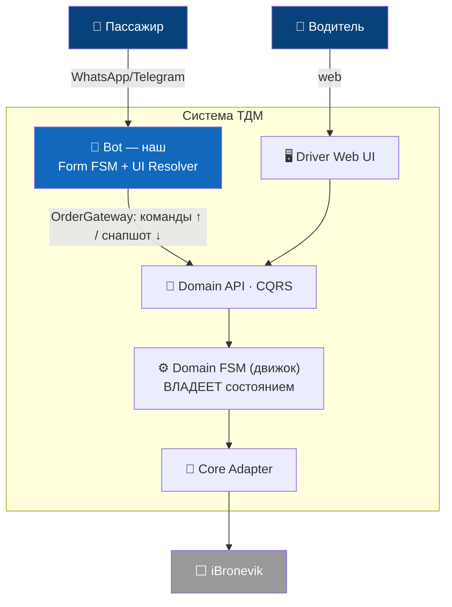

# Документация ТДМ

Индекс проектной документации.

> **Обновлено:** 2026-06-26 · ведёт: Павел (аналитика). История решений — [ROADMAP.md](ROADMAP.md) §0, [ADR-001](architecture-decision-variant3.md) §6.

## TL;DR — резюме проекта

**Цель.** Спроектировать **FSM интерфейса бота** (WhatsApp + Telegram) как чистый UI-слой над
**внешним FSM заказа**: бот **не владеет** бизнес-логикой и **никогда не вычисляет статус сам** — лишь
отражает доменное состояние, пришедшее с сервера.

**Архитектура — принята ([ADR-001](architecture-decision-variant3.md), Вариант 3).** Владелец состояния —
**серверный Domain FSM** на универсальном табличном FSM-движке (постаматный, дорабатывает @spitegod).
iBronevik — за Core-слоем, **не** источник истины. UI пассажира и водителя — **производные** (UI Resolver),
не хранятся как самостоятельная истина.

**FSM на едином движке ([ADR-001](architecture-decision-variant3.md) §2):** серверные — Domain Order,
Driver (домен + web-UI); ботовые — **WhatsApp Form** (Redis) и **Passenger UI Resolver** (проекция домена).

Container-уровень C4 (компактно). Полная версия + System Context — [ADR-001 §1а](architecture-decision-variant3.md).

**Статус.** Документация Этапов 1–6 — готова ✅; черновики JSON-схем — есть ✅. В работе 🟡: ядро серверного
FSM (strawman [order-fsm/fsm-core-design.md](order-fsm/fsm-core-design.md); RFC по развитию ядра отправлен
@spitegod — [order-fsm/fsm-engine-rfc.md](order-fsm/fsm-engine-rfc.md)).

**Ключевые блокеры** (полный список с владельцами — [open-questions.md](open-questions.md)).
1. Ответы @spitegod по RFC ядра (guard / effect / timer / context / registry) → затем синхронизация `fsm-core-design.md`.
2. Как бэкенд отдаёт состав кандидатов/предложений — в поллинге VOTE / OFFER / DIRECT **неразличимы**.
3. Утверждение кодовой базы заказчиком (рекомендация — MultiBot, [gap-analysis.md](gap-analysis.md) §4).
4. **Timer Worker** (no-show / expire) ещё не построен — таймерные переходы есть в графе, но в рантайме не срабатывают.

**Ближайшие шаги.** Ответы @spitegod → синхронизация `fsm-core-design.md` → подтверждение базы →
реализация по [implementation-plan.md](implementation-plan.md).

---

## План
- [ROADMAP.md](ROADMAP.md) — план проекта по этапам, ключевые решения, открытые вопросы.
- [open-questions.md](open-questions.md) — ⭐ сводный навигатор открытых вопросов: владельцы, приоритеты, ссылки.

## Этап 1 — Доменный фундамент ✅
- [domain/glossary.md](domain/glossary.md) — единый словарь терминов.
- [domain/order-model.md](domain/order-model.md) — доменная модель заказа.
- [domain/execution-models.md](domain/execution-models.md) — модели исполнения DIRECT / VOTE / OFFER + Carrier Determination.
- [domain/business-rules.md](domain/business-rules.md) — ⭐ бизнес-правила: стоимость (4 формы), оплата, отмена/завершение, инциденты (заказчик 2026-06-20).

## Этап 2 — Спецификация FSM заказа (внешний) ✅
- [order-fsm/backend-mapping.md](order-fsm/backend-mapping.md) — текущий бэкенд iBronevik (`b_state`+`c_state`) → доменная модель.
- [order-fsm/api-payload-reference.md](order-fsm/api-payload-reference.md) — ⭐ авторитетный контракт payload/actions API (из дампа серверного FSM).
- [order-fsm/states.md](order-fsm/states.md) — состояния и переходы (12 доменных состояний движка + наблюдаемый/целевой FSM).
- [order-fsm/fsm-core-design.md](order-fsm/fsm-core-design.md) — ⭐ strawman устройства серверного FSM-ядра: агрегаты, сущности, таблицы, переходы (команда/авто/таймер), таймеры, авто-действия. Предмет проектирования для @spitegod.
- [order-fsm/events.md](order-fsm/events.md) — каталог событий `order_status_*` + payload.
- [order-fsm/commands.md](order-fsm/commands.md) — команды бот → заказ.
- [order-fsm/timers.md](order-fsm/timers.md) — таймеры.

## Этап 3 — Контракт интеграции ✅
- [integration/order-gateway-contract.md](integration/order-gateway-contract.md) — порт `OrderGateway`, маппинг, гарантии доставки.
- [integration/bot-domain-api-contract.md](integration/bot-domain-api-contract.md) — ⭐ контракт B0: Бот ↔ Domain API (CQRS, snapshot, availableActions, fsmVersion). Согласован v1.
- [domain-api-contract.md](domain-api-contract.md) — дополнение к B0: версионирование, forward-совместимость, capabilities, коды ошибок/идемпотентность, разведение FSM-state vs ObservedState.

## Этап 4 — FSM интерфейса бота (основная задача) ✅
- [bot-fsm/dsl-spec.md](bot-fsm/dsl-spec.md) — DSL: состояния, validation, Guard, cross-flow, actions.
- [bot-fsm/event-model.md](bot-fsm/event-model.md) — единая модель событий UI / System / Domain.
- [bot-fsm/form-fsm.md](bot-fsm/form-fsm.md) — слой 1: сбор данных заказа.
- [bot-fsm/tracking-fsm.md](bot-fsm/tracking-fsm.md) — слой 3: сопровождение заказа (реакция на FSM заказа).

## Этап 5 — Gap-анализ и выбор базы ✅
- [gap-analysis.md](gap-analysis.md) — сравнение WATaxiBot vs MultiBot, рекомендация базы.

## Этап 6 — План реализации ✅
- [implementation-plan.md](implementation-plan.md) — блоки A–E, MVP-срез, граф зависимостей.

## Черновики схем (реализация спеки)
- [../schemas/](../schemas/) — `_init.json`, `form.json` (форма такси), `order.json` (сопровождение) — DSL MultiBot + Guard.

---

**Все 6 этапов документации завершены + черновики схем.** Дальше — утверждение базы заказчиком,
ответы бэкенд-команды (ветки VOTE/OFFER), переход к реализации по [implementation-plan.md](implementation-plan.md).
