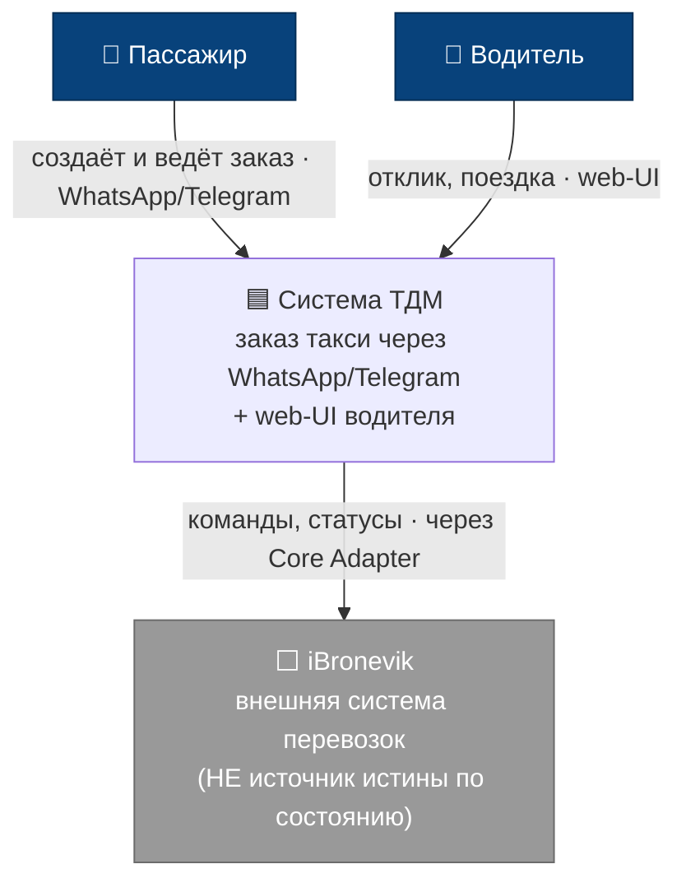
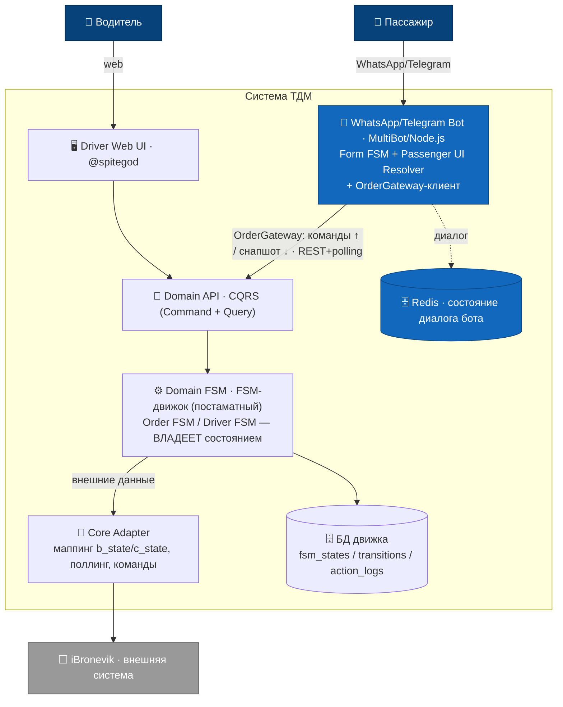

# ADR-001 — Целевая архитектура: серверный FSM-владелец состояния (Вариант 3)

> **Статус: ПРИНЯТО.** Подтверждено заказчиком (Валентин), 2026-06-24.
> Закрывает стратегическую развилку (блокер №2). Этот документ — источник истины по архитектурному
> разделению ответственности; затронутые доки ссылаются сюда.

---

## 1. Решение

Целевая архитектура — **Вариант 3** («постаматная»): владельцем состояния заказа является
**серверный Domain FSM**, работающий на **универсальном FSM-движке**. Движок не пишется с нуля и не
сводится к набору SQL-таблиц состояний — это существующая единая платформа (первоначально разработана
для доставки через постаматы), которую @spitegod дорабатывает под **Vote-заказ ТДМ** и **web-UI
водителя**. На этом движке будут работать Order FSM, Driver FSM и другие доменные автоматы.

```
WhatsApp / Web / Driver UI     ← каналы (наш WhatsApp-бот — здесь)
        ↓
       API                     ← серверный API (контракт, который потребляет бот)
        ↓
   Domain FSM                  ← Order FSM / Driver FSM. ВЛАДЕЕТ состоянием. На FSM-движке.
        ↓
      Core                     ← Core Adapter: интеграция внешних систем
        ↓
   iBronevik                   ← внешняя система. НЕ источник истины по состоянию заказа.
```

**Инварианты:**
- iBronevik интегрирован через **Core-слой** и не является источником истины по состоянию заказа.
- WhatsApp / Web / Driver UI работают через **единый серверный FSM** и **не содержат** собственной
  логики жизненного цикла заказа.
- UI-состояния пассажира и водителя — **производные**: вычисляются из доменных состояний через
  **UI Resolver**, а не хранятся как самостоятельная истина в БД.

**Что это закрывает:** прежняя развилка «бот ходит в серверный FSM vs напрямую в iBronevik» решена в
пользу серверного FSM. Бот **не** поллит `b_state`, **не** маппит статусы iBronevik, **не** держит
бизнес-логику заказа.

---

## 1а. Архитектура в нотации C4 (Context + Container)

Та же модель, что и пайплайн выше (§1), в нотации [C4](https://c4model.com): кто пользуется системой
(Context) и из каких блоков она состоит (Container). Компактная версия — в [README §TL;DR](README.md).

**Уровень 1 — System Context.** Кто и зачем взаимодействует с ТДМ.



**Уровень 2 — Container.** Из чего состоит ТДМ и кто чем владеет (см. §2–3).



> **Зоны ответственности:** синим (`bot`, `redis`) — **наш WhatsApp-бот** (Form FSM + UI Resolver,
> §3); остальное внутри ТДМ — **сервер** (@spitegod): Domain FSM владеет состоянием, Core Adapter
> прячет iBronevik. Бот ходит **только** в Domain API, не в iBronevik напрямую (инвариант §1).

---

## 2. Пять FSM и кто чем владеет

Свод доменных состояний (формулировки заказчика, диалог 2) с нашими доками:

| FSM (каноника заказчика) | Наш документ | Владелец | Хранение | Статус для нас |
|---|---|---|---|---|
| **Domain Order FSM** | `order-fsm/states.md` (+events/commands/timers) | сервер | БД (движок) | наш `states.md` = *предлагаемая каноника*, свести с реальными состояниями движка |
| **Driver UI FSM** | — (вне нашего scope) | сервер (@spitegod) | производное, без БД | вне зоны бота; web-UI водителя делает @spitegod |
| **Passenger UI FSM** | `bot-fsm/tracking-fsm.md` | **бот** | производное, без БД | переосмыслить как **UI Resolver** (проекция), не авторитетный трекинг |
| **WhatsApp Form FSM** | `bot-fsm/form-fsm.md` | **бот** | Redis (это диалог) | без изменений — остаётся нашим ✅ |

Имена доменных состояний у заказчика «почти каноничны» — задача: свести `order-fsm/states.md` с
фактическими состояниями движка (когда @spitegod даст их перечень / по дампу `vote_fsm`).

---

## 3. Зона ответственности бота (WhatsApp-канал)

**Остаётся за ботом:**
1. **WhatsApp Form FSM** — диалог сбора параметров заказа (`form.json`). Персистится в Redis. ✅ C2/C3.
2. **Passenger UI Resolver** — чистая проекция доменного состояния заказа (из API) в сообщения/кнопки
   WhatsApp. Состояние пассажирского UI **вычисляется**, не хранится как истина.
   `bot-fsm/tracking-fsm.md` — спецификация этого резолвера.
3. **Клиент серверного API** — исходящий порт `OrderGateway`: шлёт намерения/события пользователя
   ВВЕРХ, получает доменные состояния ВНИЗ.

**Уходит на сервер (@spitegod / backend), вне зоны бота:**
- **Domain Order FSM** (на FSM-движке) — владеет состоянием.
- **Driver FSM + Driver Web UI.**
- **Core Adapter** — интеграция iBronevik: маппинг `b_state`/`c_*`, поллинг, команды
  `set_offer`/`set_performer`, идемпотентность доставки. Наши `order-fsm/backend-mapping.md`,
  `order-fsm/api-payload-reference.md` и находки `driver-emulator` — **спецификация** для этого
  Core Adapter, а не код бота.

**Усиление инварианта:** раньше «бот не вычисляет статус, а отражает события поллинга». Теперь — ещё
строже: бот не поллит и не выводит события сам; сервер владеет состоянием, бот рендерит то, что отдал
API.

---

## 4. Влияние на план реализации (Этап 6)

| Блок | Было (Вариант 2) | Стало (Вариант 3) |
|---|---|---|
| **A** (движок A1/A3 ✅) | ядро FSM бота | без изменений — питает Form FSM и логику UI Resolver |
| **B1** `OrderGateway`-порт | фасад над iBronevik | остаётся как **исходящий порт бота**, но за ним — **серверный API**, не iBronevik |
| **B2** адаптер iBronevik | в боте (`deriveEvent`, `b_state`-маппинг) | **уходит на сервер** в Core Adapter. В боте — тонкий *server-API adapter* (когда API готов) |
| **B3** OrderSnapshot | собирать из сырого поллера | доменное представление приходит из **API**, бот не деривит |
| **B4/B5** реестр/доставка | в боте | преимущественно серверные заботы (FSM-движок) |
| **C1** tracking → `order.json` | авторитетный трек | **Passenger UI Resolver** (проекция домена) |
| **C2/C3** form + mode ✅ | наш Form FSM | без изменений — остаётся нашим |
| **C4** расчёт `Actual` 🟡 | в боте | ⚠️ это **доменное** вычисление → вероятно **серверная** сторона; бот рендерит. Уточнить (см. §5) |
| **C5** ветки VOTE/OFFER | поверх снапшота из поллера | поверх доменного состояния из API |

**Новый критический артефакт — контракт Бот↔API:** какие события бот шлёт ВВЕРХ (намерения
пассажира: подтвердить, отменить, задать pickup fee, принять цену OFFER…) и какое представление
доменного состояния API отдаёт ВНИЗ для UI Resolver. Проектируется **совместно с @spitegod**.

Roadmap-направление подтверждено заказчиком:
**домен → адаптация FSM-движка → Order FSM → Driver FSM → Core Adapter → каналы.**

---

## 5. Координационные вопросы — ✅ ЗАКРЫТЫ (@spitegod + Валентин, 2026-06-24)

Все 4 вопроса отвечены. Решения зафиксированы в контракте B0 →
[integration/bot-domain-api-contract.md](integration/bot-domain-api-contract.md).

1. **Тайминг / интерим — ✅ принят (б).** `OrderGateway` как исходящий порт бота допустим как интерим,
   **но его интерфейс сразу = будущий контракт Domain API, а не iBronevik** (требование @spitegod).
   Под портом временно может стоять адаптер iBronevik; при готовности API порт перенаправляется без
   изменения FSM бота. Сроков точных нет — @spitegod заканчивает ORM + action-слой.
2. **Контракт Бот↔API — ✅ согласован (черновик v1).** **CQRS-раздел** (Command API меняет состояние /
   Query API читает снапшот). Старт: REST + поллинг `GET /orders/{id}`; push — следующий этап. Полный
   перечень endpoints, payload создания и схема снапшота — в контракте B0. Ключевые правила Валентина:
   сервер отдаёт только доменный `state` (UI-каунику считает бот), `availableActions` — **обязательное**
   поле (ведёт рендер кнопок без знания ботом бизнес-правил), +`fsmVersion`, структурированные
   `candidates/offers`.
3. **Ценообразование — ✅ Core.** Расчёт цены живёт в **Core** (доменный сервис ценообразования), НЕ в
   FSM-процедуре и НЕ в канале. FSM только **фиксирует** посчитанные значения; бот только **рендерит**.
   → наш `actualPrice.ts` — не доменный код бота, а **спецификация** алгоритма `Actual` для Core.
4. **Состояния движка — ✅ получены (12).** Фактический перечень + маппинг на UI-каноники сведён 1:1 →
   [order-fsm/states.md](order-fsm/states.md) §1a. Добавлен новый UI-статус `NO_SHOW`
   (`order_vote_no_show`). Режимы DIRECT/VOTE/OFFER в Domain FSM — **разные ветки** (различимы, в
   отличие от сырого поллинга iBronevik).

**Новые инварианты (из ответов):**
- Сервер отдаёт **только доменный `state`**, не `uiState` — UI-проекция целиком на боте.
- `availableActions` — **источник истины по разрешённым действиям**; бот не реплицирует бизнес-правила.
- **Цена — в Core**: ни FSM, ни канал её не считают.

---

## 6. История

- 2026-06-24 — заказчик подтвердил Вариант 3 + доступность FSM-движка (@spitegod дорабатывает под
  Vote-заказ ТДМ и web-UI водителя). ADR создан, блокер №2 закрыт.
- 2026-06-24 (позже) — @spitegod ответил на 4 координационных вопроса, Валентин дал 7 уточнений.
  §5 закрыт; создан контракт B0 ([integration/bot-domain-api-contract.md](integration/bot-domain-api-contract.md)),
  `states.md` §1a сведён с фактическими состояниями движка, ценообразование закреплено за Core.
