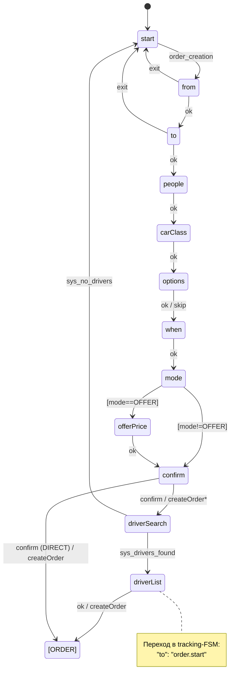

# FSM формы (слой 1) — сбор данных заказа

> Per-channel FSM: собирает у клиента параметры заказа и завершается командой `createOrder`.
> Содержит **только** сбор данных и навигацию — никакой логики жизненного цикла заказа.
> Опирается на доменную модель ([../domain/order-model.md](../domain/order-model.md)) и реальный DSL
> MultiBot (`main.json`); очищена от «протечек» домена ([dsl-spec.md](dsl-spec.md) §2).
>
> Прообраз в коде: WATaxiBot `orderMachine.ts` (collectionFrom…confirm), MultiBot `main.json`.

---

## 1. Состояния формы (такси, все 3 модели)

| Состояние | Что собирает | Память |
|---|---|---|
| `form.start` | Меню: создать заказ / настройки / помощь | — |
| `form.from` | Точка отправления (гео/адрес) | `order.from` |
| `form.to` | Точка назначения | `order.to` |
| `form.people` | Количество мест | `order.peopleCount` |
| `form.carClass` | Класс авто (PETIT/GRAND/ANY) | `order.carClass` |
| `form.options` | Доп. требования (requirements) | `order.requirements[]` |
| `form.when` | Тип подачи NOW/LATER + время | `order.dispatchType`, `order.when` |
| `form.mode` | Режим: DIRECT / VOTE / OFFER | `order.mode` |
| `form.offerPrice` | (только OFFER) желаемая цена | `order.clientPrice` |
| `form.confirm` | Подтверждение заказа | — |
| `form.driverSearch` | Ожидание результата поиска | `order.input.waitingForDrivers` |
| `form.driverList` | (VOTE/адресный) выбор водителя из списка | `order.input.driversMap` |

> `form.*` = переименованный `main.*` из текущего кода — чтобы имя отражало назначение (форма),
> а не «основное флоу». Doc-flow (оферта/политика) — отдельный под-flow, как в main.json (`docs*`).

---

## 2. Поток (happy path + ветвление по режиму)



> **Где именно ветвится режим (как в `schemas/form.json`, проверено `tests/test_form_fsm.ts`):**
> - на `form.mode` выбор пользователя (1/2/3) маппится валидацией в РАЗНЫЕ события
>   (`mode_direct`/`mode_vote` → `form.confirm`, `mode_offer` → `form.offerPrice`) — guard здесь не нужен,
>   событие само несёт выбор;
> - **guard** ([dsl-spec.md](dsl-spec.md) §3) стоит на `form.confirm` и разводит СЦЕНАРИЙ СОЗДАНИЯ:
>   `{ "event": "confirm", "guard": "order.mode == 'DIRECT'", "to": "form.driverSearch" }` (бот ищет водителя)
>   vs `{ "event": "confirm", "guard": "order.mode != 'DIRECT'", "to": "order.start" }` (прямое создание, VOTE/OFFER).

---

## 3. Где создаётся заказ и начинается сопровождение

Два сценария (как в текущем коде):

1. **DIRECT (поиск водителя ботом):** `confirm` → `startDriverSearch` (System).
   - `sys_drivers_found` → `form.driverList` → клиент выбирает → `createOrder` → **`order.start`** (tracking).
   - `sys_no_drivers` → возврат в `form.start`.
2. **Прямое создание (VOTE/адресный):** `confirm` → `createOrder` → **`order.start`** сразу
   (водители откликаются уже на созданный заказ).

> Какой сценарий — зависит от режима и наличия `preferredDriversList` (в коде: `b_only_offer=1`).
> Точная развилка финализируется после ответа бэкенда (backend-mapping §6). Сейчас: DIRECT через
> driverSearch (как `main.json`), VOTE/OFFER — прямое создание.

Переход `form.* → order.start` — **cross-flow** (см. [dsl-spec.md](dsl-spec.md) §1), отдаёт управление
[tracking-fsm.md](tracking-fsm.md).

---

## 4. Память формы (Memory, не State)

Всё, что собрала форма, лежит в `order.input.*` / `order.*` (см. gpt1: это Memory, а не состояния):
```
order.from, order.to, order.via[]
order.peopleCount, order.carClass
order.requirements[]            // вместо additionalOptions-числовых кодов
order.dispatchType, order.when
order.mode                      // DIRECT | VOTE | OFFER
order.clientPrice               // OFFER
order.input.preferredDriversList, order.input.driversMap
```
> Доменная очистка: текущие `additionalOptions: number[]` + `additionalOptionsTokenMap` в validation
> (main.json `options`) → заменить на `requirements[]` с кодами из доменной модели
> ([../domain/order-model.md](../domain/order-model.md) §2.4), справочник вынести из движка.

---

## 5. Навигация и отмена
- В любом состоянии сбора: `0` → `exit` → возврат в `form.start` (как сейчас).
- `9` → `help` (контекстная подсказка).
- Невалидный ввод → `error` → повтор состояния с подсказкой.
- `back` (шаг назад) — желательное улучшение (сейчас нет); опционально на Этапе 6.

---

## 6. Очистка от UI
Тексты/кнопки/порядок — через `sendL10n`/`send*` actions и l10n-ключи (`wab_*`), не в структуре FSM.
Структура формы стабильна; представление меняется без изменения переходов.
