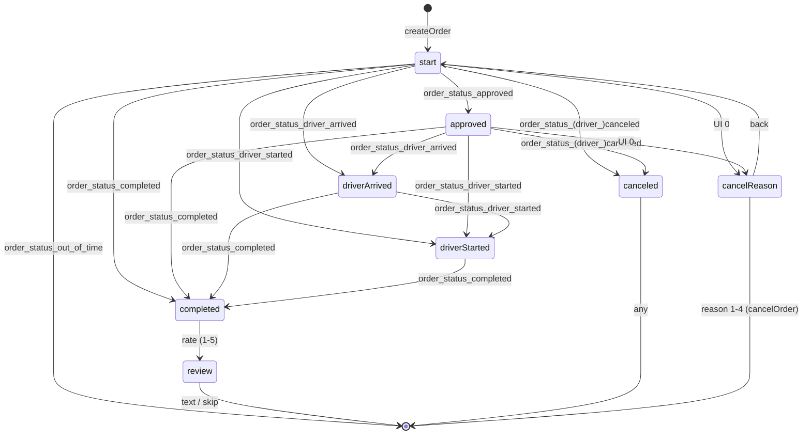

# FSM сопровождения (слой 3) — реакция на FSM заказа

> **Основная задача проекта.** FSM, которая после создания заказа подписывается на доменные события
> внешнего FSM заказа ([../order-fsm/events.md](../order-fsm/events.md)) и отражает их клиенту. Никакой
> бизнес-логики заказа — только представление и навигация по под-диалогам (отмена, рейтинг, выбор).
>
> Прообраз в коде: MultiBot `order.json` (полностью разобран), WATaxiBot `observer/order.ts`.
> Вход — cross-flow из [form-fsm.md](form-fsm.md) (`order.start`). Источник событий —
> [../integration/order-gateway-contract.md](../integration/order-gateway-contract.md).

---

## 1. Состояния сопровождения (наблюдаемый трек — реализуем сейчас)

| Состояние | Вход (Domain event) | Что показывает клиенту | UI-события |
|---|---|---|---|
| `order.start` | createOrder / `order_status_processing` | «Ищем водителя…» | `0`→отмена |
| `order.approved` | `order_status_approved` | Водитель назначен (имя/авто/номер) | `0`→отмена |
| `order.driverArrived` | `order_status_driver_arrived` | «Водитель прибыл» | `0`→отмена |
| `order.driverStarted` | `order_status_driver_started` | «Поездка началась» | `0`→отмена |
| `order.completed` ⛔ | `order_status_completed` | Итог + запрос рейтинга (1–5) | рейтинг / skip |
| `order.review` | (после рейтинга) | Запрос отзыва | текст / skip |
| `order.canceled` ⛔ | `order_status_canceled` / `_driver_canceled` | «Заказ отменён» | любое → меню |
| `order.cancelReason` | UI `0` из любого активного | Список причин отмены | 1–4 / назад |
| (→ EXPIRED) | `order_status_out_of_time` | «Время истекло» → меню | — |

⛔ — после терминального события и закрытия под-диалога → возврат в `form.start`/`main.default`.

> Это 1:1 фактический `order.json` MultiBot (start/approved/driverArrived/driverStarted/completed/
> review/canceled/cancelReason). Подтверждено чтением кода.

---

## 2. Диаграмма (наблюдаемый трек)

> Важно: каждое активное состояние принимает события «через шаг» (поллинг может перепрыгнуть статус) —
> напр. `start → completed` напрямую. Это уже отражено в order.json (у `start` есть переход на
> `completed`/`canceled`). Соответствует правилу «пропуски» из контракта интеграции (§5).

---

## 3. Под-диалог отмены (cancelReason)

UI-событие `0` в активных состояниях (`start`/`approved`/`driverArrived`/`driverStarted`) ведёт в
`order.cancelReason` (выбор причины 1–4 → `cancelOrderWithReason`; `01` → назад к исходному состоянию).

> В order.json возврат «назад» реализован событиями `cancel_back_to_*` — после отмены под-диалога
> вернуться в то состояние заказа, откуда пришли. Это пример **сохранения контекста** при асинхронных
> Domain-событиях (см. §5).

---

## 4. Ветки VOTE / OFFER (расширение — зависит от бэкенда)

Наблюдаемый трек **режим-агностичен** (backend-mapping §6): по статусу VOTE/OFFER/DIRECT неразличимы.
Ветки выбора — поверх **чтения состава** из снимка заказа (`OrderSnapshot.candidates/offers`):

| Состояние (расширение) | Условие (guard) | Действие |
|---|---|---|
| `order.candidateList` | `snapshot.candidates.length > 0` (VOTE) | Показать кандидатов; выбор → `selectCandidate` |
| `order.offerList` | `snapshot.offers.length > 0` (OFFER) | Показать предложения; выбор → `selectOffer` |
| `order.boarding` | внешний водитель (VOTE) | Показать/ввести код посадки → `confirmBoarding` |

Эти состояния входят между `start` и `approved` (когда состав приходит) и используют команды из
[../order-fsm/commands.md](../order-fsm/commands.md). **Активируются после ответа бэкенд-команды** на 4
вопроса (ROADMAP §4). До тех пор — проектное допущение; базовый трек (§1) от них не зависит.

> votingTimer (продление +3 мин, уведомление при ≤30с) — System-события сопровождения в режиме VOTE
> (см. [../order-fsm/timers.md](../order-fsm/timers.md)).

---

## 5. Обработка асинхронных Domain-событий и гонок

Domain-события приходят из `OrderGateway` независимо от того, в каком под-диалоге пользователь.

Правила:
- **Не терять Domain-события.** Если в текущем состоянии нет перехода по пришедшему `order_status_*`,
  применять fallback: завершить под-диалог и перейти по событию (напр. пользователь в `cancelReason`,
  а пришёл `order_status_completed` → выйти из под-диалога в `order.completed`).
- **Идемпотентность отрисовки.** Повторный `order_status_*` того же типа (после дедупа Gateway —
  редкость) не дублирует сообщение (флаг «уже показано» в памяти; ср. `sendOrderProcessing unconditional`).
- **Терминальность.** После `completed/canceled/expired` + закрытия под-диалога рейтинга/отзыва —
  `clearOrderData` и возврат в меню.

---

## 6. Что переиспользуем из кода
- `order.json` (MultiBot) — почти готовая реализация наблюдаемого трека (§1–3).
- `observer/order.ts` (WATaxiBot) — логика отрисовки водителя/цены, voting-уведомления (перенести в
  actions, отделив представление от вычислений — рекомендация gpt2/анализа).

---

## 7. Инвариант (главный принцип проекта)
FSM сопровождения **не вычисляет** статус заказа и не хранит бизнес-логику. Она:
1. слушает нормализованные Domain-события из `OrderGateway`;
2. меняет состояние представления;
3. шлёт клиенту сообщения (actions) и команды заказу (`cancelOrder`, `selectCandidate`, `setRate`…).

Это и есть «FSM интерфейса бота, взаимодействующий с чужим FSM заказа».
