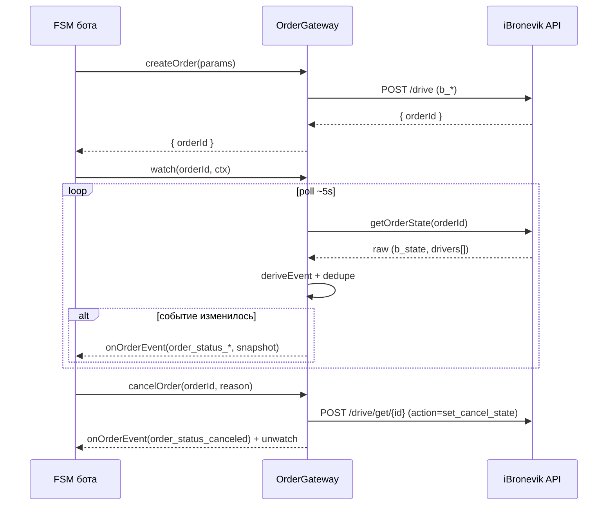

# Контракт интеграции: OrderGateway (бот ↔ FSM заказа)

> 🏛 **Архитектура (ADR-001, Вариант 3) + контракт B0 (@spitegod/Валентин, 2026-06-24).**
> ⚠️ **Главное обновление:** интерфейс `OrderGateway` теперь **зеркалит будущий серверный Domain API**
> ([bot-domain-api-contract.md](bot-domain-api-contract.md)), а **не** iBronevik (требование @spitegod:
> «интерфейс OrderGateway должен сразу повторять будущий контракт domain api, а не iBronevik»).
> Адаптер iBronevik (поллинг `b_state`, `deriveEvent`, `set_offer`) — лишь **интерим-реализация под
> портом** до готовности серверного API; всё это в целевой архитектуре уходит на сервер в **Core
> Adapter**, а не в бот. Когда API готов — порт перенаправляется на него без изменения FSM бота.
>
> Опирается на: **[bot-domain-api-contract.md](bot-domain-api-contract.md)** (истина по форме),
> [../order-fsm/states.md](../order-fsm/states.md), [../order-fsm/commands.md](../order-fsm/commands.md).
> Прообраз в коде — `OrderManager` (MultiBot), но как интерим-адаптер, не как форма порта.

---

## 1. Назначение

Бот общается с заказом только через `OrderGateway` — порт, **зеркалящий Domain API** (CQRS):
- **команды** (бот → сервер, Command API): создать, отменить, выбрать кандидата/предложение, задать
  pickup fee, подтвердить посадку, рейтинг.
- **состояние** (сервер → бот, Query API): **снапшот** заказа по `orderId` (доменный `state` +
  `availableActions` + driver/candidates/offers/price). Из снапшота бот сам выводит `order_status_*`
  как system-events в FSM (через diff с прошлым снапшотом).

Под портом в **интериме** живёт адаптер iBronevik (`b_*`/`c_*`/`set_offer`, `deriveEvent`); в целевой
архитектуре под портом — **HTTP-клиент серверного API**, а маппинг iBronevik уходит в серверный Core
Adapter. FSM бота про `b_state` не знает ни в одном из случаев.

```
интерим:  FSM бота ──command──► OrderGateway ──► [Adapter iBronevik] ──► iBronevik
          FSM бота ◄──snapshot── OrderGateway ◄── [Poller: deriveEvent] ◄── iBronevik
цель:     FSM бота ──command──► OrderGateway ──► [HTTP] ──► Domain API (Command)
          FSM бота ◄──snapshot── OrderGateway ◄── [poll GET /orders/{id}] ◄── Domain API (Query)
```

---

## 2. Интерфейс (= Domain API, см. bot-domain-api-contract.md)

Методы 1:1 с endpoints контракта B0. **Command API:**

```ts
interface OrderGateway {
  // Command API (намерения пассажира → сервер)
  createOrder(params: CreateOrderPayload): Promise<{ orderId: string }>;  // POST /orders
  cancelOrder(orderId: string, reason?: string): Promise<void>;           // POST /orders/{id}/cancel
  selectCandidate(orderId: string, driverUserId: string): Promise<void>;  // VOTE  POST .../candidates/{driverUserId}/select
  releaseCandidate(orderId: string): Promise<void>;                       // VOTE  POST .../candidates/release
  selectOffer(orderId: string, driverUserId: string): Promise<void>;      // OFFER POST .../offers/{driverUserId}/select
  setPickupFee(orderId: string, amount: number): Promise<void>;           // POST .../pickup-fee
  confirmBoarding(orderId: string, code?: string): Promise<void>;         // POST .../boarding/confirm
  rate(orderId: string, rating: number, review?: string): Promise<void>;  // POST .../rating

  // Query API (доменное состояние → бот)
  getSnapshot(orderId: string): Promise<OrderSnapshot>;                   // GET /orders/{id}

  // наблюдение (интерим: поллинг GET /orders/{id}; цель: + push)
  watch(orderId: string, ctx: WatchContext): void;
  unwatch(orderId: string): void;
  // дифф снапшота → колбэк onOrderEvent(event), заданный при инициализации
}

interface OrderEvent {
  orderId: string;
  event: OrderStatusEvent;          // выведено из diff снапшота (events.md)
  snapshot: OrderSnapshot;          // полный снапшот контракта B0 (см. §4)
  occurredAt: string;               // ISO; ставится при доставке (не в скрипте)
  seq?: number;                     // монотонный номер для упорядочивания
}

interface WatchContext { botId: string; chatId: string; userId: string; lang?: string;
                         maxWaitingSecs?: number; idField?: Record<string,string>; }
```

> `CreateOrderPayload` и `OrderSnapshot` — ровно из [bot-domain-api-contract.md](bot-domain-api-contract.md)
> §2–3 (B0 — истина по форме). Замена транспорта (поллинг → push) = замена реализации `watch`; сигнатуры
> и FSM бота не меняются. Переход интерим → цель = замена реализации под портом, не сигнатур.

---

## 3. Маппинг статусов (вынесен в конфиг адаптера)

Таблица `b_state`+`c_*` → `order_status_*` (см. [../order-fsm/backend-mapping.md](../order-fsm/backend-mapping.md) §2–5)
живёт **в адаптере iBronevik**, а не в FSM бота. Это позволяет:
- менять бэкенд, переписав только таблицу/адаптер;
- тестировать FSM бота на фейковом gateway.

---

## 4. OrderSnapshot — форма из контракта B0

Снапшот — **ровно** структура из [bot-domain-api-contract.md](bot-domain-api-contract.md) §3
(сервер — истина). Ключевые поля:

```ts
interface OrderSnapshot {
  fsmVersion: number;                   // версия графа состояний движка
  orderId: string;
  mode: 'DIRECT' | 'VOTE' | 'OFFER';
  state: DomainOrderState;              // order_created | order_vote_waiting_candidates | ... (12 шт.)
  availableActions: string[];           // ОБЯЗАТЕЛЬНО — ведёт рендер кнопок (бот не знает бизнес-правил)
  driver: { driverUserId: string; driverName?: string; vehicle?: string } | null;
  candidates: Array<{ driverUserId: string; driverName?: string; vehicle?: string }>;  // VOTE
  offers: Array<{ driverUserId: string; driverName?: string; vehicle?: string; price?: number; eta?: string; comment?: string }>; // OFFER
  price: { estimated?: number; pickupFee?: number; minimumRidePrice?: number; actual?: number | null; currency?: string };
  paymentStatus: string;
  updatedAt: string;
}
```

- **`uiState` сервер НЕ отдаёт** — UI-каноника (`SEARCHING`…) вычисляется ботом (UI Resolver,
  [../order-fsm/states.md](../order-fsm/states.md) §1a).
- **Цена** приходит готовой (считает Core); бот не считает.
- В **интериме** адаптер iBronevik наполняет эти поля из сырого ответа: кандидаты = `drivers[]` где
  `c_state==1`, цена/eta/коммент оффера = их `c_options.{performers_price,driver_offer_eta,
  driver_offer_comment}` (backend-mapping §3, §6); ключ выбора (VOTE и OFFER) = `driverUserId` (`u_id`),
  отдельного `offerId` нет.

---

## 5. Гарантии доставки (правила для адаптера)

| Свойство | Правило |
|---|---|
| **Дедупликация** | Эмитить только при изменении относительно `lastEmittedEvent` (как сейчас). |
| **Терминальность** | После `COMPLETED/CANCELLED/EXPIRED/DRIVER_CANCELED` — `unwatch`. |
| **Идемпотентность команд** | Повтор `cancelOrder` на терминальном — без эффекта. |
| **Упорядочивание** | `seq`/`occurredAt`; FSM бота игнорирует событие «назад» по треку. |
| **Пропуски** | Поллинг может «перепрыгнуть» промежуточный статус — FSM сопровождения должен принимать переход через несколько шагов (напр. SEARCHING→IN_RIDE). |
| **Восстановление после рестарта** | ⚠️ Сейчас реестр наблюдения — в памяти процесса; при рестарте теряется. Цель — персистить активные заказы (Redis), чтобы поллинг продолжился. |

---

## 6. Жизненный цикл (sequence)



---

## 7. Соответствие текущему коду (что переиспользуем)

| Контракт | Текущая реализация (MultiBot) |
|---|---|
| `watch/unwatch/poll` | `OrderManager.registerOrder/unregisterOrder/tick` |
| `deriveEvent` | `OrderManager.deriveEvent` |
| `onOrderEvent` | `config.onSystemEvent` → `Orchestrator.emitSystemEvent` → FSM transition |
| `createOrder`/`cancelOrder` | `OrderActions` / `order.json` action `cancelOrder` (`/drive/cancel`) |
| таймауты | `OrderManager.isOutOfTime` |

→ `OrderGateway` — это **рефакторинг `OrderManager` в явный порт** + вынос маппинга в адаптер +
обогащение снимком + персистентность. Детали — Этап 6.

---

## Открытые вопросы
- ✅ Чтение состава кандидатов/предложений для `snapshot.candidates/offers` — `drivers[]` + `c_options` (backend-mapping §3, §6).
- ✅ `updatePickupLocation` — отдельной команды на бэкенде нет; из контракта убираем (или отдельно к бэкенду).
- Персистентность реестра наблюдения (Redis) — обязательна для надёжности при рестарте (без изменений).
- ⏳ Уточнить у бэкенда отдельную семантику принятия оффера/контр-цены, помимо `set_performer`.
