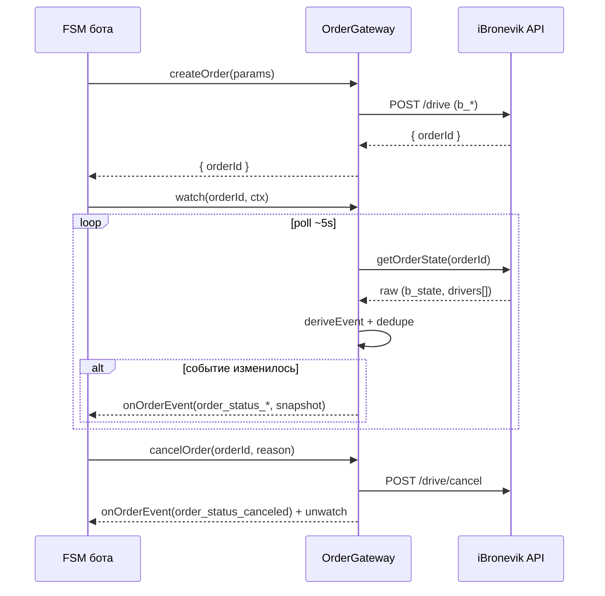

# Контракт интеграции: OrderGateway (бот ↔ FSM заказа)

> Абстрактный порт, изолирующий FSM бота от реализации внешнего FSM заказа.
> Решения заказчика: транспорт — **поллинг**, бэкенд — **текущий iBronevik**. Контракт спроектирован
> так, чтобы поллинг можно было заменить на webhook/WS без изменения FSM бота.
>
> Опирается на: [../order-fsm/events.md](../order-fsm/events.md), [../order-fsm/commands.md](../order-fsm/commands.md),
> [../order-fsm/backend-mapping.md](../order-fsm/backend-mapping.md). Прообраз в коде — `OrderManager` (MultiBot).

---

## 1. Назначение

Бот общается с заказом только через `OrderGateway`:
- **команды** (бот → заказ): создать, отменить, выбрать кандидата/предложение, подтвердить посадку…
- **события** (заказ → бот): нормализованные `order_status_*` (как system-events в FSM).

Внутри `OrderGateway` живёт **адаптер бэкенда** (iBronevik), который переводит нормализованные
команды/события в `b_*`/`c_*`/`set_offer` и обратно. FSM бота про `b_state` ничего не знает.

```
FSM бота ──command──► OrderGateway ──► [Adapter iBronevik] ──► API
FSM бота ◄──event──── OrderGateway ◄── [Poller: deriveEvent] ◄── API (polling ~5s)
```

---

## 2. Интерфейс (нормализованный, транспорт-агностичный)

```ts
interface OrderGateway {
  // команды (см. order-fsm/commands.md)
  createOrder(params: OrderParams): Promise<{ orderId: string }>;
  cancelOrder(orderId: string, reason: string): Promise<void>;
  selectCandidate(orderId: string, driverId: string): Promise<void>;   // VOTE
  selectOffer(orderId: string, offerId: string): Promise<void>;        // OFFER
  confirmBoarding(orderId: string, code: string): Promise<void>;       // VOTE/внешний
  setRate(orderId: string, rate: number): Promise<void>;
  setReview(orderId: string, text: string): Promise<void>;

  // наблюдение (события)
  watch(orderId: string, ctx: WatchContext): void;    // поставить на наблюдение
  unwatch(orderId: string): void;
  // доставка событий — через колбэк, заданный при инициализации:
  // onOrderEvent(event: OrderEvent): Promise<void>
}

interface OrderEvent {
  orderId: string;
  event: OrderStatusEvent;          // order_status_* (events.md)
  snapshot?: OrderSnapshot;         // рекомендуемое обогащение (см. §4)
  occurredAt: string;               // ISO; ставится при доставке (не в скрипте)
  seq?: number;                     // монотонный номер для упорядочивания
}

interface WatchContext { botId: string; chatId: string; userId: string; lang?: string;
                         maxWaitingSecs?: number; idField?: Record<string,string>; }
```

> Замена транспорта = замена реализации `watch`/поллера (Poller → WebhookReceiver → WSClient).
> Сигнатуры команд/событий и FSM бота не меняются.

---

## 3. Маппинг статусов (вынесен в конфиг адаптера)

Таблица `b_state`+`c_*` → `order_status_*` (см. [../order-fsm/backend-mapping.md](../order-fsm/backend-mapping.md) §2–5)
живёт **в адаптере iBronevik**, а не в FSM бота. Это позволяет:
- менять бэкенд, переписав только таблицу/адаптер;
- тестировать FSM бота на фейковом gateway.

---

## 4. Обогащение события снимком (OrderSnapshot) — рекомендация

Сейчас payload минимален (`{orderId}`), и FSM-actions дочитывают детали из API (лишние запросы,
гонки). Предлагается в момент эмита прикладывать снимок:

```ts
interface OrderSnapshot {
  state: OrderObservedState;            // SEARCHING | ASSIGNED | ...
  driver?: { name?: string; phone?: string; car?: string; plate?: string };
  price?: { estimated?: number; final?: number };
  candidates?: Array<{ driverId: string; ... }>;   // VOTE (когда бэкенд отдаёт)
  offers?: Array<{ offerId: string; driverId: string; price: number }>; // OFFER
  pickup?: { requested?: Location; actual?: Location };
}
```
Поллер уже держит сырой ответ API — наполнить снимок дешево.

---

## 5. Гарантии доставки (правила для адаптера)

| Свойство | Правило |
|---|---|
| **Дедупликация** | Эмитить только при изменении относительно `lastEmittedEvent` (как сейчас). |
| **Терминальность** | После `COMPLETED/CANCELLED/EXPIRED/DRIVER_CANCELED` — `unwatch`. |
| **Идемпотентность команд** | Повтор `cancelOrder` на терминальном — без эффекта. |
| **Упорядочивание** | `seq`/`occurredAt`; FSM бота игнорирует событие «назад» по треку. |
| **Пропуски** | Поллинг может «перепрыгнуть» промежуточный статус — FSM сопровождения должен принимать переход через несколько шагов (напр. SEARCHING→IN_RIDE). |
| **Восстановление после рестарта** | ⚠️ Сейчас реестр наблюдения — в памяти процесса; при рестарте теряется. Цель — персистить активные заказы (Redis), чтобы поллинг продолжился. |

---

## 6. Жизненный цикл (sequence)



---

## 7. Соответствие текущему коду (что переиспользуем)

| Контракт | Текущая реализация (MultiBot) |
|---|---|
| `watch/unwatch/poll` | `OrderManager.registerOrder/unregisterOrder/tick` |
| `deriveEvent` | `OrderManager.deriveEvent` |
| `onOrderEvent` | `config.onSystemEvent` → `Orchestrator.emitSystemEvent` → FSM transition |
| `createOrder`/`cancelOrder` | `OrderActions` / `order.json` action `cancelOrder` (`/drive/cancel`) |
| таймауты | `OrderManager.isOutOfTime` |

→ `OrderGateway` — это **рефакторинг `OrderManager` в явный порт** + вынос маппинга в адаптер +
обогащение снимком + персистентность. Детали — Этап 6.

---

## Открытые вопросы
- Чтение состава кандидатов/предложений для `snapshot.candidates/offers` (backend-mapping §6).
- Персистентность реестра наблюдения (Redis) — обязательна для надёжности при рестарте.
- Нужна ли команда `updatePickupLocation` (изменение точки до старта).
