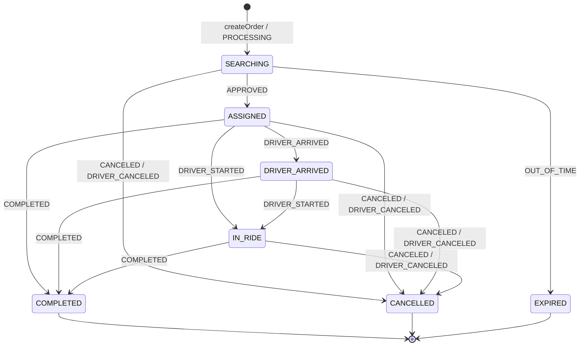

# FSM заказа (внешний) — состояния и переходы

> 🏛 **Архитектура (ADR-001, Вариант 3):** этот FSM = **Domain Order FSM**, владелец состояния —
> **сервер** (на FSM-движке, дорабатывает @spitegod), не iBronevik. Бот его НЕ владеет и НЕ вычисляет.
> iBronevik — за Core-слоем. Маппинг `b_state`/`c_*` ниже — спецификация для серверного **Core
> Adapter**, а не код бота. Состояния здесь — *предлагаемая каноника*; свести с фактическими
> состояниями движка. См. [../architecture-decision-variant3.md](../architecture-decision-variant3.md).
>
> «Чужой» FSM заказа как чёрный ящик, на события которого реагирует бот. Привязан к текущему
> бэкенду iBronevik (см. [backend-mapping.md](backend-mapping.md)), выверен по идеализированной
> модели ([../domain/execution-models.md](../domain/execution-models.md)) и рецензии grok1.
>
> ⚠️ Бот **не владеет** этим FSM и не вычисляет его состояние — только получает доменные состояния
> от серверного API. Состояния ниже — то, что различимо в доменном представлении.

---

## 1. Два уровня описания

- **Фактические состояния Domain FSM (@spitegod, 2026-06-24)** — авторитетный перечень состояний
  серверного движка и маппинг на UI-каноники (раздел 1a). **Истина по состоянию заказа.**
- **Целевой FSM (домен ТДМ)** — полный, со стратегиями Carrier Determination (раздел 4). Ориентир.
- **Наблюдаемый FSM (текущий бэкенд)** — то, что реально различимо по 8 событиям поллинга iBronevik
  (раздел 2). Это путь Core Adapter / интерим-адаптера, НЕ доменная истина.

---

## 1a. Фактические состояния Domain FSM (авторитет — @spitegod, 2026-06-24)

Перечень доменных состояний движка (12). Это то, что отдаёт серверный API в поле `state` снапшота
([../integration/bot-domain-api-contract.md](../integration/bot-domain-api-contract.md) §3). Бот их
НЕ владеет и НЕ вычисляет — только проецирует в UI через **Passenger UI Resolver**.

| Доменное состояние | Режим | UI-каноника (резолвер бота) |
|---|---|---|
| `order_created` | все | `SEARCHING` |
| `order_vote_waiting_candidates` | VOTE | `SEARCHING` |
| `order_offer_waiting` | OFFER | `SEARCHING` |
| `order_vote_driver_assigned` | VOTE | `ASSIGNED` |
| `order_driver_assigned` | DIRECT/OFFER | `ASSIGNED` |
| `order_driver_arrived` | все | `DRIVER_ARRIVED` |
| `order_in_ride` | все | `IN_RIDE` |
| `order_completed` ⛔ | все | `COMPLETED` |
| `order_cancelled` ⛔ | все | `CANCELLED` |
| `order_expired` ⛔ | все | `EXPIRED` |
| `ride_interrupted` ⛔ | все | `RIDE_INTERRUPTED` |
| `order_vote_no_show` ⛔ | VOTE | `NO_SHOW` *(новый UI-статус)* |

⛔ — терминальное.

> **Причина отмены — атрибут терминала, не отдельное состояние** (business-rules
> [../domain/business-rules.md](../domain/business-rules.md) §4.1.1, Валентин 2026-06-26). `order_cancelled`
> несёт `cancellationReason` из выбора пассажира (обязателен, из списка); системные завершения по таймеру
> (`order_expired` до назначения / `order_vote_no_show` после) несут фикс. системную причину
> (`«отмена по таймеру»`), проставляемую timer worker'ом. Снапшот экспонирует поле `cancellationReason`
> ([../integration/bot-domain-api-contract.md](../integration/bot-domain-api-contract.md) §3).

> ✅ **Подтверждено машинно (2026-06-26):** `taxi_order_fsm_seed.sql` + `fsm_spec.py` (Иван) содержат ровно
> эти 12 имён состояний (1:1), без промежуточных. Все 5 терминалов подтверждены отсутствием исходящих
> переходов в seed. Построчная сверка переходов — [fsm-core-sync-checklist.md](fsm-core-sync-checklist.md) §1.

> **`uiState` сервер НЕ отдаёт** — UI-каноника вычисляется ботом (ADR §3, Вариант 3). `availableActions`
> из снапшота ведут рендер кнопок без знания ботом бизнес-правил.
> `order_vote_driver_assigned` и `order_driver_assigned` сводятся к `ASSIGNED` для пассажира, но на
> доменном уровне различны — важно для аналитики (Валентин #6).

> **No-show — специфика VOTE (решение Валентина 2026-06-26, поддержана позиция Павла).**
> `order_vote_no_show` существует **только** для VOTE: клиент выбрал **конкретного** водителя, тот прибыл
> (или должен был), а клиент не появился. Для DIRECT/OFFER отдельного терминала «не приехал» **намеренно
> нет** — там «не доехали» имеет разные причины (водитель не приехал / отменил; клиент отменил; истекло
> ожидание; не дозвонились), и закрывается **ручной отменой** пассажира (→ `order_cancelled`). Новых
> состояний не вводим (принцип «не плодить состояния без бизнес-правила»). На будущее различаем **событие**
> (`pickup_timeout`), а не терминал: оно разрешается по режиму (VOTE→`order_vote_no_show`,
> DIRECT/OFFER→`order_cancelled`) — [fsm-core-design.md](fsm-core-design.md) §5a, [events.md](events.md) §4.

### Ветки по режимам (различимы в Domain FSM)

```
DIRECT: order_created → order_driver_assigned → order_driver_arrived → order_in_ride → order_completed
VOTE:   order_created → order_vote_waiting_candidates → order_vote_driver_assigned
                      → order_driver_arrived → order_in_ride → order_completed
OFFER:  order_created → order_offer_waiting → order_driver_assigned
                      → order_driver_arrived → order_in_ride → order_completed
```

---

## 2. Наблюдаемый FSM (поллинг iBronevik) — путь Core Adapter, НЕ доменная истина

### Состояния
| Состояние | Вход (событие) | Смысл (поля бэкенда) |
|---|---|---|
| `SEARCHING` | `PROCESSING` | Идёт поиск/ожидание исполнителя (`b_state` 1; OFFER — `b_state=6`) |
| `ASSIGNED` | `APPROVED` | Водитель назначен (`b_state=2`, `c_state=3`) |
| `DRIVER_ARRIVED` | `DRIVER_ARRIVED` | Водитель прибыл (`c_state=4`) |
| `IN_RIDE` | `DRIVER_STARTED` | Поездка идёт (`c_state=5`) |
| `COMPLETED` ⛔ | `COMPLETED` | Поездка завершена (`c_state=6` / `b_state=4`) |
| `CANCELLED` ⛔ | `CANCELED` / `DRIVER_CANCELED` | Отменён (`b_state=3` / `c_state=2`) |
| `EXPIRED` ⛔ | `OUT_OF_TIME` | Истёк таймер ожидания |

⛔ — терминальное. Маппинг `b_state`/`c_state` — [backend-mapping.md](backend-mapping.md) §2–4.

### Диаграмма (наблюдаемый)



> Заметки:
> - Переходы повторяют фактический `order.json` MultiBot (start/approved/driverArrived/driverStarted →
>   completed/canceled) — см. backend-mapping §4.
> - `DRIVER_CANCELED` (после назначения) в текущем боте трактуется как отмена (→ CANCELLED). В целевой
>   модели здесь возможен **re-matching** (раздел 4) — пока не реализовано бэкендом так явно.

---

## 3. Соответствие доменным стадиям

| Наблюдаемое | Доменная стадия ([execution-models.md](../domain/execution-models.md)) |
|---|---|
| SEARCHING | Discovery + Candidate Formation + (часть) Carrier Determination |
| ASSIGNED | Carrier Determination завершена (AssignedDriver) |
| DRIVER_ARRIVED | Rendezvous завершён; перед Boarding Verification |
| IN_RIDE | Transportation (после Boarding Verification) |
| COMPLETED/CANCELLED/EXPIRED | Completion (ExecutionOutcome) |

> Boarding Verification в текущем потоке отдельным наблюдаемым состоянием не выделено: переход
> `DRIVER_ARRIVED → IN_RIDE` (`c_started`) уже подразумевает состоявшуюся посадку. В VOTE с внешним
> водителем подтверждение — через `b_driver_code` (код посадки), но статусом поллинга не отражается.

---

## 4. Целевой FSM (домен ТДМ) — ориентир

Полная машина из gpt3, дополненная по grok1 (EN_ROUTE, re-matching). **Не реализуется сейчас** —
держим как направление развития, когда бэкенд начнёт отдавать больше деталей.

```
INIT/DRAFT → CREATED → MATCHING_STARTED
  ├─ DIRECT:  → DRIVER_ASSIGNED
  ├─ VOTE:    WAITING_FOR_CANDIDATES → DRIVER_SELECTED_BY_CLIENT ─┐
  │                                  → (FirstArrived/AnyArrived)  │
  └─ OFFER:   WAITING_FOR_OFFERS     → OFFER_SELECTED → DRIVER_ASSIGNED
DRIVER_ASSIGNED → EN_ROUTE/HEADING_TO_PICKUP → ARRIVAL
   → BOARDING_VERIFICATION → RIDE_STARTED → FINISHED
Терминальные: CANCELLED, EXPIRED, NO_SHOW_DRIVER, RIDE_INTERRUPTED
Возвраты: RE_MATCHING / RE_ASSIGNMENT (водитель отказался после назначения)
```

**Правило отмены/завершения** (бизнес-правила заказчика, [../domain/business-rules.md](../domain/business-rules.md) §4):
- `CANCELLED` допустим **только до начала поездки** — из `CREATED`, `MATCHING_STARTED`,
  `WAITING_FOR_CANDIDATES`, `DRIVER_ASSIGNED`, `ARRIVAL`, `BOARDING_VERIFICATION`.
- После `RIDE_STARTED` отмены нет; досрочное прекращение поездки (высадка не в плановой точке) —
  **отдельное терминальное** `RIDE_INTERRUPTED` (исход `early_terminated`), **отличное от** `CANCELLED`.
- Неоплата и SOS — **инциденты вне FSM**, состояние не меняют ([business-rules.md](../domain/business-rules.md) §5).

Отличия целевого от наблюдаемого (gap для будущего):
- явные `WAITING_FOR_CANDIDATES` / `WAITING_FOR_OFFERS` с составом для выбора клиентом;
- `EN_ROUTE` между ASSIGNED и ARRIVAL;
- `BOARDING_VERIFICATION` как отдельное состояние;
- `RE_MATCHING` / `RE_ASSIGNMENT` вместо безусловного CANCELLED при отказе водителя;
- `NO_SHOW_DRIVER` — **один универсальный** будущий терминал (не per-mode), только при появлении
  бизнес-правила; вводится **событием** `pickup_timeout`, а не отдельным `*_no_show` на режим. На MVP
  его нет: VOTE использует `order_vote_no_show`, DIRECT/OFFER — ручную отмену (§1a, решение 2026-06-26).

См. [events.md](events.md) (каталог событий), [timers.md](timers.md) (таймеры), [commands.md](commands.md) (команды боту → заказу).
