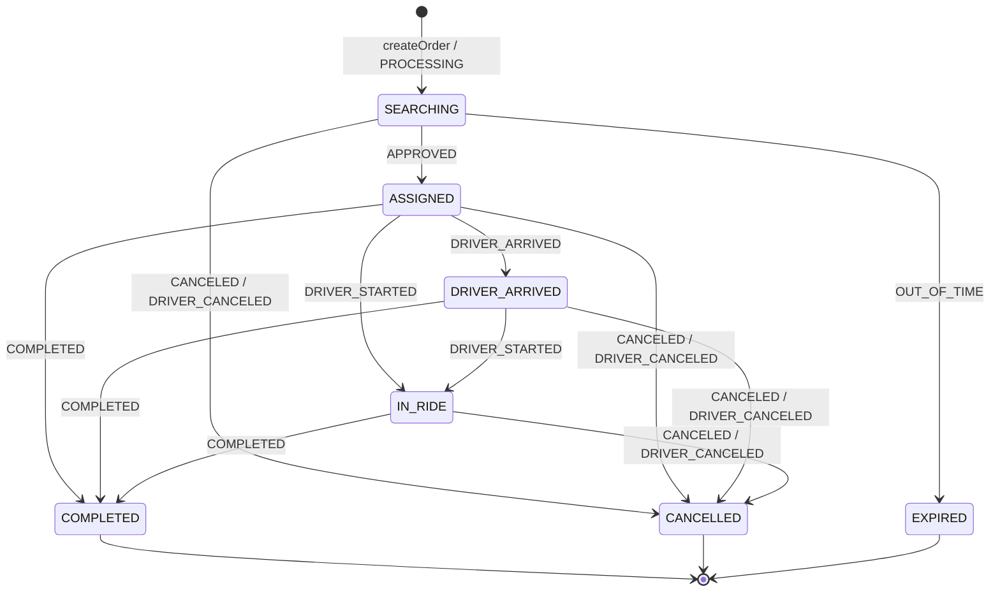

# FSM заказа (внешний) — состояния и переходы

> «Чужой» FSM заказа как чёрный ящик, на события которого реагирует бот. Привязан к текущему
> бэкенду iBronevik (см. [backend-mapping.md](backend-mapping.md)), выверен по идеализированной
> модели ([../domain/execution-models.md](../domain/execution-models.md)) и рецензии grok1.
>
> ⚠️ Бот **не владеет** этим FSM и не вычисляет его состояние — только наблюдает события (поллинг)
> и шлёт команды. Состояния ниже — то, что бот может **различить** по событиям API.

---

## 1. Два уровня описания

- **Целевой FSM (домен ТДМ)** — полный, со стратегиями Carrier Determination (раздел 4). Ориентир.
- **Наблюдаемый FSM (текущий бэкенд)** — то, что реально различимо по 8 событиям поллинга (раздел 2).
  Именно его реализует бот сегодня.

---

## 2. Наблюдаемый FSM (текущий бэкенд) — то, что реализуем сейчас

### Состояния
| Состояние | Вход (событие) | Смысл |
|---|---|---|
| `SEARCHING` | `PROCESSING` | Идёт поиск/ожидание исполнителя |
| `ASSIGNED` | `APPROVED` | Водитель назначен (`c_appointed`) |
| `DRIVER_ARRIVED` | `DRIVER_ARRIVED` | Водитель прибыл (`c_arrived`) |
| `IN_RIDE` | `DRIVER_STARTED` | Поездка идёт (`c_started`) |
| `COMPLETED` ⛔ | `COMPLETED` | Поездка завершена (`c_completed` / `b_state=4`) |
| `CANCELLED` ⛔ | `CANCELED` / `DRIVER_CANCELED` | Отменён (клиентом/системой/водителем) |
| `EXPIRED` ⛔ | `OUT_OF_TIME` | Истёк таймер ожидания |

⛔ — терминальное.

### Диаграмма (наблюдаемый)



> Заметки:
> - Переходы повторяют фактический `order.json` MultiBot (start/approved/driverArrived/driverStarted →
>   completed/canceled) — см. backend-mapping §4.
> - `DRIVER_CANCELED` (после назначения) в текущем боте трактуется как отмена (→ CANCELLED). В целевой
>   модели здесь возможен **re-matching** (раздел 4) — пока не реализовано бэкендом так явно.

---

## 3. Соответствие доменным стадиям

| Наблюдаемое | Доменная стадия ([execution-models.md](../domain/execution-models.md)) |
|---|---|
| SEARCHING | Discovery + Candidate Formation + (часть) Carrier Determination |
| ASSIGNED | Carrier Determination завершена (AssignedDriver) |
| DRIVER_ARRIVED | Rendezvous завершён; перед Boarding Verification |
| IN_RIDE | Transportation (после Boarding Verification) |
| COMPLETED/CANCELLED/EXPIRED | Completion (ExecutionOutcome) |

> Boarding Verification в текущем потоке отдельным наблюдаемым состоянием не выделено: переход
> `DRIVER_ARRIVED → IN_RIDE` (`c_started`) уже подразумевает состоявшуюся посадку. В VOTE с внешним
> водителем подтверждение — через `b_driver_code` (код посадки), но статусом поллинга не отражается.

---

## 4. Целевой FSM (домен ТДМ) — ориентир

Полная машина из gpt3, дополненная по grok1 (EN_ROUTE, re-matching). **Не реализуется сейчас** —
держим как направление развития, когда бэкенд начнёт отдавать больше деталей.

```
INIT/DRAFT → CREATED → MATCHING_STARTED
  ├─ DIRECT:  → DRIVER_ASSIGNED
  ├─ VOTE:    WAITING_FOR_CANDIDATES → DRIVER_SELECTED_BY_CLIENT ─┐
  │                                  → (FirstArrived/AnyArrived)  │
  └─ OFFER:   WAITING_FOR_OFFERS     → OFFER_SELECTED → DRIVER_ASSIGNED
DRIVER_ASSIGNED → EN_ROUTE/HEADING_TO_PICKUP → ARRIVAL
   → BOARDING_VERIFICATION → RIDE_STARTED → FINISHED
Терминальные: CANCELLED, EXPIRED, NO_SHOW_DRIVER
Возвраты: RE_MATCHING / RE_ASSIGNMENT (водитель отказался после назначения)
```

Отличия целевого от наблюдаемого (gap для будущего):
- явные `WAITING_FOR_CANDIDATES` / `WAITING_FOR_OFFERS` с составом для выбора клиентом;
- `EN_ROUTE` между ASSIGNED и ARRIVAL;
- `BOARDING_VERIFICATION` как отдельное состояние;
- `RE_MATCHING` / `RE_ASSIGNMENT` вместо безусловного CANCELLED при отказе водителя;
- `NO_SHOW_DRIVER`.

См. [events.md](events.md) (каталог событий), [timers.md](timers.md) (таймеры), [commands.md](commands.md) (команды боту → заказу).
